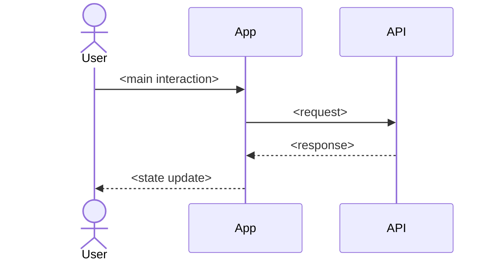

[USER JOURNEY DIAGRAM — prepended by michael-speckit-presets/user-journey-mermaid preset]

After completing § User Scenarios & Testing, render the main happy-path
flow as a mermaid sequenceDiagram into the placeholder block below.
Each arrow = one step of the user's primary scenario. Keep it concise
(5-10 arrows); branch/error scenarios stay in text.

## User Journey Diagram

[END USER JOURNEY DIAGRAM]
