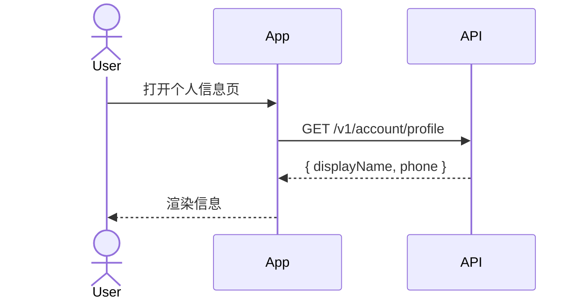

# Plan: spec-kit template review — orchestrator 倒推驱动的模板工程化补全

> **Status**: SUPERSEDED(2026-05-24 状态追进) — DRAFT v1 从未进入逐 template review;其 template 工程化产物(如 spec.zod `state_branches`)已被 [test-infra master](05-22-test-infra-master.md) 链(#80-82)吸收落地,本 plan 无独立执行剩余。
> **v0 → v1 pivot**: v0 只盯"workflow.yml 缺 clarify/analyze";v1 真重心 = **template 产出的语料对下游 orchestrator 是否够用**
> **Supersedes scope**:本 plan amend [Plan 2 § 2.2.5](2026-05/05-25-account-migration-p1-toolchain-ralph-loop.md#22-起手准备phase-0约-1-周) — Wiggum CLI + Bridge Adapter 的 defer 被本 plan **激活并以自写 Node22+tsx orchestrator 替代**(per 2026-05-20 user Q3 答 "Phase 0 端到端激活")
> ⚠️ **[HISTORICAL — 布局已变 (2026-05-24)]**：本文 `src/modules/<module>` 及旧 `domain/application/infrastructure/web` 分层示例反映当时认知；server 实际为**扁平** `apps/server/src/<module>/`（无 layer 子目录，per [ADR-0043](../../adr/0043-server-flat-module-paradigm.md)）。示例不逐条改，作历史留痕。

---

## 1. Context

Plan 2 起手 002-account-profile-base feature 前,需要把 spec-kit 的"标准面"(template)与"执行面"(orchestrator)接通。

现有 spec-kit template 为**人类阅读 + LLM 自然语言生成**设计,对**自动化 orchestrator 的 parser**不够友好:

- task 之间的依赖图无法机器构建(LLM 喜欢在标题加 emoji / 改 checkbox 语法)
- task 完成的 verify 命令无明确锚点
- 跨 artifact ID 一致性(spec 的 FR-001 ↔ plan 的 Section / tasks 的 T001)无机器可校验信号
- 沙盒 / workspace 路径映射散落在自然语言段
- 契约 drift 无 checksum / 单一来源

**驱动**:Plan 2 Phase 0 graduation 必须把 template 升级到能喂 orchestrator,否则 002 起手就是手工 + LLM 自由发挥,8-9 周 16 use case 节奏崩。

---

## 2. 架构(三层,已对齐)

```
┌────────────────────────────────────────────────────────────────┐
│ 控制面: .specify/workflows/speckit/workflow.yml                 │
│   - 编排 6 步: constitution(项目) / specify / clarify / plan / │
│     tasks / analyze / implement                                 │
│   - review gate 声明                                            │
│   - 纯声明,不执行                                               │
└──────────────────────┬─────────────────────────────────────────┘
                       │ 调度
┌──────────────────────▼─────────────────────────────────────────┐
│ 标准面: .specify/templates/*.md + preset 的 template prepend    │
│   - 决定 LLM 产出什么形态的语料                                  │
│   - 三层混合语料(per 2026-05-20 user Q2 答):                  │
│       1. YAML frontmatter — 跨文档级元数据                       │
│       2. JSON fenced block(刻意 JSON 而非 YAML)— 宏观架构      │
│       3. HTML 注释内塞 JSON — 微观依赖图 / per-task meta         │
└──────────────────────┬─────────────────────────────────────────┘
                       │ 喂语料
┌──────────────────────▼─────────────────────────────────────────┐
│ 执行面: scripts/orchestrator/*.ts(Node22 + tsx,自写)          │
│   - orchestrator 直接调 LLM(Anthropic SDK 或 Claude Code       │
│     subprocess,§ 5.2 待定)                                    │
│   - parser: gray-matter(frontmatter)+ regex(fence/marker)+    │
│     Zod schema 校验                                             │
│   - LLM JSON 输出失败 → Ralph-loop 让 LLM 重写 markdown          │
│   - 推进 task-by-task,跑测试 + git commit + flip tasks.md [X]   │
└────────────────────────────────────────────────────────────────┘
```

### 2.1 已 firm 的设计决策

| 决策 | 选定 | 理由(per 2026-05-20 user Q2 答) |
|---|---|---|
| **Orchestrator 是否调 LLM** | 是,Wiggum / ralph-loop 等价物 | orchestrator driver 完整 implement loop,不依赖用户手动 invoke Claude Code |
| **跨文档级元数据载体** | YAML frontmatter | 开源标准(Docusaurus / Nextra / Hugo),`gray-matter` 一行解析 |
| **宏观架构 / 沙盒配置载体** | JSON fenced block(刻意 JSON,非 YAML) | LLM(尤其 Opus)生成 JSON 稳定性远高于 YAML;`JSON.parse()` 容错强 |
| **微观执行流 / DAG 依赖图载体** | HTML 注释内塞 JSON | 保留人类可读 markdown checkbox + 机器可严格解析,避免发明脆弱自定义 inline 语法 |
| **Parser 工程化** | `gray-matter` + `regex JSON fenced` + Zod schema 校验 | LLM JSON 出错 → Zod 抛 → Ralph-loop 让 LLM 重写本 markdown |
| **失败处理** | Ralph-loop 重写 markdown(orchestrator 内置) | 不靠人工 fix LLM 输出格式 |
| **Plan 2 § 2.2.5 defer 项关系** | 激活,自写 Node22+tsx orchestrator 替代 Wiggum/Bridge Adapter | Phase 0 端到端落地,002 起手前 dry-run 验证 |

---

## 3. Deliverable

本 plan 产出:

1. **Template patch 集合** — 5 个 vendored template + 3 个 preset 的 prepend 片段(范围待 user § 5 Q1 确认)的修改,落定三层混合语料 schema
2. **Zod schema 定义** — `scripts/orchestrator/schemas/*.ts`(SpecSchema / PlanSchema / TaskSchema / 等),作为模板与 orchestrator 之间的契约
3. **Orchestrator PoC** — `scripts/orchestrator/*.ts`,最小可跑(read tasks.md → DAG schedule → 调 LLM 写 impl → 跑 test → git commit → flip [X]),不要求全功能
4. **Dry-run 报告** — 在 002 spec 草稿(或 throwaway demo spec)上端到端跑一遍,验收三层语料 + parser + Ralph-loop 闭环
5. **预设(preset)装机** — 若 patch 走 spec-kit preset 形态(§ 7 待定),新写 `.specify/presets/<name>/`;若直改 vendored,记录在 ADR

---

## 4. Out of scope(明确划线)

- Wiggum CLI 第三方 binary(本 plan 自写 orchestrator 替代)
- claude-mem env-gate(Plan 2 § 2.2.4 独立)
- 业务 spec(002-006)内容设计 — 本 plan 只准备工具链
- mobile UI mockup 工作流(per ADR-0017 类 1/2/3,独立)
- workflow.yml 加 clarify/analyze 步骤的"完成性 enforcement" — 因为 orchestrator 直接 driver 整个流程,完成性由 orchestrator state 机器自校,workflow.yml 的 review gate 仅作人工卡点声明

---

## 5.1 spec-template review 对齐结果(v2 — 2026-05-20 user 防呆 4 点 + B4/B5 收紧后)

### 5.1.1 现状盘点

- vendored `.specify/templates/spec-template.md`(129 行):5 个主 section(User Scenarios / Edge Cases / Requirements / Key Entities / Success Criteria / Assumptions),无 YAML frontmatter,与 ADR-0024 frontmatter 强制要求 drift
- `.specify/presets/user-journey-mermaid/templates/spec-template.md`:prepend `## User Journey Diagram` + mermaid `sequenceDiagram`
- vendored 顶部 `**Status**: Draft` 与 ADR-0024 frontmatter `status:` 字段双写

### 5.1.2 修订矩阵(orchestrator 倒推视角)

**Marker 收紧后只对"引用方"(US / FR)与"clarify"挂载,被引用方(SC / EC)走 markdown ID + 自然语言 trace**:

| # | 缺失 | orchestrator 影响 | 补法(v2) |
|---|---|---|---|
| **B1** | YAML frontmatter 缺失 | 无法 read 全局元数据 | 顶部加 frontmatter,字段集见 § 5.1.3 |
| **B2** | `**Status**: Draft` 与 frontmatter 双写 | LLM drift | 删 markdown bold field,统一 frontmatter |
| **B3** | US 缺 stable ID | trace graph 断 | heading 末加 `<!-- us-meta: {...} -->` |
| ~~B4~~ | ~~AS 缺 marker~~ | 经父级 US trace 已覆盖 | **不补**(per user 防呆反馈) |
| ~~B5~~ | ~~EC 缺 marker~~ | EC 挂父级 FR | **不补**,EC 行内自然语言 `(covers FR-002)`,parser fuzzy regex |
| **B6** | FR/SC 用 markdown bold ID,regex 容错差 | trace 不稳 | FR 保 markdown + `<!-- fr-meta: {...} -->`(引用方);SC 仅保 markdown bold ID 不补 marker |
| **B7** | Entities 自由文本 | 无法 derive 数据模型 | fenced JSON block,含 `domain?` + `aggregate_root` |
| **B8** | NEEDS CLARIFICATION 仅 inline | clarify 任务难驱动 | inline 保留人读,fr-meta 内 `needs_clarification: true` + `questions: []` |
| **B9** | `## Clarifications` placeholder 缺失 | clarify 产出无落点 | 顶部固定 placeholder(`<!-- pending: /speckit-clarify -->`) |

### 5.1.3 Frontmatter 字段集

```yaml
---
feature_id: 002-account-profile-base   # NNN-slug,与 branch / dir / PR 三位一体
modules: [account]                     # business-naming.md 域值;跨模块 [cross-cutting]
owners: ["@xiaocaishen-michael"]       # CODEOWNERS 兼容
status: clarified                      # draft → clarified → planned → tasks-ready → implementing → implemented → superseded → archived
created_at: 2026-05-20
updated_at: 2026-05-20
spec_kit_version: ">=0.8.5,<0.10.0"
orchestrator_compat: ">=0.1.0"
# contracts 数组(optional,per user 防呆反馈 #1 多契约支持):
contracts:
  - path: "packages/api-client/src/auth.interface.ts"
    checksum: "sha256-xxx"
  - path: "packages/api-client/src/profile.interface.ts"
    checksum: "sha256-yyy"
---
```

### 5.1.4 Marker JSON schema(v2,收紧后只 4 种)

```jsonc
// us-meta (User Story heading 后)
{
  "id": "US1",
  "priority": "P1",
  "independent_test": "Login with valid phone → see profile",
  "trace_fr": ["FR-001", "FR-002"]
}

// fr-meta (FR 行后)
{
  "id": "FR-001",
  "priority": "must",                  // must | should | may
  "needs_clarification": false,
  "questions": [],                     // [{q: string, options?: string[]}]
  "trace_us": ["US1"],                 // 或 ["GLOBAL"] 给基础设施类 FR
  "trace_sc": ["SC-001"]
}

// cl-meta (Clarifications 段内每条)
{
  "id": "CL-001",
  "resolved": true,
  "resolved_at": "2026-05-20",
  "trace_fr": ["FR-006"]
}

// entities fenced block(集中一处,非 per-row marker)
{
  "entities": [{
    "id": "E1", "name": "Account",
    "domain": "account",               // optional,DDD subdomain
    "aggregate_root": true,            // required,引导 NestJS Service 层
    "attrs": [{ "name": "id", "type": "string" }],
    "relations": []
  }]
}
```

### 5.1.5 Zod schema 草案(`scripts/orchestrator/schemas/spec.ts`)

```typescript
import { z } from "zod";

export const SpecFrontmatterSchema = z.object({
  feature_id: z.string().regex(/^\d{3}-[a-z0-9-]+$/),
  modules: z.array(z.string()).min(1),
  owners: z.array(z.string().regex(/^@/)).min(1),
  status: z.enum(["draft","clarified","planned","tasks-ready","implementing","implemented","superseded","archived"]),
  created_at: z.string().regex(/^\d{4}-\d{2}-\d{2}$/),
  updated_at: z.string().regex(/^\d{4}-\d{2}-\d{2}$/),
  spec_kit_version: z.string(),
  orchestrator_compat: z.string(),
  contracts: z.array(z.object({
    path: z.string(),
    checksum: z.string().regex(/^sha256-/),
  })).optional(),
});

export const UsMetaSchema = z.object({
  id: z.string().regex(/^US\d+$/),
  priority: z.string().regex(/^P\d+$/),
  independent_test: z.string().min(10),
  trace_fr: z.array(z.string().regex(/^FR-\d{3}$/)).min(1),
});

export const FrMetaSchema = z.object({
  id: z.string().regex(/^FR-\d{3}$/),
  priority: z.enum(["must","should","may"]),
  needs_clarification: z.boolean(),
  questions: z.array(z.object({ q: z.string(), options: z.array(z.string()).optional() })),
  // trace_us 允许 "GLOBAL" magic literal 给基础设施类 FR(per user 防呆反馈 #3):
  trace_us: z.array(z.union([z.string().regex(/^US\d+$/), z.literal("GLOBAL")])).min(1),
  trace_sc: z.array(z.string().regex(/^SC-\d{3}$/)),  // 允许空数组(基础设施 FR 可无 metric)
});

export const ClMetaSchema = z.object({
  id: z.string().regex(/^CL-\d{3}$/),
  resolved: z.boolean(),
  resolved_at: z.string().regex(/^\d{4}-\d{2}-\d{2}$/).optional(),
  trace_fr: z.array(z.string().regex(/^FR-\d{3}$/)).min(1),
});

export const EntitySchema = z.object({
  id: z.string().regex(/^E\d+$/),
  name: z.string().min(1),
  domain: z.string().optional(),       // DDD subdomain,与 modules 松绑
  aggregate_root: z.boolean(),
  attrs: z.array(z.object({
    name: z.string(),
    type: z.string(),
    max_len: z.number().optional(),
    format: z.string().optional(),
  })),
  relations: z.array(z.object({
    to: z.string().regex(/^E\d+$/),
    kind: z.enum(["1:1","1:N","N:1","N:N"]),
  })),
});
```

### 5.1.6 Parser 三层管道(per user 防呆反馈 #2)

```typescript
// scripts/orchestrator/parsers/marker-json.ts
import JSON5 from "json5";

export function parseMarkerJson<T>(raw: string, schema: z.ZodType<T>): T {
  // 层 1:预清洗
  const cleaned = raw
    .replace(/```\w*\s*/g, "")          // 去 markdown fence
    .replace(/‘|’/g, "'")     // smart quote → ascii
    .replace(/“|”/g, '"')
    .trim();
  // 层 2:json5.parse(容错强,允许 trailing comma / 单引号 / unquoted key)
  const parsed = JSON5.parse(cleaned);
  // 层 3:Zod strict schema 校验
  return schema.parse(parsed);
}
// 三层全 fail → orchestrator 抛 → Ralph-loop 喂 error message 让 LLM 重写本 markdown
```

### 5.1.7 spec.md 渲染样板(mini sample,供 review)

````markdown
---
feature_id: 002-account-profile-base
modules: [account]
owners: ["@xiaocaishen-michael"]
status: planned
created_at: 2026-05-20
updated_at: 2026-05-20
spec_kit_version: ">=0.8.5,<0.10.0"
orchestrator_compat: ">=0.1.0"
contracts:
  - path: "packages/api-client/src/profile.interface.ts"
    checksum: "sha256-abcd1234..."
---

# Feature Specification: Account Profile Base

## User Journey Diagram



## Clarifications

<!-- pending: 运行 /speckit-clarify 填充。每条 resolved 时挂 cl-meta marker -->

## User Scenarios & Testing

### User Story 1 — 查看个人信息 (Priority: P1)
<!-- us-meta: {"id":"US1","priority":"P1","independent_test":"Login with valid phone → see profile","trace_fr":["FR-001"]} -->

**Why this priority**: ...

**Acceptance Scenarios**:
1. **Given** logged-in account, **When** open profile page, **Then** see displayName & masked phone
2. **Given** displayName=null, **When** open profile page, **Then** show "未设置" 占位

### Edge Cases

- 当 displayName 含 emoji 时如何展示? (covers FR-001)
- 用户 phone 被运营商回收后状态? (covers FR-002, FR-003)

## Requirements

### Functional Requirements

- **FR-001**: System MUST return account profile (id, displayName, phone) <!-- fr-meta: {"id":"FR-001","priority":"must","needs_clarification":false,"questions":[],"trace_us":["US1"],"trace_sc":["SC-001"]} -->
- **FR-002**: System MUST mask phone middle 4 digits in response <!-- fr-meta: {"id":"FR-002","priority":"must","needs_clarification":false,"questions":[],"trace_us":["US1"],"trace_sc":["SC-002"]} -->
- **FR-003**: 密码哈希 MUST 使用 bcrypt cost ≥ 12 <!-- fr-meta: {"id":"FR-003","priority":"must","needs_clarification":false,"questions":[],"trace_us":["GLOBAL"],"trace_sc":[]} -->

### Key Entities

```json entities
{
  "entities": [
    {
      "id": "E1", "name": "Account", "domain": "account", "aggregate_root": true,
      "attrs": [
        { "name": "id", "type": "string" },
        { "name": "displayName", "type": "string", "max_len": 50 },
        { "name": "phone", "type": "string", "format": "E.164" }
      ],
      "relations": []
    }
  ]
}
```

## Success Criteria

- **SC-001**: 95% of profile GET requests return in ≤ 200ms
- **SC-002**: 0 phone numbers exposed in plain text in API responses

## Assumptions

- 用户已通过登录流程(由 003-tokens feature 覆盖)
````

### 5.1.8 Orchestrator 7 个 spec.md 调用点

1. **frontmatter parse** → 决定 sandbox cwd / git branch / permission scope
2. **mermaid User Journey parse** → 校验 plan.md architecture 与 spec.md user flow 一致
3. **trace graph build** → 扫 us-meta + fr-meta + cl-meta,构建 US→FR→{SC,EC}→Tasks DAG
4. **clarify task driver** → 扫 fr-meta 内 `needs_clarification: true`,拼 prompt 抛 question → 写回 `## Clarifications` 段并加 cl-meta + flip fr-meta
5. **plan generation precheck** → 校验:每 FR 有 ≥ 1 个 `trace_sc`(或 `trace_us=["GLOBAL"]` 标基础设施类豁免);每 US 有 ≥ 1 个 `trace_fr`
6. **tasks generation precheck** → 校验:每 US 至少 1 个 task(反向 trace,§ 5.3 tasks-template 时细化)
7. **implement task prompt 拼装** → 把当前 task 关联的 FR / SC / EC / entity 节选 + graphify 代码节点注入 `temp-prompt.md`

### 5.1.9 spec-template 落地形态(未决,§ 7 Alt 决定)

- Vendored `.specify/templates/spec-template.md` 需重写为 v2(加 frontmatter / placeholders / marker example)
- `user-journey-mermaid` preset prepend 不变(mermaid block 已经能与 v2 共存)
- 是否新写 `.specify/presets/orchestrator-ready/templates/spec-template.md` 作 prepend,还是直接覆盖 vendored,留 § 7 决

---

## 5.2 plan-template review 对齐结果(v2 — 2026-05-20)

### 5.2.1 现状盘点

- vendored `.specify/templates/plan-template.md`(105 行)主结构:Header → Summary → Technical Context → Constitution Check → Project Structure(Documentation tree + Source Code tree)→ Complexity Tracking
- `.specify/presets/context7-injection/templates/plan-template.md`:LLM 指令 prepend(让 plan 阶段调 `mcp__context7__*` 校第三方库版本)
- **严重 drift mono**:
  - Source Code 3 options(single/web/mobile)无一适配 mono nx 布局(`apps/server` + `apps/mobile` + `packages/*`)
  - Documentation tree 写 `contracts/` 子目录,与 ADR-0024 扁平 feature-first 冲突
  - Technical Context 全是 inline `**Field**: [value]` 自然语言,无机器可消费结构
  - 完全无 `orchestrator_config` block(本 plan 核心需求)
  - 无 per-task / per-workspace verify command 锚点
  - 无 phase DAG 表达
  - 无 API contract 草图

### 5.2.2 修订矩阵(orchestrator 倒推视角,12 项)

| # | 缺失 | orchestrator 影响 | 补法(v2) |
|---|---|---|---|
| **P1** | YAML frontmatter 缺失 | 无法 cross-doc 链 spec ↔ plan | 加 frontmatter(字段集见 § 5.2.3) |
| **P2** | Source Code 3 options 不适配 mono | LLM 抓不到 workspace map | 全删,统一用 `orchestrator_config.workspaces` JSON |
| **P3** | Technical Context 散落 markdown bold | 无 schema 校验 | 升级为 `orchestrator_config.tech_constraints` JSON 段 |
| **P4** | `orchestrator_config` JSON block 不存在 | orchestrator 无 sandbox cwd / verify command 知识 | 新增 fenced `json orchestrator_config` block(核心) |
| **P5** | per-workspace verify command 缺 | implement task 跑完无法判断成功 | `orchestrator_config.workspaces[].verify_commands` 字段(每 workspace 默认值,tasks.md 可 override) |
| **P6** | Tech stack 版本无锁定字段 | LLM 默认走旧版语法 | `orchestrator_config.tech_constraints.versions` 列 NestJS/Prisma/Fastify/Expo 等 |
| **P7** | Phase DAG 无机器表达 | tasks 生成时依赖图推不出 | `orchestrator_config.phases` 数组,每 phase 标 workspace + blocks_on |
| **P8** | API contract 无 sketch section | server impl 与 api-client 同步无 source | 新增 fenced `json api_contracts` block |
| **P9** | ADR refs 散落自然语言 | orchestrator 无法注入相关 ADR | frontmatter `adr_refs: ["0018","0019","0020"]` 数组 |
| **P10** | Module boundary 缺 | ESLint boundaries 违反靠 CI 兜底 | `orchestrator_config.module_boundaries` 字段 |
| **P11** | Performance budget 仅 inline | 与 spec SC 无 trace | `orchestrator_config.tech_constraints.perf_budget` 带 `trace_sc` |
| **P12** | Constitution Check 仅 placeholder | orchestrator 不知 pass/fail | 新增 fenced `json constitution_check` block(独立 block,易扩 violations 数组) |

### 5.2.3 Frontmatter 字段集

```yaml
---
feature_id: 002-account-profile-base
spec_ref: ./spec.md                    # 必填,orchestrator 校验 spec.md frontmatter feature_id 与此一致
status: tasks-ready                    # plan lifecycle: drafted | reviewed | tasks-ready | superseded
created_at: 2026-05-20
updated_at: 2026-05-20
adr_refs: ["0018","0019","0020","0023","0024"]
orchestrator_compat: ">=0.1.0"
---
```

### 5.2.4 orchestrator_config JSON block(核心,单块设计)

per user Q2 答 "orchestrator_config" 单块,内嵌多个 section:

```jsonc
{
  // [A] workspace map — 每个 mono nx project 一个条目
  "workspaces": [
    {
      "id": "server",                          // 内部引用 ID
      "nx_project": "server",                  // pnpm nx run <project>:<target>
      "cwd": "apps/server",                    // sandbox cwd 模板
      "lang": "typescript",
      "module_path": "apps/server/src/modules/account",  // 本 feature 落点
      "verify_commands": {
        "build": "pnpm nx build server",
        "test": "pnpm nx test server",
        "lint": "pnpm nx lint server",
        "typecheck": "pnpm nx run server:typecheck",
        "e2e": "pnpm nx run server:e2e",
        "openapi_export": "pnpm nx run server:export-openapi"
      },
      "graphify_scope": "apps/server/src/modules/account/**"  // graphify 节点抽取 glob
    },
    {
      "id": "api-client",
      "nx_project": "api-client",
      "cwd": "packages/api-client",
      "lang": "typescript",
      "verify_commands": {
        "generate": "pnpm nx run api-client:generate",
        "build": "pnpm nx build api-client",
        "test": "pnpm nx test api-client"
      },
      "graphify_scope": "packages/api-client/src/**"
    },
    {
      "id": "mobile",
      "nx_project": "mobile",
      "cwd": "apps/mobile",
      "lang": "typescript",
      "feature_path": "apps/mobile/src/features/account",
      "verify_commands": {
        "test": "pnpm nx test mobile",
        "typecheck": "pnpm nx run mobile:typecheck",
        "start": "pnpm nx run mobile:start",
        "export_web": "pnpm nx run mobile:export-web"
      },
      "graphify_scope": "apps/mobile/src/features/account/**"
    }
  ],

  // [B] phase DAG — tasks-template 生成 task 时 each task 必须挂到一个 phase
  "phases": [
    { "id": "P1",  "name": "schema",         "workspace": "server",     "blocks_on": [] },
    { "id": "P2",  "name": "module",         "workspace": "server",     "blocks_on": ["P1"] },
    { "id": "P3",  "name": "controller",     "workspace": "server",     "blocks_on": ["P2"] },
    { "id": "P4",  "name": "service",        "workspace": "server",     "blocks_on": ["P2"] },
    { "id": "P5",  "name": "test-server",    "workspace": "server",     "blocks_on": ["P3","P4"] },
    { "id": "P6",  "name": "openapi-export", "workspace": "server",     "blocks_on": ["P5"] },
    { "id": "P7",  "name": "api-client-gen", "workspace": "api-client", "blocks_on": ["P6"] },
    { "id": "P8",  "name": "mobile-feature", "workspace": "mobile",     "blocks_on": ["P7"] },
    { "id": "P9",  "name": "test-mobile",    "workspace": "mobile",     "blocks_on": ["P8"] },
    { "id": "P10", "name": "e2e",            "workspace": "server",     "blocks_on": ["P5","P9"] }
  ],

  // [C] NestJS module 边界(per ADR-0020 ESLint boundaries),orchestrator 拼 implement prompt 时注入
  "module_boundaries": {
    "server": {
      "modules": ["account"],
      "allowed_imports": ["@nestjs/*","@prisma/*","fastify","../shared/*"],
      "forbidden_imports": ["../auth/*","../pkm/*"]
    }
  },

  // [D] sandbox cwd 与清理策略
  "sandbox": {
    "cwd_template": "/tmp/orchestrator-{feature_id}-{task_id}",
    "cleanup_on_success": true,
    "cleanup_on_failure": false                // failure 留 cwd 给人工调试
  },

  // [E] 版本锁 + perf budget(LLM prompt 注入)
  "tech_constraints": {
    "versions": [
      { "lib": "nestjs",   "version": ">=11.0.0 <12" },
      { "lib": "prisma",   "version": ">=6.0.0 <7" },
      { "lib": "fastify",  "version": ">=5.0.0 <6" },
      { "lib": "expo",     "version": ">=52.0.0 <53" },
      { "lib": "vitest",   "version": ">=2.0.0 <3" }
    ],
    "perf_budget": [
      { "metric": "P95 latency GET /v1/account/profile", "target": "≤ 200ms", "trace_sc": ["SC-001"] }
    ],
    "scale": { "users": 10000, "rps": 100 }
  }
}
```

### 5.2.5 api_contracts JSON block(独立块,server ↔ api-client ↔ mobile 共同 source)

```jsonc
{
  "endpoints": [
    {
      "id": "EP1",
      "method": "GET",
      "path": "/v1/account/profile",
      "auth": "bearer",
      "request": null,
      "response_schema_ref": "E1",            // 引 spec.md entities[E1] = Account
      "trace_fr": ["FR-001"]
    },
    {
      "id": "EP2",
      "method": "PATCH",
      "path": "/v1/account/profile",
      "auth": "bearer",
      "request_schema": { "displayName": { "type": "string", "max_len": 50 } },
      "response_schema_ref": "E1",
      "trace_fr": ["FR-001"]
    }
  ]
}
```

### 5.2.6 constitution_check JSON block

```jsonc
{
  "passed": true,
  "violations": []
  // 若 passed=false,每条:
  // { "rule": "no-circular-deps", "justification": "..." }
}
```

### 5.2.7 Zod schema 草案(`scripts/orchestrator/schemas/plan.ts`)

```typescript
import { z } from "zod";

export const PlanFrontmatterSchema = z.object({
  feature_id: z.string().regex(/^\d{3}-[a-z0-9-]+$/),
  spec_ref: z.string(),
  status: z.enum(["drafted","reviewed","tasks-ready","superseded"]),
  created_at: z.string().regex(/^\d{4}-\d{2}-\d{2}$/),
  updated_at: z.string().regex(/^\d{4}-\d{2}-\d{2}$/),
  adr_refs: z.array(z.string().regex(/^\d{4}$/)),
  orchestrator_compat: z.string(),
});

export const WorkspaceSchema = z.object({
  id: z.string(),
  nx_project: z.string(),
  cwd: z.string(),
  lang: z.enum(["typescript","javascript","markdown"]),
  module_path: z.string().optional(),
  feature_path: z.string().optional(),
  verify_commands: z.record(z.string(), z.string()),  // free-form key → shell command
  graphify_scope: z.string().optional(),
});

export const PhaseSchema = z.object({
  id: z.string().regex(/^P\d+$/),
  name: z.string(),
  workspace: z.string(),                              // 必须引 workspaces[].id
  blocks_on: z.array(z.string().regex(/^P\d+$/)),
});

export const OrchestratorConfigSchema = z.object({
  workspaces: z.array(WorkspaceSchema).min(1),
  phases: z.array(PhaseSchema).min(1),
  module_boundaries: z.record(z.string(), z.object({
    modules: z.array(z.string()),
    allowed_imports: z.array(z.string()),
    forbidden_imports: z.array(z.string()),
  })),
  sandbox: z.object({
    cwd_template: z.string(),
    cleanup_on_success: z.boolean(),
    cleanup_on_failure: z.boolean(),
  }),
  tech_constraints: z.object({
    versions: z.array(z.object({ lib: z.string(), version: z.string() })),
    perf_budget: z.array(z.object({
      metric: z.string(),
      target: z.string(),
      trace_sc: z.array(z.string().regex(/^SC-\d{3}$/)),
    })),
    scale: z.record(z.string(), z.union([z.number(), z.string()])),
  }),
});

export const EndpointSchema = z.object({
  id: z.string().regex(/^EP\d+$/),
  method: z.enum(["GET","POST","PATCH","PUT","DELETE"]),
  path: z.string().regex(/^\//),
  auth: z.enum(["none","bearer","oauth"]),
  request: z.union([z.null(), z.record(z.string(), z.unknown())]).optional(),
  request_schema: z.record(z.string(), z.unknown()).optional(),
  response_schema_ref: z.string().regex(/^E\d+$/).optional(),
  response_schema: z.record(z.string(), z.unknown()).optional(),
  trace_fr: z.array(z.string().regex(/^FR-\d{3}$/)).min(1),
});

export const ApiContractsSchema = z.object({
  endpoints: z.array(EndpointSchema),
});

export const ConstitutionCheckSchema = z.object({
  passed: z.boolean(),
  violations: z.array(z.object({
    rule: z.string(),
    justification: z.string(),
  })),
});
```

### 5.2.8 plan.md 渲染样板(mini sample)

````markdown
---
feature_id: 002-account-profile-base
spec_ref: ./spec.md
status: tasks-ready
created_at: 2026-05-20
updated_at: 2026-05-20
adr_refs: ["0018","0019","0020","0024"]
orchestrator_compat: ">=0.1.0"
---

# Implementation Plan: Account Profile Base

## Summary

GET / PATCH `/v1/account/profile` 两个 endpoint,基于现有 NestJS `account` module
扩展。mobile 设置页消费 typed api-client。

## Orchestrator Config

```json orchestrator_config
{ ... (per § 5.2.4 完整内容) ... }
```

## API Contracts

```json api_contracts
{ ... (per § 5.2.5 完整内容) ... }
```

## Constitution Check

```json constitution_check
{ "passed": true, "violations": [] }
```

## Architecture Notes

(自然语言段,给人读 + 给 LLM 拼 prompt 注入用。不强制机器解)

- 复用现有 `AccountModule`,新增 `ProfileController` + `ProfileService`
- Prisma schema 已有 `Account.displayName / phone` 字段,无需 migration
- mobile 沿用 `@nvy/api-client` 自动生成 client(per ADR-0019/0024)
- 验证 NestJS 11 + Prisma 6 + Fastify 5 版本(verified via context7)

## Complexity Tracking

(沿用 vendored markdown 表;无 violations 时空)
````

### 5.2.9 orchestrator 9 个 plan.md 调用点

1. **frontmatter parse** → 校验 `spec_ref` 与 spec.md `feature_id` 一致;拉 `adr_refs` 内容
2. **orchestrator_config.workspaces parse** → 注册可用 nx project;计算 sandbox cwd 模板
3. **orchestrator_config.phases parse** → 构建 phase DAG;tasks-template 生成 task 时 each task 必挂 phase ID
4. **orchestrator_config.module_boundaries parse** → 拼 implement prompt 时注入"允许 / 禁止 import"
5. **orchestrator_config.tech_constraints.versions parse** → 拼 prompt 注入版本锁,避免 LLM 用旧 API
6. **orchestrator_config.tech_constraints.perf_budget parse** → 生成 perf IT 时输入(per memory `feedback_env_gated_perf_it_pattern`)
7. **api_contracts.endpoints parse** → server impl prompt 注入 endpoint 蓝图;api-client gen 之前校验 server openapi.json 是否匹配
8. **constitution_check.passed parse** → false → orchestrator hard-stop,/speckit-tasks 不能跑
9. **api_contracts → graphify scope** → 抽 graphify 节点时按 endpoint path / module_path 裁剪

### 5.2.10 与 tasks.md 的职责切分(预告)

- **plan.md = workspace-level 默认值**(verify_commands / module_boundaries / tech_constraints)
- **tasks.md = task-level 具体值**(per-task verify_command override / per-task graphify_scope override / per-task DAG edge)

§ 5.3 tasks-template review 时细化。

### 5.2.11 context7-injection preset prepend 处理

vendored preset prepend 是 LLM 指令(call `mcp__context7__*`),与 v2 的机器可消费结构正交,**保留不动**。但需要在 plan.md frontmatter 追加 `context7_verified` 字段(可选)记录已校验的库:

```yaml
context7_verified:
  - { lib: "nestjs", version: "11.0.0", source: "/nestjs/nest/v11.0.0" }
  - { lib: "prisma", version: "6.0.0", source: "/prisma/prisma/v6.0.0" }
```

### 5.2.12 plan-template 落地形态(同 § 5.1.9)

留 § 7 决:vendored 直改 vs 新写 preset prepend。

### 5.2.13 plan-template v2 完整渲染(LLM-facing 模板源)

> **⚠️ Superseded by § 5.2.16 v3** — phases 剥离 + module_boundaries 简化 + status 3 态 + ACTION REQUIRED 注释删 + response_schema_ref 表达式语法 + json5 全 artifact 通用。本段保留作为演进轨迹。

下方即 `.specify/templates/plan-template.md` 重写后的完整内容:

`````markdown
---
feature_id: [###-feature-name]
spec_ref: ./spec.md
status: drafted
created_at: [YYYY-MM-DD]
updated_at: [YYYY-MM-DD]
adr_refs: []
orchestrator_compat: ">=0.1.0"
context7_verified: []
---

# Implementation Plan: [FEATURE]

## Summary *(mandatory)*

<!--
  ACTION REQUIRED: 从 spec.md 抽取 primary requirement + 1-2 句技术取向。
  禁超过 200 字;详细架构展开写到 ## Architecture Notes 段。
-->

[Extract from spec.md: primary requirement + 1-line technical approach]

## Orchestrator Config *(mandatory)*

<!--
  ACTION REQUIRED: 填充下方 orchestrator_config block。
  - workspaces[]:本 feature 涉及的 mono nx project(server / api-client / mobile / 其他)
  - phases[]:phase DAG,each phase 标 workspace + blocks_on(前置 phase ID 数组)
  - module_boundaries:per workspace 列 modules / allowed_imports / forbidden_imports(per ADR-0020)
  - sandbox:cwd 模板 + 清理策略,通常沿用默认
  - tech_constraints.versions:验证过的库才能列(配合 context7-injection preset)
  - tech_constraints.perf_budget:每条必须 trace_sc 到 spec.md SC ID
  JSON 必须严格合规(scripts/orchestrator/schemas/plan.ts OrchestratorConfigSchema 校验)。
  纯文档 / 无后端 feature → workspaces 可只列 mobile 或留空数组,phases 同步精简。
-->

```json orchestrator_config
{
  "workspaces": [
    {
      "id": "<workspace-id>",
      "nx_project": "<nx-project-name>",
      "cwd": "<path-from-repo-root>",
      "lang": "typescript",
      "module_path": "<server-only-module-path-or-omit>",
      "feature_path": "<mobile-only-feature-path-or-omit>",
      "verify_commands": {
        "build": "pnpm nx build <project>",
        "test": "pnpm nx test <project>",
        "lint": "pnpm nx lint <project>",
        "typecheck": "pnpm nx run <project>:typecheck"
      },
      "graphify_scope": "<glob-from-repo-root>"
    }
  ],
  "phases": [
    { "id": "P1", "name": "<phase-name>", "workspace": "<workspace-id>", "blocks_on": [] }
  ],
  "module_boundaries": {
    "<workspace-id>": {
      "modules": ["<module-name>"],
      "allowed_imports": ["@nestjs/*"],
      "forbidden_imports": []
    }
  },
  "sandbox": {
    "cwd_template": "/tmp/orchestrator-{feature_id}-{task_id}",
    "cleanup_on_success": true,
    "cleanup_on_failure": false
  },
  "tech_constraints": {
    "versions": [
      { "lib": "<lib-name>", "version": ">=X.Y.Z <X+1" }
    ],
    "perf_budget": [
      { "metric": "<metric-description>", "target": "<target>", "trace_sc": ["SC-001"] }
    ],
    "scale": { "users": 0, "rps": 0 }
  }
}
```

## API Contracts *(mandatory)*

<!--
  ACTION REQUIRED: 填充 api_contracts block。
  - 每 endpoint 必须 trace_fr 到 spec.md FR ID
  - response_schema_ref 优先引 spec.md entities[].id(避免重复定义)
  - request_schema 用 inline JSON Schema 片段
  - feature 不涉及 API(纯内部 refactor / 文档)→ endpoints: []
-->

```json api_contracts
{
  "endpoints": [
    {
      "id": "EP1",
      "method": "GET",
      "path": "/v1/<resource>",
      "auth": "bearer",
      "request": null,
      "response_schema_ref": "E1",
      "trace_fr": ["FR-001"]
    }
  ]
}
```

## Constitution Check *(mandatory)*

<!--
  ACTION REQUIRED: 跑 .specify/memory/constitution.md 的 gate checklist。
  - 全 pass → { "passed": true, "violations": [] }
  - 有 violation → passed: false,逐条 rule + justification
  - passed=false 时 orchestrator hard-stop,/speckit-tasks 不能跑。
    需先解决违反,或在 ## Complexity Tracking 表里加 justification 后将 passed flip 为 true。
-->

```json constitution_check
{
  "passed": true,
  "violations": []
}
```

## Architecture Notes *(mandatory)*

<!--
  ACTION REQUIRED: 自然语言段,给人读 + 给 LLM 在 implement 阶段拼 prompt 注入用。
  - 列本 feature 关键设计抉择(module 复用 / 新增 / 跨 workspace 协议 / 错误码命名 / 缓存策略)
  - 列 spec.md 之外的工程约束(Prisma migration 顺序 / outbox 消费方 / split-tx 接口形状等)
  - 不强制机器可解析;但每条决策若关联 ADR,以 (per ADR-NNNN) 形式标注
  - 单条建议 ≤ 2 句;超长论证拆 ADR 而非堆在此处
-->

- [关键设计抉择 1,如:"复用现有 AccountModule,新增 ProfileController + ProfileService"]
- [关键设计抉择 2,如:"Prisma schema 已有字段,无需 migration (per ADR-0019)"]
- [关键设计抉择 3,如:"mobile 沿用 @nvy/api-client 自动生成 client (per ADR-0024)"]

## Complexity Tracking

> Fill ONLY if Constitution Check 报告 violations 需要 justification。

| Violation | Why Needed | Simpler Alternative Rejected Because |
|-----------|------------|-------------------------------------|
| [跨 module import 等] | [当前需求] | [更简方案为何不够] |
`````

### 5.2.14 与 vendored 的 diff 摘要

- ❌ 删 `## Project Structure / Documentation tree` 段(per ADR-0024 扁平,跨 feature 不变)
- ❌ 删 `## Project Structure / Source Code tree` 3 options 段(全不适配 mono nx 布局,统一靠 `workspaces` JSON)
- ❌ 删 `## Technical Context` markdown bold field 段(升级为 `tech_constraints` JSON)
- ❌ 删顶部 `**Branch** | **Date** | **Spec** | **Input**` markdown header(frontmatter 完全覆盖)
- ❌ 删 `**Note**: This template is filled in by the /speckit-plan command...` 自指注释(已不需要)
- ✅ 新增 frontmatter(P1)
- ✅ 新增 `## Orchestrator Config` JSON block(P4-P11)
- ✅ 新增 `## API Contracts` JSON block(P8)
- ✅ 新增 `## Constitution Check` JSON block(P12,从纯 placeholder 升级)
- ✅ 保留 `## Architecture Notes` 自然语言段(原 Summary 的延伸,人读 + LLM prompt 注入)
- ✅ 保留 `## Complexity Tracking` 表(vendored 沿用)

---

### 5.2.15 v2 → v3 user 反馈整合 changelog(2026-05-20)

| 调整 | v2 | v3 | 理由 |
|---|---|---|---|
| **phases 字段** | plan.md `orchestrator_config.phases` 数组 | **删除**,由 tasks.md 内 task deps 隐式表达 DAG | 单一来源,避免 plan/tasks 双写 phase 信息 drift |
| **module_boundaries** | 全量配置 per workspace | **仅本 feature 强相关边界**,其余下放 `verify_commands.lint`(`@nx/enforce-module-boundaries` 全局兜底) | LLM 维护负担降,实际边界违反 CI 硬拦 |
| **response_schema_ref** | `"E1"` 单引用 | **表达式语法** `"E1"` / `"array(E1)"` / `"union(E1, E2)"` | 避免 inline JSON Schema 膨胀;Zod regex 校验 |
| **status 枚举** | `drafted → reviewed → tasks-ready → superseded`(4 态) | **`drafted → approved → superseded`(3 态)** | 中间态由 tasks.md 推进信号推导,plan.md 自身只需粗状态 |
| **ACTION REQUIRED 注释** | 每 section 前 HTML 注释指导 LLM 填写 | **全删** | 与 B2 强化形式契合 — orchestrator 拼 prompt 时动态注入指导,模板对 LLM 直读友好不是要求 |
| **Architecture Notes section** | mandatory free-form bullet | **保留 mandatory**,parser 必须抽这段自然语言以便 implement 阶段注入 prompt | LLM 在 implement 阶段需 spec.md 之外的工程约束(Prisma migration / 错误码 / split-tx 接口形状),否则代码会脱节 |
| **json5 容错垫片 scope** | 仅 spec.md HTML marker 用,plan.md 大块用 strict JSON | **全 artifact 通用** — spec marker / plan 大块 / tasks 大块一律 json5 | 统一 parser 出口,Ralph-loop 触发频率降 |
| **示例值校正** | `@nestjs/core ^10.0.0` / `src/app/account`(typo) | `@nestjs/core ^11.0.0` / `src/modules/account`(mono 实际) | 对齐 `apps/server/package.json` 与 `business-naming.md` |

### 5.2.16 plan-template v3 完整渲染(LLM-facing 模板源,最终版)

下方即 `.specify/templates/plan-template.md` 重写后的完整内容:

`````markdown
---
feature_id: [###-feature-name]
spec_ref: ./spec.md
status: drafted
created_at: [YYYY-MM-DD]
updated_at: [YYYY-MM-DD]
adr_refs: []
orchestrator_compat: ">=0.1.0"
context7_verified: []
---

# Implementation Plan: [FEATURE]

## Summary *(mandatory)*

[Extract from spec.md: primary requirement + 1-line technical approach]

## Orchestrator Config *(mandatory)*

```json orchestrator_config
{
  "workspaces": [
    {
      "id": "server-app",
      "nx_project": "server",
      "cwd": "apps/server",
      "lang": "typescript",
      "module_path": "src/modules/account",
      "verify_commands": {
        "build": "pnpm nx build server",
        "test": "pnpm nx test server --watch=false",
        "lint": "pnpm nx lint server",
        "typecheck": "pnpm nx run server:typecheck"
      },
      "graphify_scope": "apps/server/src/modules/account/**/*"
    }
  ],
  "module_boundaries": {
    "server-app": {
      "modules": ["account"],
      "allowed_imports": ["@nestjs/*", "libs/db"],
      "forbidden_imports": ["apps/mobile/**/*"]
    }
  },
  "sandbox": {
    "cwd_template": "/tmp/orchestrator-{feature_id}-{task_id}",
    "cleanup_on_success": true,
    "cleanup_on_failure": false
  },
  "tech_constraints": {
    "versions": [
      { "lib": "@nestjs/core", "version": "^11.0.0" }
    ],
    "perf_budget": [
      { "metric": "TTFB on Login Endpoint", "target": "< 50ms", "trace_sc": ["SC-001"] }
    ],
    "scale": { "users": 10000, "rps": 100 }
  }
}
```

## API Contracts *(mandatory)*

```json api_contracts
{
  "endpoints": [
    {
      "id": "EP1",
      "method": "POST",
      "path": "/v1/auth/login",
      "auth": "public",
      "request": {
        "type": "object",
        "properties": {
          "phone": { "type": "string" },
          "code": { "type": "string" }
        },
        "required": ["phone", "code"]
      },
      "response_schema_ref": "E1",
      "trace_fr": ["FR-001"]
    }
  ]
}
```

## Constitution Check *(mandatory)*

```json constitution_check
{
  "passed": true,
  "violations": []
}
```

## Architecture Notes *(mandatory)*

- [关键设计抉择 1,自然语言段;LLM implement 阶段会被 orchestrator 整段注入 prompt]
- [关键设计抉择 2,如:"复用 AccountModule,新增 ProfileController + ProfileService"]
- [关键设计抉择 3,如:"Prisma schema 已有字段,无需 migration (per ADR-0019)"]

## Complexity Tracking

> Fill ONLY if Constitution Check 报告 violations 需要 justification。

| Violation | Why Needed | Simpler Alternative Rejected Because |
|-----------|------------|-------------------------------------|
| [跨 module import 等] | [当前需求] | [更简方案为何不够] |
`````

### 5.2.17 Zod schema 草案 v3(`scripts/orchestrator/schemas/plan.ts`)

```typescript
import { z } from "zod";

// 1. Frontmatter
export const PlanFrontmatterSchema = z.object({
  feature_id: z.string().regex(/^\d{3}-[a-z0-9-]+$/),
  spec_ref: z.string(),
  status: z.enum(["drafted", "approved", "superseded"]),   // v3 简化为 3 态
  created_at: z.string().regex(/^\d{4}-\d{2}-\d{2}$/),
  updated_at: z.string().regex(/^\d{4}-\d{2}-\d{2}$/),
  adr_refs: z.array(z.string().regex(/^\d{4}$/)),
  orchestrator_compat: z.string(),
  context7_verified: z.array(z.union([
    z.string(),
    z.object({ lib: z.string(), version: z.string(), source: z.string() }),
  ])).default([]),
});

// 2. Workspace(verify_commands 用 free-form record,允许 mobile workspace 加 start / e2e / export_web 等)
export const WorkspaceSchema = z.object({
  id: z.string(),
  nx_project: z.string(),
  cwd: z.string(),
  lang: z.enum(["typescript", "javascript", "json"]),
  module_path: z.string().optional(),
  feature_path: z.string().optional(),
  verify_commands: z.record(z.string(), z.string()),
  graphify_scope: z.string(),
});

// 3. Orchestrator Config(v3 删 phases;module_boundaries 仅本 feature 强相关)
export const OrchestratorConfigSchema = z.object({
  workspaces: z.array(WorkspaceSchema).min(1),
  module_boundaries: z.record(
    z.string(),
    z.object({
      modules: z.array(z.string()),
      allowed_imports: z.array(z.string()),
      forbidden_imports: z.array(z.string()),
    })
  ),
  sandbox: z.object({
    cwd_template: z.string(),
    cleanup_on_success: z.boolean(),
    cleanup_on_failure: z.boolean(),
  }),
  tech_constraints: z.object({
    versions: z.array(z.object({ lib: z.string(), version: z.string() })),
    perf_budget: z.array(z.object({
      metric: z.string(),
      target: z.string(),
      trace_sc: z.array(z.string().regex(/^SC-\d{3}$/)),
    })),
    scale: z.object({ users: z.number(), rps: z.number() }),
  }),
});

// 4. API Contracts(response_schema_ref 表达式语法)
const ResponseSchemaRef = z.string().regex(
  /^(E\d+|array\(E\d+\)|union\(E\d+(,\s*E\d+)*\))$/,
  { message: "response_schema_ref 必须是 E<n> / array(E<n>) / union(E<n>, E<m>, ...) 形式" }
);

export const EndpointSchema = z.object({
  id: z.string().regex(/^EP\d+$/),
  method: z.enum(["GET", "POST", "PUT", "DELETE", "PATCH"]),
  path: z.string().regex(/^\//),
  auth: z.enum(["public", "bearer", "api_key"]),
  request: z.any().nullable(),
  response_schema_ref: ResponseSchemaRef,
  trace_fr: z.array(z.string().regex(/^FR-\d{3}$/)).min(1),
});

export const ApiContractsSchema = z.object({
  endpoints: z.array(EndpointSchema),
});

// 5. Constitution Check
export const ConstitutionCheckSchema = z.object({
  passed: z.boolean(),
  violations: z.array(z.object({
    rule_id: z.string(),
    justification: z.string(),
  })),
});
```

### 5.2.18 parser.ts 草案 v3(`scripts/orchestrator/parsers/plan.ts`)

**关键 v2 → v3 调整**:
1. `JSON.parse` → `json5.parse`(per D-b 全 artifact 通用 + 三层清洗管道)
2. 新增 `extractMarkdownSection` 方法,抽 `## Architecture Notes` 整段 raw markdown
3. ParsedPlan 接口增 `architectureNotes: string` 字段供 implement 阶段拼 prompt 注入

```typescript
import * as fs from 'node:fs';
import matter from 'gray-matter';
import JSON5 from 'json5';
import { z } from 'zod';
import {
  PlanFrontmatterSchema,
  OrchestratorConfigSchema,
  ApiContractsSchema,
  ConstitutionCheckSchema,
} from '../schemas/plan';

export interface ParsedPlan {
  frontmatter: z.infer<typeof PlanFrontmatterSchema>;
  config: z.infer<typeof OrchestratorConfigSchema>;
  contracts: z.infer<typeof ApiContractsSchema>;
  constitution: z.infer<typeof ConstitutionCheckSchema>;
  architectureNotes: string;     // raw markdown,implement 阶段整段注入 prompt
}

export class PlanAnalyzer {
  parse(filePath: string): ParsedPlan {
    console.log(`🔍 [Parser] Loading implementation plan: ${filePath}`);
    const fileContent = fs.readFileSync(filePath, 'utf-8');
    const { data: frontmatter, content: body } = matter(fileContent);

    const validatedFrontmatter = PlanFrontmatterSchema.parse(frontmatter);
    const config = OrchestratorConfigSchema.parse(this.extractJsonBlock(body, 'orchestrator_config'));
    const contracts = ApiContractsSchema.parse(this.extractJsonBlock(body, 'api_contracts'));
    const constitution = ConstitutionCheckSchema.parse(this.extractJsonBlock(body, 'constitution_check'));

    // 🛡️ GATEKEEPER:Constitution 不通过 → hard-stop
    if (!constitution.passed) {
      console.error(`\n🛑 [HARD STOP] Feature ${validatedFrontmatter.feature_id} 违反系统架构规章!`);
      console.table(constitution.violations);
      console.error(`先修正不规范设计,或在 Complexity Tracking 填写人肉豁免理由并将 passed 置为 true。`);
      process.exit(1);
    }
    console.log(`\n✅ [GATE PASSED] 架构纪律合规校验通过`);

    // 抽 Architecture Notes 整段(implement 阶段注入 prompt)
    const architectureNotes = this.extractMarkdownSection(body, 'Architecture Notes');
    if (!architectureNotes.trim()) {
      console.warn(`⚠️ ${validatedFrontmatter.feature_id} Architecture Notes 空,implement task prompt 将缺工程约束注入`);
    }

    return {
      frontmatter: validatedFrontmatter,
      config,
      contracts,
      constitution,
      architectureNotes,
    };
  }

  // 三层清洗管道(per § 5.1.6 与 D-b):预清洗 → json5.parse → Zod 在外层校验
  private extractJsonBlock(markdown: string, blockId: string): unknown {
    const regex = new RegExp(`\`\`\`json\\s+${blockId}\\s*([\\s\\S]*?)\\n\`\`\``);
    const match = markdown.match(regex);
    if (!match) throw new Error(`[Parse Error] Missing mandatory fenced JSON block: ${blockId}`);

    // 层 1:预清洗
    const cleaned = match[1]
      .replace(/[‘’]/g, "'")     // smart quote → ascii
      .replace(/[“”]/g, '"')
      .trim();

    // 层 2:json5.parse(容错 trailing comma / 单引号 / unquoted key / 行注释)
    try {
      return JSON5.parse(cleaned);
    } catch (e: any) {
      throw new Error(`[JSON5 Syntax Error] block '${blockId}': ${e.message}`);
    }
  }

  // 抽 `## <heading>` 起到下一个 `## ` 之前的 raw markdown
  private extractMarkdownSection(markdown: string, heading: string): string {
    const regex = new RegExp(`^##\\s+${heading}\\b[^\\n]*\\n([\\s\\S]*?)(?=\\n##\\s|$)`, 'm');
    const match = markdown.match(regex);
    return match ? match[1].trim() : '';
  }
}
```

### 5.2.19 implement 阶段 prompt 拼装(预告)

orchestrator 跑 implement task 时,把 plan.md 的内容这样注入 `temp-prompt.md`:

```
[Task description from tasks.md]

## Spec context (relevant FR/SC/Entities from spec.md)
{trace_fr 关联的 FR + entities[ref] 抽取节选}

## Plan context (from plan.md)
### Architecture Notes (raw markdown)
{parsedPlan.architectureNotes}     ← v3 新加抽取,implement 阶段必须注入

### Tech constraints
{parsedPlan.config.tech_constraints.versions, perf_budget}

### Module boundaries (允许 / 禁止 import)
{parsedPlan.config.module_boundaries[currentWorkspaceId]}

### API contract (本 task 关联 endpoint)
{parsedPlan.contracts.endpoints.filter(matchingCurrentTask)}

## Codebase context (graphify 抽节点)
{graphify.queryGraph(workspace.graphify_scope)}

## Verify command
{workspace.verify_commands[task.verify_kind]}
```

§ 5.3 tasks-template review 时定义 `task.verify_kind` 与 task 关联 endpoint 的字段。

---

## 5.3 tasks-template review 对齐结果(v3 — 2026-05-20)

### 5.3.1 现状盘点

- vendored `.specify/templates/tasks-template.md`(252 行)主结构:
  - 顶部 `description` frontmatter(无 feature_id / spec_ref)
  - Header:Input / Prerequisites / Tests / Organization / Format / Path Conventions
  - **大段 sample tasks block(含说明"DO NOT keep these in generated tasks.md")**
  - Phase 1 Setup → Phase 2 Foundational → Phase 3+ Per-US → Phase N Polish
  - Task 行格式:`- [ ] T001 [P] [US1] Description (depends on T012, T013)`
  - Dependencies / Parallel Example / Implementation Strategy / Notes 4 段元说明
- `.specify/presets/context7-injection/templates/tasks-template.md` prepend:LLM 指令 — implement 阶段调 `mcp__context7__query-docs` 校 third-party API surface
- `.specify/presets/task-closure/templates/tasks-template.md` prepend:checkbox 语义 + per-task closure protocol(TDD + flip [X] + same commit + /speckit-tasks-verify hook)

**严重 drift mono**:
- Path Conventions 3 options(single/web/mobile)全不适配 mono nx + workspaces
- task 行用自然语言 `(depends on T012, T013)` 表达 deps,parser 抓不动
- task 行 metadata 仅 `[P] [US1]` inline bold,无 workspace / verify_kind / trace_fr / trace_ep / files / op 等字段
- task kind(impl / test / gen / migration / docs / config)无表达
- Phase 用 markdown heading 表达,但 phase 与 mono nx workspaces 不直接对应(`Phase 1: Setup` 对 mono 是空)
- task 与 plan.md endpoints / spec.md FR/US/SC 无 trace 链
- per-task verify command 不可 override workspace 默认值

### 5.3.2 修订矩阵(orchestrator 倒推视角,13 项)

| # | 缺失 | orchestrator 影响 | 补法(v3) |
|---|---|---|---|
| **T1** | YAML frontmatter 仅 `description` | 无法 cross-doc 链 spec/plan/tasks | 完整 frontmatter(§ 5.3.3) |
| **T2** | Path Conventions 不适配 mono | LLM 抓不到 workspace 路径 | 全删,workspace 引 plan.md workspaces[].id |
| **T3** | task deps 自然语言 `(depends on T012)` | DAG 不可机器构建 | task-meta marker `deps: ["T012"]` 数组 |
| **T4** | task 无 `workspace` 字段 | orchestrator 不知 sandbox cwd / verify_commands | task-meta `workspace: <plan workspace id>` |
| **T5** | task 无 `verify_kind` | implement 跑完不知用哪条 verify_command | task-meta `verify_kind: "test"` 引 plan workspace verify_commands key |
| **T6** | task 无 `files` 字段 | LLM 自由发挥乱建文件;graphify scope 推不准 | task-meta `files: [{path, op}]` 显式列文件 + create/modify/delete/rename op |
| **T7** | task 无 trace_fr / trace_ep / trace_sc | implement prompt 拼装时不知挂哪个 FR / endpoint | task-meta 加 4 个 trace 数组 |
| **T8** | task `kind` 无表达(impl / test / gen / migration / ...) | orchestrator 无法分流(test 任务跑 verify_kind=test,gen 任务跑 verify_kind=generate) | task-meta `kind` 枚举字段 |
| **T9** | `[P]` parallel hint 仅 markdown bold | 不稳 | task-meta `parallel: boolean` |
| **T10** | sample tasks block 占模板 80% | LLM 生成时易复制 sample 内容 | 全删 sample,极简骨架 |
| **T11** | Dependencies / Parallel / Strategy / Notes 4 段元说明 | parser 噪音;LLM 抄废话 | 全删,信息进 plan v3 / parser 设计 |
| **T12** | phase 结构强制 Setup/Foundational/Per-US/Polish | mono 实际 phase 是 Server / API-Client / Mobile / E2E,与 mono nx workspaces 强对齐 | markdown heading 仅人读分组(机器忽略),DAG 全靠 task.deps |
| **T13** | task 完成态语义未集成 frontmatter status | orchestrator 不知整个 feature 进度 | frontmatter `status` 字段 + per-task `- [X]` 双层 |

### 5.3.3 Frontmatter 字段集

```yaml
---
feature_id: 002-account-profile-base
spec_ref: ./spec.md
plan_ref: ./plan.md
status: in-progress                    # not-started | in-progress | completed | blocked
created_at: 2026-05-20
updated_at: 2026-05-20
orchestrator_compat: ">=0.1.0"
---
```

### 5.3.4 task-meta marker JSON schema(核心)

per user Q2 答 "微观执行流 → HTML marker",每 task heading 后挂:

```jsonc
{
  "id": "T001",
  "workspace": "server-app",              // 引 plan.md orchestrator_config.workspaces[].id
  "deps": [],                             // 前置 task IDs(取代 plan v2 phases,DAG 完全靠这个)
  "trace_us": ["US1"],                    // 关联 spec.md US,允许 ["GLOBAL"]
  "trace_fr": ["FR-001"],                 // 关联 spec.md FR
  "trace_ep": ["EP1"],                    // 关联 plan.md api_contracts.endpoints[].id(optional,impl/gen 类必填)
  "trace_sc": ["SC-001"],                 // 关联 spec.md SC(perf IT 任务必填)
  "kind": "impl",                         // impl | test-unit | test-integration | test-e2e | gen | migration | docs | config
  "verify_kind": "test",                  // 引 plan workspace.verify_commands key,parser 校验存在
  "files": [
    { "path": "apps/server/src/modules/account/profile.controller.ts", "op": "create" }
  ],
  "graphify_scope_override": "...",       // optional,默认沿用 workspace.graphify_scope
  "parallel": false                       // 取代 [P] markdown hint
}
```

### 5.3.5 phase 表达策略(人读 vs 机读分离)

- **人读层**:markdown heading `## Server` / `## API Client` / `## Mobile` / `## E2E` 给人读分组
- **机读层**:parser **完全忽略** phase heading,只扫 `- [ ]` / `- [X]` checkbox + task-meta marker
- **DAG**:完全靠 task-meta.deps 表达,parser topo-sort 输出执行批次

**这意味着**:LLM 自由调整 phase heading 不影响 orchestrator;phase 是组织语言,不是约束契约。

### 5.3.6 task kind 与 verify_kind 协同表

| task.kind | task.verify_kind 推荐值 | 含义 | files.op 典型值 |
|---|---|---|---|
| `impl` | `test`(单元/集成同 verify_commands key) | server / mobile / api-client 实现 | `create` / `modify` |
| `test-unit` | `test` | 单测,通常先于 impl(TDD red) | `create` |
| `test-integration` | `test`(或 `e2e` 若 workspace 分) | 集成测,跑 Testcontainers | `create` |
| `test-e2e` | `e2e` | 端到端测 | `create` |
| `gen` | `generate` | OpenAPI export / api-client regen / prisma generate | `create` / `modify` |
| `migration` | `test`(跑 prisma migrate + 测) | Prisma migration | `create`(`prisma/migrations/`) |
| `docs` | `lint`(markdownlint)或无 verify | ADR 写、Architecture Notes 改、README 改 | `create` / `modify` |
| `config` | `lint`(或 `typecheck` 若 ts 配置) | lefthook / CI workflow / nx project.json | `modify` |

**verify_kind 校验**:parser 必须校验 `task.verify_kind` 是 `plan.workspaces[task.workspace].verify_commands` 的合法 key,否则报错。

### 5.3.7 与 preset prepend 协同

- **task-closure preset prepend** 保留:checkbox `[ ]`/`[X]` 语义 + per-task closure protocol(TDD + flip + same commit)与 orchestrator 自动行为一致;`/speckit-tasks-verify` hook 作为双层兜底
- **context7-injection preset prepend** 保留:implement 阶段 LLM 在 `claude -p` subprocess 内仍能调 MCP `mcp__context7__*`,prepend 指令通过 orchestrator 拼装 prompt 时注入(per § 5.2.19)

### 5.3.8 Zod schema 草案(`scripts/orchestrator/schemas/tasks.ts`)

```typescript
import { z } from "zod";

export const TasksFrontmatterSchema = z.object({
  feature_id: z.string().regex(/^\d{3}-[a-z0-9-]+$/),
  spec_ref: z.string(),
  plan_ref: z.string(),
  status: z.enum(["not-started", "in-progress", "completed", "blocked"]),
  created_at: z.string().regex(/^\d{4}-\d{2}-\d{2}$/),
  updated_at: z.string().regex(/^\d{4}-\d{2}-\d{2}$/),
  orchestrator_compat: z.string(),
});

export const TaskFileOpSchema = z.object({
  path: z.string(),
  op: z.enum(["create", "modify", "delete", "rename"]),
  rename_to: z.string().optional(),
}).refine(d => d.op !== "rename" || !!d.rename_to, {
  message: "op=rename 必须带 rename_to",
});

export const TaskKindSchema = z.enum([
  "impl",
  "test-unit",
  "test-integration",
  "test-e2e",
  "gen",
  "migration",
  "docs",
  "config",
]);

export const TaskMetaSchema = z.object({
  id: z.string().regex(/^T\d{3}$/),
  workspace: z.string(),
  deps: z.array(z.string().regex(/^T\d{3}$/)),
  trace_us: z.array(z.union([z.string().regex(/^US\d+$/), z.literal("GLOBAL")])),
  trace_fr: z.array(z.string().regex(/^FR-\d{3}$/)),
  trace_ep: z.array(z.string().regex(/^EP\d+$/)).optional(),
  trace_sc: z.array(z.string().regex(/^SC-\d{3}$/)).optional(),
  kind: TaskKindSchema,
  verify_kind: z.string(),
  files: z.array(TaskFileOpSchema).min(1),
  graphify_scope_override: z.string().optional(),
  parallel: z.boolean(),
});

// 解析后的 task 含 status(从 markdown checkbox 推导)
export const ParsedTaskSchema = TaskMetaSchema.extend({
  status: z.enum(["pending", "completed"]),     // [ ] → pending / [X] → completed
  title: z.string(),                            // checkbox 行 description
});
```

### 5.3.9 parser.ts 草案(`scripts/orchestrator/parsers/tasks.ts`)

```typescript
import * as fs from 'node:fs';
import matter from 'gray-matter';
import JSON5 from 'json5';
import { z } from 'zod';
import {
  TasksFrontmatterSchema,
  TaskMetaSchema,
  ParsedTaskSchema,
} from '../schemas/tasks';
import type { ParsedPlan } from './plan';
import type { ParsedSpec } from './spec';

export interface ParsedTasks {
  frontmatter: z.infer<typeof TasksFrontmatterSchema>;
  tasks: z.infer<typeof ParsedTaskSchema>[];
  schedule: z.infer<typeof ParsedTaskSchema>[][]; // 拓扑批次,batch[N] 内并发跑
}

export class TasksAnalyzer {
  parse(filePath: string, plan: ParsedPlan, spec: ParsedSpec): ParsedTasks {
    const fileContent = fs.readFileSync(filePath, 'utf-8');
    const { data: frontmatter, content: body } = matter(fileContent);
    const validatedFrontmatter = TasksFrontmatterSchema.parse(frontmatter);

    // 校验 cross-ref
    if (validatedFrontmatter.feature_id !== plan.frontmatter.feature_id) {
      throw new Error(`tasks.md feature_id mismatch plan.md`);
    }

    // 抽 task: markdown checkbox + 紧跟 task-meta HTML marker
    const tasks = this.extractTasks(body);

    // 校验 task-meta 与 plan / spec 一致性
    for (const t of tasks) {
      this.validateTask(t, plan, spec);
    }

    // 拓扑排序 + 检环
    const schedule = this.topoSort(tasks);

    return { frontmatter: validatedFrontmatter, tasks, schedule };
  }

  private extractTasks(body: string): z.infer<typeof ParsedTaskSchema>[] {
    // 匹配 `- [ ] T<n> <title>` 或 `- [X] T<n> <title>`,紧跟一行的 <!-- task-meta: {...} -->
    const taskRegex = /^- \[([ X])\] (T\d{3})\s+(.+?)\n\s*<!--\s*task-meta:\s*([\s\S]*?)\s*-->/gm;
    const out: z.infer<typeof ParsedTaskSchema>[] = [];
    let m;
    while ((m = taskRegex.exec(body)) !== null) {
      const [, checkbox, id, title, metaRaw] = m;
      // 三层清洗管道(per § 5.1.6)
      const cleaned = metaRaw.replace(/[‘’]/g, "'").replace(/[“”]/g, '"').trim();
      let meta;
      try {
        meta = JSON5.parse(cleaned);
      } catch (e: any) {
        throw new Error(`[JSON5] task ${id}: ${e.message}`);
      }
      const validated = TaskMetaSchema.parse(meta);
      if (validated.id !== id) {
        throw new Error(`task-meta id (${validated.id}) ≠ checkbox id (${id})`);
      }
      out.push({
        ...validated,
        status: checkbox === 'X' ? 'completed' : 'pending',
        title: title.trim(),
      });
    }
    return out;
  }

  private validateTask(
    t: z.infer<typeof ParsedTaskSchema>,
    plan: ParsedPlan,
    spec: ParsedSpec,
  ): void {
    // workspace 必须在 plan.workspaces 内
    const ws = plan.config.workspaces.find(w => w.id === t.workspace);
    if (!ws) throw new Error(`task ${t.id} workspace '${t.workspace}' not in plan.md`);

    // verify_kind 必须是 workspace.verify_commands 的合法 key
    if (!(t.verify_kind in ws.verify_commands)) {
      throw new Error(`task ${t.id} verify_kind '${t.verify_kind}' not in workspace.verify_commands`);
    }

    // deps 必须指向有效 task ID — 留 topoSort 时校验
    // trace_fr 必须在 spec.frs 内 — 留 SpecAnalyzer 输出验证
    // trace_ep 必须在 plan.contracts.endpoints 内
    if (t.trace_ep) {
      for (const ep of t.trace_ep) {
        if (!plan.contracts.endpoints.find(e => e.id === ep)) {
          throw new Error(`task ${t.id} trace_ep '${ep}' not in plan.api_contracts`);
        }
      }
    }
  }

  private topoSort(tasks: z.infer<typeof ParsedTaskSchema>[]): z.infer<typeof ParsedTaskSchema>[][] {
    // Kahn 算法 + 检环 + 输出按 level 分批(同 level 内 parallel=true 可并发)
    const idMap = new Map(tasks.map(t => [t.id, t]));
    const indeg = new Map(tasks.map(t => [t.id, 0]));
    const adj = new Map<string, string[]>(tasks.map(t => [t.id, []]));

    for (const t of tasks) {
      for (const d of t.deps) {
        if (!idMap.has(d)) throw new Error(`task ${t.id} dep '${d}' not found`);
        adj.get(d)!.push(t.id);
        indeg.set(t.id, indeg.get(t.id)! + 1);
      }
    }

    const batches: z.infer<typeof ParsedTaskSchema>[][] = [];
    let current = tasks.filter(t => indeg.get(t.id) === 0);
    let processed = 0;
    while (current.length > 0) {
      batches.push(current);
      processed += current.length;
      const next: z.infer<typeof ParsedTaskSchema>[] = [];
      for (const t of current) {
        for (const child of adj.get(t.id)!) {
          indeg.set(child, indeg.get(child)! - 1);
          if (indeg.get(child) === 0) next.push(idMap.get(child)!);
        }
      }
      current = next;
    }
    if (processed !== tasks.length) {
      throw new Error(`task DAG has cycle (processed ${processed} of ${tasks.length})`);
    }
    return batches;
  }
}
```

### 5.3.10 tasks-template v3 完整渲染(LLM-facing 模板源)

`````markdown
---
feature_id: [###-feature-name]
spec_ref: ./spec.md
plan_ref: ./plan.md
status: not-started
created_at: [YYYY-MM-DD]
updated_at: [YYYY-MM-DD]
orchestrator_compat: ">=0.1.0"
---

# Tasks: [FEATURE NAME]

## Server

- [ ] T001 [task title]
  <!-- task-meta: {"id":"T001","workspace":"server-app","deps":[],"trace_us":["US1"],"trace_fr":["FR-001"],"trace_ep":["EP1"],"kind":"impl","verify_kind":"test","files":[{"path":"apps/server/src/modules/<module>/<file>.ts","op":"create"}],"parallel":false} -->

## API Client

- [ ] T0XX [task title]
  <!-- task-meta: {"id":"T0XX","workspace":"api-client","deps":["T001"],"trace_us":["US1"],"trace_fr":["FR-001"],"trace_ep":["EP1"],"kind":"gen","verify_kind":"generate","files":[{"path":"packages/api-client/src/<file>.gen.ts","op":"create"}],"parallel":false} -->

## Mobile

- [ ] T0XX [task title]
  <!-- task-meta: {"id":"T0XX","workspace":"mobile","deps":["T0XX"],"trace_us":["US1"],"trace_fr":["FR-001"],"trace_ep":["EP1"],"kind":"impl","verify_kind":"test","files":[{"path":"apps/mobile/src/features/<module>/<file>.tsx","op":"create"}],"parallel":false} -->

## E2E (optional)

- [ ] T0XX [task title]
  <!-- task-meta: {"id":"T0XX","workspace":"server-app","deps":["T0XX","T0XX"],"trace_us":["US1"],"trace_fr":["FR-001"],"trace_ep":["EP1"],"kind":"test-e2e","verify_kind":"e2e","files":[{"path":"apps/server/test/<feature>.e2e-spec.ts","op":"create"}],"parallel":false} -->
`````

### 5.3.11 mini sample(002-account-profile-base)

`````markdown
---
feature_id: 002-account-profile-base
spec_ref: ./spec.md
plan_ref: ./plan.md
status: in-progress
created_at: 2026-05-20
updated_at: 2026-05-20
orchestrator_compat: ">=0.1.0"
---

# Tasks: 002-account-profile-base

## Server

- [ ] T001 GET /v1/account/profile endpoint + ProfileService
  <!-- task-meta: {"id":"T001","workspace":"server-app","deps":[],"trace_us":["US1"],"trace_fr":["FR-001"],"trace_ep":["EP1"],"kind":"impl","verify_kind":"typecheck","files":[{"path":"apps/server/src/modules/account/profile.controller.ts","op":"create"},{"path":"apps/server/src/modules/account/profile.service.ts","op":"create"}],"parallel":false} -->

- [ ] T002 ProfileController unit test
  <!-- task-meta: {"id":"T002","workspace":"server-app","deps":["T001"],"trace_us":["US1"],"trace_fr":["FR-001"],"trace_ep":["EP1"],"kind":"test-unit","verify_kind":"test","files":[{"path":"apps/server/src/modules/account/profile.controller.spec.ts","op":"create"}],"parallel":false} -->

- [ ] T003 PATCH /v1/account/profile + displayName 校验
  <!-- task-meta: {"id":"T003","workspace":"server-app","deps":["T001"],"trace_us":["US1"],"trace_fr":["FR-002"],"trace_ep":["EP2"],"kind":"impl","verify_kind":"test","files":[{"path":"apps/server/src/modules/account/profile.controller.ts","op":"modify"}],"parallel":true} -->

- [ ] T004 PATCH endpoint unit + integration test
  <!-- task-meta: {"id":"T004","workspace":"server-app","deps":["T003"],"trace_us":["US1"],"trace_fr":["FR-002"],"trace_ep":["EP2"],"trace_sc":["SC-001"],"kind":"test-integration","verify_kind":"test","files":[{"path":"apps/server/src/modules/account/profile.integration.spec.ts","op":"create"}],"parallel":false} -->

## API Client

- [ ] T005 OpenAPI export + @hey-api regenerate
  <!-- task-meta: {"id":"T005","workspace":"api-client","deps":["T002","T004"],"trace_us":["US1"],"trace_fr":["FR-001","FR-002"],"trace_ep":["EP1","EP2"],"kind":"gen","verify_kind":"generate","files":[{"path":"packages/api-client/src/profile.gen.ts","op":"create"}],"parallel":false} -->

## Mobile

- [ ] T006 设置页 - 个人信息 Section(显示 displayName / phone masked)
  <!-- task-meta: {"id":"T006","workspace":"mobile","deps":["T005"],"trace_us":["US1"],"trace_fr":["FR-001"],"trace_ep":["EP1"],"kind":"impl","verify_kind":"typecheck","files":[{"path":"apps/mobile/src/features/account/profile/screen.tsx","op":"create"}],"parallel":false} -->

- [ ] T007 设置页 - displayName 编辑表单
  <!-- task-meta: {"id":"T007","workspace":"mobile","deps":["T006"],"trace_us":["US1"],"trace_fr":["FR-002"],"trace_ep":["EP2"],"kind":"impl","verify_kind":"test","files":[{"path":"apps/mobile/src/features/account/profile/edit-display-name.tsx","op":"create"}],"parallel":false} -->

## E2E

- [ ] T008 端到端测试 — 登录 → 看 profile → 改 displayName → 重读
  <!-- task-meta: {"id":"T008","workspace":"server-app","deps":["T004","T007"],"trace_us":["US1"],"trace_fr":["FR-001","FR-002"],"trace_ep":["EP1","EP2"],"trace_sc":["SC-001"],"kind":"test-e2e","verify_kind":"e2e","files":[{"path":"apps/server/test/account-profile.e2e-spec.ts","op":"create"}],"parallel":false} -->
`````

DAG 解后批次:
- **Batch 1**:[T001](无 deps)
- **Batch 2**:[T002, T003](T002 串行,T003 parallel=true)
- **Batch 3**:[T004](T003 之后)
- **Batch 4**:[T005](T002 + T004 之后)
- **Batch 5**:[T006]
- **Batch 6**:[T007]
- **Batch 7**:[T008]

### 5.3.12 orchestrator 核心循环(伪代码)

```typescript
// scripts/orchestrator/index.ts(精简版)
import { SpecAnalyzer } from './parsers/spec';
import { PlanAnalyzer } from './parsers/plan';
import { TasksAnalyzer } from './parsers/tasks';
import { buildPrompt } from './prompt-assembler';
import { ralphLoop } from './ralph-loop';
import { graphify } from './graphify-client';
import { execFile, execSh } from './shell';
import fs from 'node:fs/promises';

async function runFeature(featurePath: string) {
  const spec = new SpecAnalyzer().parse(`${featurePath}/spec.md`);
  const plan = new PlanAnalyzer().parse(`${featurePath}/plan.md`);   // 内含 constitution hard-stop
  const tasks = new TasksAnalyzer().parse(`${featurePath}/tasks.md`, plan, spec);

  for (const batch of tasks.schedule) {
    const pending = batch.filter(t => t.status === 'pending');
    if (pending.length === 0) continue;

    // batch 内 parallel=true 可并发,否则串行
    const parallelGroup = pending.filter(t => t.parallel);
    const serialGroup = pending.filter(t => !t.parallel);

    await Promise.all(parallelGroup.map(t => runTask(t, plan, spec)));
    for (const t of serialGroup) await runTask(t, plan, spec);
  }
}

async function runTask(task, plan, spec) {
  const workspace = plan.config.workspaces.find(w => w.id === task.workspace);
  const cwd = plan.config.sandbox.cwd_template
    .replace('{feature_id}', plan.frontmatter.feature_id)
    .replace('{task_id}', task.id);

  // 1. 拼 graphify context
  const graphifyScope = task.graphify_scope_override ?? workspace.graphify_scope;
  const codeCtx = await graphify.query(graphifyScope);

  // 2. 拼 temp-prompt.md(per § 5.2.19)
  const prompt = buildPrompt({
    task,
    spec,                                        // FR / US / Entities 节选
    plan,                                        // architecture_notes + tech_constraints + endpoints
    workspace,                                   // module_boundaries + versions
    codeCtx,
  });
  await fs.mkdir(`${cwd}/.spec-kit`, { recursive: true });
  await fs.writeFile(`${cwd}/.spec-kit/temp-prompt.md`, prompt);

  // 3. claude -p subprocess(阅后即焚)
  const claudeResult = await execFile('claude', ['-p', '.spec-kit/temp-prompt.md'], { cwd });

  // 4. 跑 verify_command(在 workspace.cwd 而非 sandbox cwd)
  const verifyCmd = workspace.verify_commands[task.verify_kind];
  const verifyResult = await execSh(verifyCmd, { cwd: workspace.cwd });

  if (verifyResult.exitCode !== 0) {
    // Ralph-loop:把 verify stderr 喂给 LLM 让重写 task 范围内文件
    return ralphLoop(task, plan, spec, verifyResult.stderr, /* maxRetries */ 3);
  }

  // 5. flip [X] in tasks.md
  await flipCheckbox(`${featurePath}/tasks.md`, task.id);

  // 6. git add impl + test + tasks.md 同 stage,commit
  await execSh(`git add ${task.files.map(f => f.path).join(' ')} ${featurePath}/tasks.md`, { cwd: repoRoot });
  await execSh(`git commit -m "feat(${plan.config.module_boundaries[task.workspace].modules[0]}): ${task.title} (${task.id})"`, { cwd: repoRoot });

  // 7. 若 plan.config.sandbox.cleanup_on_success → 清 cwd
  if (plan.config.sandbox.cleanup_on_success) await fs.rm(cwd, { recursive: true });
}
```

### 5.3.13 与 vendored 的 diff 摘要

**删**:
- vendored `description` frontmatter(替换为完整 frontmatter,P1/T1)
- Path Conventions 3 options(T2)
- 大段 sample tasks block(`Phase 1: Setup` / `Phase 2: Foundational` / `Phase 3+ Per-US` / `Phase N: Polish`,T10)
- Dependencies & Execution Order section(T11,DAG 信息进 task.deps)
- Parallel Example section(T11)
- Implementation Strategy section(T11)
- Notes section(T11)
- task 行内 `(depends on T012, T013)` 自然语言(T3,改 task-meta.deps 数组)
- `[P]` markdown bold(T9,改 task-meta.parallel)
- `[Story]` markdown bold(T7,改 task-meta.trace_us)

**新增**:
- 完整 YAML frontmatter(T1/T13)
- 每 task heading 后 `<!-- task-meta: {...} -->` HTML marker(T3-T9)

**保留 + 微调**:
- markdown checkbox `- [ ] T<n>` / `- [X] T<n>`(per task-closure preset)— 但 ID 必须与 task-meta.id 一致
- markdown phase heading `## Server / API Client / Mobile / E2E`(T12,人读分组,parser 忽略)
- task-closure preset prepend 保留(per-task closure protocol 与 orchestrator 自动行为一致)
- context7-injection preset prepend 保留(implement 阶段调 MCP context7)

### 5.3.14 与 § 5.2 plan.md 的双向 ref

| plan.md 字段 | tasks.md 字段 | 校验关系 |
|---|---|---|
| `workspaces[].id` | `task-meta.workspace` | tasks 必须引存在的 workspace |
| `workspaces[].verify_commands` keys | `task-meta.verify_kind` | tasks verify_kind 必须是该 workspace verify_commands 合法 key |
| `workspaces[].graphify_scope` | `task-meta.graphify_scope_override`(optional) | tasks 不设 → 沿用 workspace 默认 |
| `api_contracts.endpoints[].id` | `task-meta.trace_ep` | impl/gen 类 task 必须 trace 至少 1 个 endpoint |
| `module_boundaries.<ws_id>` | `task.files[].path` 前缀 | parser 弱校验:files.path 与 module_path 匹配 |
| `tech_constraints.perf_budget[].trace_sc` | `task-meta.trace_sc` | perf IT task 必须 trace 至少 1 个 SC |
| frontmatter `feature_id` | frontmatter `feature_id` | 必须一致 |
| frontmatter `spec_ref` | frontmatter `spec_ref` | 必须一致 |

---

### 5.3.15 user 2026-05-20 反馈整合 v3 → v3.1 补丁

#### 5.3.15.1 schema 字段可选性微调

| 字段 | v3 | v3.1 | 理由 |
|---|---|---|---|
| `task-meta.parallel` | required boolean | **optional default false** | 初期 PoC 强制串行(便于追踪 Ralph-loop 报错链路),量产期再开并行 |
| `task-meta.graphify_scope_override` | optional | **保持 optional** | 95% 任务沿用 workspace 默认 AST scope,只极少老模块重构需收窄 |
| `task-meta.tdd_red_expected` | (不存在) | **新增 optional boolean default false** | TDD red 阶段 test-unit 任务注定 verify_command 失败(impl 未写),需特殊放行 |

Zod schema 补丁:

```typescript
export const TaskMetaSchema = z.object({
  // ... 既有字段
  parallel: z.boolean().optional().default(false),
  graphify_scope_override: z.string().optional(),
  tdd_red_expected: z.boolean().optional().default(false),
});
```

#### 5.3.15.2 Pre-emptive File Operations(orchestrator 抢跑建文件)

**痛点**:让 LLM 自己用 bash `mkdir -p` / `touch` 新文件,路径拼写错误 = 浪费一轮对话。

**新增 § 5.3.12 step 2.5**(在拼 prompt 之后、唤醒 `claude -p` 之前):

```typescript
// 2.5: Pre-emptive file operations(orchestrator 抢跑,降 LLM 幻觉)
for (const f of task.files) {
  const absPath = path.join(workspace.cwd, f.path);
  switch (f.op) {
    case 'create':
      await fs.mkdir(path.dirname(absPath), { recursive: true });
      if (!fsSync.existsSync(absPath)) await fs.writeFile(absPath, '');
      break;
    case 'delete':
      await fs.rm(absPath, { force: true });
      break;
    case 'rename':
      if (!f.rename_to) throw new Error(`task ${task.id} file ${f.path} op=rename 缺 rename_to`);
      await fs.rename(absPath, path.join(workspace.cwd, f.rename_to));
      break;
    case 'modify':
      if (!fsSync.existsSync(absPath)) {
        throw new Error(`task ${task.id} file ${f.path} op=modify 但文件不存在`);
      }
      break;
  }
}
```

**Prompt 指令调整**:`buildPrompt` 内 task 描述改为"文件已建好(`create`)/ 已删除(`delete`)/ 已改名(`rename`),你直接编内容,不要再 mkdir / touch / mv"。

#### 5.3.15.3 TDD Red-Green 适配

**痛点**:`kind=test-unit` 在 TDD red 阶段(impl 未写)跑 verify 必败,Ralph-loop 死循环试图修复"注定通不过的测试"。

**v3.1 解决**:

- `task-meta.tdd_red_expected: true` 标识本 task 是 TDD 红测先锋
- orchestrator 跑 verify 时分两路:
  1. 跑 `verify_kind` 对应的 verify_command(通常 `test`)
  2. 同时跑 `typecheck`(workspace.verify_commands.typecheck)
- 判定:
  - typecheck 通 + test fail → **task 通过**(真正的 TDD red,impl 未来补)
  - typecheck fail → **Ralph-loop**(LLM 写的 test 有语法/import 错,需修)
  - typecheck 通 + test pass → **task 通过**(意外早绿,记 warning 但放行)

```typescript
// step 4 verify 改造
if (task.tdd_red_expected) {
  const typecheckCmd = workspace.verify_commands.typecheck;
  if (!typecheckCmd) throw new Error(`task ${task.id} tdd_red_expected 需 workspace.verify_commands.typecheck`);
  const typecheckResult = await execSh(typecheckCmd, { cwd: workspace.cwd });
  if (typecheckResult.exitCode !== 0) {
    // typecheck 失败 = LLM 写的 test 有 bug,Ralph-loop
    return ralphLoop(task, plan, spec, typecheckResult.stderr);
  }
  // typecheck 通 → test 红绿任意,task 通过
  console.log(`✅ ${task.id} TDD red 通过(typecheck green + test ${verifyResult.exitCode === 0 ? 'green' : 'red'})`);
} else {
  // 常规:verify_command 必须 green
  if (verifyResult.exitCode !== 0) {
    return ralphLoop(task, plan, spec, verifyResult.stderr);
  }
}
```

**tasks-template 模板加注释**:test-unit task 若 deps 不含对应 impl task → `tdd_red_expected: true`;若 deps 含 impl task → `tdd_red_expected: false`(impl 已写,test 应直接绿)。

#### 5.3.15.4 Atomic State & Git Flow(待 user 决断)

**痛点**:5.3.12 当前序列 flip [X] → git add → git commit。git commit hook(lefthook `tasks-md-drift` / markdownlint / typecheck 等)若挂掉,tasks.md 已 flip 但 commit 没成 = 状态"脏",下次 orchestrator 误判任务已完成。

**user 提议**:`git commit --no-verify`(verify_command 已等价过,绕过全局 hook 防万一)。

**冲突点**:
- `docs/conventions/git-workflow.md` 明确"禁 skip hooks (--no-verify) 除非用户显式要求"
- mono 仓的 lefthook 现有 hook(per PR #33):`tasks-md-drift` 检测 "commit 含 impl 代码但 tasks.md 未 staged" — 这正是 orchestrator commit 序列**应该过**的 hook(orchestrator 必 stage tasks.md),不是要绕的
- 其他 lefthook hook(markdownlint preflight 等)同样对 orchestrator commit **应该过**(orchestrator 已跑 lint verify_command)
- memory `feedback_avoid_slow_pre_commit_or_pre_push`:30s+ 本地钩子默认拒;orchestrator commit 链可能撞 timeout

**3 选 1 给 user 拍**:见 chat 内 AskUserQuestion。

#### 5.3.15.5 v3.1 task-meta marker 完整 schema(整合后)

```jsonc
{
  "id": "T001",
  "workspace": "server-app",
  "deps": [],
  "trace_us": ["US1"],
  "trace_fr": ["FR-001"],
  "trace_ep": ["EP1"],                                  // optional
  "trace_sc": ["SC-001"],                               // optional
  "kind": "impl",
  "verify_kind": "test",
  "files": [{ "path": "...", "op": "create" }],
  "graphify_scope_override": "...",                     // optional
  "parallel": false,                                    // optional default false
  "tdd_red_expected": false                             // optional default false
}
```

#### 5.3.15.6 orchestrator 核心循环 v3.1 完整序列(11 步)

```
1.  parse tasks.md → schedule (拓扑分批)
2.  for each batch:
2.1   filter status=pending tasks
2.2   serialGroup = !parallel + parallelGroup = parallel
3.  for each task in serialGroup / Promise.all parallelGroup:
3.1   配 sandbox cwd
3.2   抽 graphify context(workspace.graphify_scope 或 override)
3.3   拼 temp-prompt.md(spec/plan/Architecture Notes/tech_constraints/module_boundaries/code ctx)
3.4   【v3.1 新增】Pre-emptive file ops(create/delete/rename/modify check)
3.5   claude -p .spec-kit/temp-prompt.md(阅后即焚)
3.6   verify:
        if tdd_red_expected → typecheck 必通 + test 红绿任意
        else → verify_command 必通
3.7   失败 → ralphLoop (max 3 retry,每次喂 stderr feedback)
3.8   成功 → 在内存 mark task=completed
3.9   【v3.1 待 user 决】flip [X] + git add + git commit(--no-verify or not)+ commit 失败回滚
3.10  sandbox 清理(per plan.config.sandbox.cleanup_on_*)
```

---

#### 5.3.15.7 Atomic State & Git Flow 最终设计(user 拍板 → A3)

> **⚠️ Superseded by § 5.3.15.8** — `classifyHookFailure` 路径粗筛整段删除;lefthook staged-scope 已让 hook scope = task scope,无需 in-scope/out-of-scope 分流。本段保留作为演进轨迹。

**决断**:不 skip hook + 接受 commit fail + 原子回滚 + Ralph-loop 二级 retry。

**理由**:
- 守 `docs/conventions/git-workflow.md` "禁 skip hooks 除非用户显式要求"
- 守 memory `feedback_implement_owns_tasks_md_sync` 不 skip 立场
- lefthook `tasks-md-drift` 命中 orchestrator commit 必过(orchestrator 必 stage tasks.md),hook 等其他防呆(markdownlint preflight 等)也对 orchestrator 是有益的"二道闸门"
- commit fail 时回滚 + 告警 user 介入,比静默吞错好

**完整 commit 序列**(取代 § 5.3.15.6 step 3.9):

```typescript
async function commitTask(task, plan, spec, workspace, repoRoot, featurePath) {
  // 1. flip [X] in tasks.md(写盘)
  await flipCheckbox(`${featurePath}/tasks.md`, task.id);

  // 2. git add 本 task 相关文件 + tasks.md
  const filesToAdd = task.files
    .filter(f => f.op !== 'delete')         // 删除文件不 add(git 自动追删)
    .map(f => f.op === 'rename' ? f.rename_to! : f.path);
  const allStaged = [...filesToAdd, path.relative(repoRoot, `${featurePath}/tasks.md`)];
  await execSh(`git add ${allStaged.map(p => `"${p}"`).join(' ')}`, { cwd: repoRoot });

  // 3. git commit(不 --no-verify,守 git-workflow.md)
  const commitMsg = buildCommitMsg(task, plan, workspace);   // 走 conventional commits
  const commitResult = await execSh(
    `git commit -m "${escapeShell(commitMsg)}"`,
    { cwd: repoRoot, allowFailure: true }
  );

  if (commitResult.exitCode === 0) {
    console.log(`✅ [${task.id}] committed: ${commitMsg.split('\n')[0]}`);
    return { ok: true };
  }

  // 4. commit fail → 原子回滚 + 决定是否进 Ralph-loop
  console.error(`🛑 [${task.id}] git commit failed (lefthook intercept):`);
  console.error(commitResult.stderr);

  // 4.1 unstage
  await execSh(`git reset HEAD -- ${allStaged.map(p => `"${p}"`).join(' ')}`, { cwd: repoRoot });

  // 4.2 还原 tasks.md flip(unflip [X] → [ ])
  await execSh(`git checkout -- "${featurePath}/tasks.md"`, { cwd: repoRoot });

  // 4.3 task.files 的改动保留 working tree(已过 verify_command,不丢)
  // (sandbox cwd 也保留,per plan.config.sandbox.cleanup_on_failure=false 默认)

  // 4.4 判断 hook stderr 是否本 task 范围内可修
  const hookScope = classifyHookFailure(commitResult.stderr, task.files);
  if (hookScope === 'in-scope') {
    // 全仓 hook 报错落在本 task 改的文件 → 进 Ralph-loop 让 LLM 修
    console.log(`🔁 [${task.id}] hook failure in-scope, Ralph-loop retry`);
    return ralphLoop(task, plan, spec, commitResult.stderr, /* phase */ 'commit-hook');
  } else {
    // 全仓 hook 报错落在 task 无关的旧文件(典型:markdownlint 在 README 上挂) → 告警 user
    console.error(`⚠️ [${task.id}] hook failure out-of-scope (task 无关旧文件)。orchestrator 不再 retry,告警 user 介入。`);
    console.error(`Sandbox 保留: ${sandboxCwd}; working tree task.files 保留,可手动 fix 后重跑 orchestrator。`);
    return { ok: false, reason: 'commit-hook-out-of-scope', stderr: commitResult.stderr };
  }
}

// hook stderr 路径粗筛
function classifyHookFailure(stderr: string, taskFiles: { path: string }[]): 'in-scope' | 'out-of-scope' {
  const taskPaths = taskFiles.map(f => f.path);
  const mentionedPaths = stderr.match(/(?:apps|packages|libs|docs|\.\/|\.specify|\.claude|scripts)\/[^\s:]+/g) ?? [];
  if (mentionedPaths.length === 0) return 'in-scope';   // 无法判断默认 in-scope 走 Ralph-loop
  return mentionedPaths.every(p => taskPaths.some(tp => p.includes(tp) || tp.includes(p))) ? 'in-scope' : 'out-of-scope';
}
```

**Ralph-loop 边界**:
- `commit-hook` phase max 3 retry(超出 → 告警 user)
- `verify-command` phase max 3 retry(per § 5.3.15.6 既有逻辑)
- 两 phase 各自计数,不互相影响

**告警 user 时**(out-of-scope hook fail 或 Ralph-loop 超 retry):
- sandbox cwd 保留(per `cleanup_on_failure=false`)
- working tree task.files 改动保留(已过 verify,不丢)
- orchestrator print 详细 hook stderr + sandbox 路径 + 手动 fix 后重跑命令
- 退出 exit code != 0,user 介入

**与 lefthook `tasks-md-drift` 的协同**(per 2026-05-19 PR #33):
- orchestrator commit 同 stage code + tasks.md → 必过 `tasks-md-drift`
- 这是设计上"命中必过的二道闸门",不是要绕的障碍

---

#### 5.3.15.8 Atomic State & Git Flow — final design v3.1.1(user 2026-05-20 二轮反馈)

**核心简化**:lefthook staged-scope 把作用域物理收窄到 task 改动文件后,orchestrator 侧的 `classifyHookFailure` 路径粗筛**整段删除**。LLM 在 git-hook retry 时遇到的 100% 是本 task 范围内的报错。

##### 5.3.15.8.1 Lefthook 侧:staged-scope 是契约前提

**mono 现状**(per `lefthook.yml` PR #33):

- 唯一 hook `tasks-md-drift` 内部用 `git diff --cached --name-only` 收窄到 staged
- **避开 lefthook `{staged_files}` 模板替换吞引号 bug**(per memory `feedback_lefthook_staged_files_template_strips_quotes`)
- ✅ 已满足 staged-scope 约束

**未来扩 hook 时必守的约定**(本 plan 顺便沉淀,后续可独立抽 ADR / convention):

```yaml
# 任何新增 hook 必须 staged-scope,禁止全仓 lint
pre-commit:
  commands:
    eslint-staged:
      run: |
        staged=$(git diff --cached --name-only --diff-filter=ACMR | grep -E '\.(ts|tsx)$' || true)
        [ -n "$staged" ] && pnpm eslint $staged || exit 0
    markdownlint-staged:
      run: |
        staged=$(git diff --cached --name-only --diff-filter=ACMR | grep -E '\.md$' || true)
        [ -n "$staged" ] && pnpm markdownlint $staged || exit 0
```

**禁忌**:`pnpm eslint .` / `pnpm markdownlint docs/`(全仓 lint)— hook scope 失控,orchestrator commit 会撞跟本 task 无关的旧文件报错,LLM 修不动。

**协议**:orchestrator commit 时 staged 严格 = `task.files ∪ {tasks.md}`,因此 hook 报错 **100% 在 task 改动范围内**,LLM 必修得动。

##### 5.3.15.8.2 Orchestrator 侧:Atomic Transaction Rollback

```typescript
async function commitTask(task, plan, spec, workspace, repoRoot, featurePath) {
  // 5. [内存态] flip [X],不立即写盘
  flipCheckboxInMemory(task.id);

  // 6. 写盘 tasks.md + git add(严格限定 task.files + tasks.md)
  await fs.writeFile(`${featurePath}/tasks.md`, getMemoryTasksMd());
  const filesToStage = task.files
    .filter(f => f.op !== 'delete')
    .map(f => f.op === 'rename' ? f.rename_to! : f.path);
  const allStaged = [...filesToStage, `${featurePath}/tasks.md`];
  await execSh(`git add ${allStaged.map(p => `"${p}"`).join(' ')}`, { cwd: repoRoot });

  try {
    // 7. 正面硬刚 lefthook,不 --no-verify
    const commitMsg = buildCommitMsg(task, plan, workspace);   // conventional commits
    await execSh(`git commit -m "${escapeShell(commitMsg)}"`, { cwd: repoRoot });

    // 8. 成功
    console.log(`✅ [${task.id}] committed`);
    return { ok: true };
  } catch (hookError: any) {
    // 🚨 Hook 失败 → 原子回滚 + Ralph-loop
    console.warn(`[Lefthook 拒签] task ${task.id}:`);
    console.warn(hookError.stderr);

    // A. 严格 scope 回滚 staging area(不用 `git restore --staged .` 宽 scope)
    await execSh(
      `git restore --staged ${allStaged.map(p => `"${p}"`).join(' ')}`,
      { cwd: repoRoot }
    );

    // B. 回滚 tasks.md checkbox(把 [X] 改回 [ ],同步写盘)
    revertCheckboxInMemory(task.id);
    await fs.writeFile(`${featurePath}/tasks.md`, getMemoryTasksMd());

    // C. task.files 改动保留 working tree(已过 verify_command,不丢)
    //    sandbox cwd 保留(cleanup_on_failure=false)

    // D. Ralph-loop with phase 标识 + 显式 prompt 引导
    const hookPromptInfo = `代码 verify_command 已通过(测试 green),但 git commit 触发 lefthook 失败。
请根据下方 hook stderr 仅修代码规范 / docs sync 问题,**不要改业务逻辑**(已 verified)。
注意:hook scope 已限定到本 task staged 文件(${allStaged.join(', ')}),报错 100% 在你改过的文件内。

hook stderr:
${hookError.stderr}`;

    return ralphLoop(task, plan, spec, hookPromptInfo, /* maxRetries */ 2, /* phase */ 'git-hook');
  }
}
```

##### 5.3.15.8.3 Ralph-loop retry 计数(verify-command vs git-hook 分立)

| phase | max retry | 触发场景 | 失败处理 |
|---|---|---|---|
| `verify-command` | 3 | impl/test 跑 verify 失败(test red 或 typecheck/lint 挂) | 超出 → 告警 user,sandbox 保留,task 留 working tree |
| `git-hook` | 2 | verify 已过 + git commit 触发 lefthook 拒签 | 超出 → 告警 user,sandbox 保留,task 留 working tree |

git-hook retry 比 verify-command 少 1:已过 verify(代码在状态好),hook 报错通常是规范层(eslint / markdownlint / tasks-md-drift)修复成本小,2 次未修动 = LLM 真不会,人介入。

##### 5.3.15.8.4 与 § 5.3.15.7 的 diff

| 项 | § 5.3.15.7 | § 5.3.15.8(最终) |
|---|---|---|
| **`classifyHookFailure` 函数** | 路径粗筛分 in-scope/out-of-scope | **删除**(lefthook staged-scope 已物理保证 in-scope) |
| **`git restore --staged`** | `git reset HEAD -- ${files}` | `git restore --staged ${allStaged}` 严格 scope |
| **tasks.md 回滚** | `git checkout -- tasks.md`(走 git) | `revertCheckboxInMemory + writeFile`(内存先,盘后) |
| **Ralph-loop prompt** | 只喂 stderr | 显式标 `git-hook` phase + "代码已 verified,只改规范"引导 |
| **lefthook 协同约定** | 未沉淀 | sx5.3.15.8.1 沉淀 staged-scope 必守规则 |
| **out-of-scope 兜底** | 告警 user 不进 Ralph-loop | **不需要**(lefthook scope 已保证不会出现) |

##### 5.3.15.8.5 优雅性 3 点(per user 二轮反馈定调)

1. **绝对遵循契约**:无需在 `git-workflow.md` 写"orchestrator 例外条款";机器人和人类在同一套 lefthook 法律下生存
2. **状态机原子安全**:`git restore --staged ${scope}` + `revertCheckboxInMemory` + `writeFile` 让 orchestrator + monorepo 状态如未发生
3. **错误类型清晰**:LLM 知"逻辑写对了(走到 commit 步骤),只是格式/规范错",retry 时不胡改业务逻辑,focus 修 lint / `tasks.md` 对齐

##### 5.3.15.8.6 orchestrator 核心循环 v3.1.1 完整步骤(取代 § 5.3.15.6)

```
1.  parse spec/plan/tasks → schedule (拓扑分批)
2.  for each batch:
2.1   filter status=pending
2.2   serialGroup = !parallel; parallelGroup = parallel
3.  for each task in serialGroup(串行)/ Promise.all parallelGroup(并发):
3.1   配 sandbox cwd
3.2   graphify.query(workspace.graphify_scope 或 override) → code ctx
3.3   buildPrompt(spec, plan, architectureNotes, tech_constraints, module_boundaries, code ctx, task.files)
3.4   【pre-emptive file ops】task.files: create→mkdir+touch / delete→rm / rename→rename / modify→exist 检
3.5   写 .spec-kit/temp-prompt.md
3.6   claude -p --bare --permission-mode dontAsk \
        --allowedTools "Read,Edit,Write,Bash(pnpm *),Bash(git *),Glob,Grep" \
        --output-format json --max-turns 5 \
        "$(cat .spec-kit/temp-prompt.md)"     # 阅后即焚(per Q-O2 调研)
3.7   verify:
        if tdd_red_expected → typecheck 必通 + test 红绿任意
        else                → verify_command 必通
3.8   verify 失败 → ralphLoop(phase=verify-command, maxRetries=3)
3.9   verify 通过 → commitTask(per § 5.3.15.8.2):
        flipCheckboxInMemory → writeFile → git add ${task.files ∪ tasks.md}
        → git commit(无 --no-verify)
        → 失败:git restore --staged ${scope} + revertCheckboxInMemory + writeFile
              → ralphLoop(phase=git-hook, maxRetries=2)
3.10  sandbox 清理(per plan.config.sandbox.cleanup_on_*)
```

---

## 5.4 Constitution review(Q-O6,2026-05-20 close)

### 5.4.1 当前状态(已 seed)

Constitution **已 seed**(Plan 1 PoC W1-W5 阶段 2026-05-17 ratify v1.0.0,`.specify/memory/constitution.md`,99 行)。用户问的"seed constitution.md"实际不需要执行 — 已存在且内容充足。

**5 个 NON-NEGOTIABLE principles**:

1. Spec-Driven Development(6 步 + 禁跳 clarify→plan / plan→tasks / analyze→implement 审批卡点)
2. Test-First TDD(红→绿→typecheck/lint→`[X]`→stage→commit)
3. Atomic Task = 30min-2h + 独立 commit
4. Module Boundary 显式 + ESLint 强制(4 类规则 1:1 覆盖 Java ArchUnit:domain 零外部依赖 / web 不直接 import infra / 跨 module 必经 api / shared 不依赖 business)
5. 类型同步链 Nx-driven(不引入跨仓 hook;`apps/server` swagger → openapi.json → api-client gen → mobile 消费 / 同 PR 边界)

**Tech Stack 14 项栈锁定**:Node 22 LTS / pnpm 10.33.2 / Nx 21+ / NestJS 11 + Fastify adapter / Prisma 6+ / `@nx/js:swc` / Expo / Vitest 2 / ESLint 9 flat / Prettier 3 / lefthook(W3+ 装)/ GitHub Actions / `node:22-alpine` / `@nestjs/swagger` code-first

**Quality Gates 4 项 PR 要求**:Required status checks(Gitleaks/Actionlint/PR title/Build)/ Conventional Commits / Squash merge only / AI agent default auto-merge

**Governance**:SemVer amend 流程(Principle 增减→MAJOR / section 重写→MINOR / 文字调整→PATCH)

### 5.4.2 与 orchestrator 设计的 gap / tension 评估

| # | Constitution 原则 | 本 plan orchestrator 设计 | 评估 | 建议 |
|---|---|---|---|---|
| **A** | Principle I "禁跳步" | orchestrator 自动跑 implement 阶段 batch task | ✅ **不冲突**(orchestrator 只接管 implement,前 5 phase 仍人工 invoke + review) | 可选 amend:Principle I 段末加一行显式说明 implement 阶段允许 orchestrator batch 执行 |
| **B** | Principle II "TDD NON-NEGOTIABLE,测试必先写" | tasks-template v3.1.1 `kind=test-unit` + `tdd_red_expected: true` 建模红测先锋,**schema 层未强制** test-unit deps 必先于 impl task | ⚠️ **未硬约束**(LLM 仍可能生成 impl deps=[] 后跟 test-unit deps=[impl]) | **加 schema 层校验**:TasksAnalyzer.validateTask 内,kind=test-unit + tdd_red_expected=true → impl 关联 task 必 deps includes 它 |
| **C** | Principle IV "4 类 module boundary 规则 1:1 覆盖" | plan-template v3 简化"仅本 feature 强相关边界,其余 ESLint plugin 兜底" | ✅ **不冲突**(ESLint plugin 全局兜底,plan.md 字段仅 LLM prompt 注入) | 无 |
| **D** | Tech Stack 14 项栈锁定 | plan-template v3 `tech_constraints.versions` per feature 重写 | ⚠️ **冗余 + 易 drift** | **加 cross-doc 校验**:PlanAnalyzer 校 plan.versions 与 constitution Tech Stack 表一致;不一致 → 报警(soft warn,非 hard-stop) |
| **E** | Quality Gates "AI agent default auto-merge" | orchestrator commit + push + auto-merge 链 | ✅ **一致** | 无 |

### 5.4.3 amend 推荐(若立即 amend,v1.0.0 → v1.1.0 MINOR)

**3 处可选 amend**:

1. **Principle I 段末**加一行:`> orchestrator-driven implement 阶段允许 batch 执行 task(per 2026-05/05-20-spec-kit-template-review.md v3.1.1),但 spec/clarify/plan/tasks/analyze 5 phase 间审批不可绕`
2. **Principle II 段末**加一行:`> 工程强约束:tasks.md schema 校验 task.kind=test-unit + tdd_red_expected=true 时,对应 impl task 必 deps includes 它`(并在 § 5.3.8 TasksAnalyzer.validateTask 加 enforce)
3. **新增 Cross-doc consistency section**:`plan.md tech_constraints.versions 字段 orchestrator 校验时必须与 Constitution 上方 Tech Stack 表一致;不一致 → soft warn(不 hard-stop,因 plan.md 可声明本 feature 临时升降)`

### 5.4.4 推荐:**不在本 plan 立 amend,推到 Plan 2 起手 002 dry-run 后再决**

理由:

- amend 应基于实战观察(orchestrator + 002 实跑后)而非纸面推演
- § 9.4 002 dry-run 会暴露真实的 schema / orchestrator / constitution 冲突
- 即使现在 amend,本 plan 仍是 reference,不影响 plan 落地
- 推迟可同时收集 Plan 2 / Plan 3 amend 候选,一次性升 v1.1.0,减少 amend PR 数量

**Q-O6 close 结论**:constitution **不需要 seed**(已 v1.0.0 ratified)+ **本 plan 不立 amend**(推到 Plan 2 起手 dry-run 后)。

---

## 5.5 Orchestrator 入口形态(Q-O7,2026-05-20 close → 强化版候选 A)

### 5.5.1 决断:强化版候选 A — CLI-First Paradigm

CLI 唯一入口 + 显式 Shim 触发 spec-kit hook 等价物 + 工作流明确二分。

**user 2026-05-20 定调**:
- 自动化编排引擎(orchestrator)与交互式对话助手(Claude Code)是**两个平行维度**,不应强行嵌套
- 切换 orchestrator 模式 = feature 生命周期从"人类对话驱动"升级为"机器全自动驱动",**责任主体明确换手**
- CLI 不被 Claude Code 对话框包裹 → 可打印漂亮 DAG 图 / 测试进度条 / 日志

### 5.5.2 工作流二分

| 场景 | 入口 | 适用 |
|---|---|---|
| **日常碎活 / 修 bug / 单 task 探索** | `claude` session + `/speckit-implement` vanilla | 人类与 AI 结对编程,1-2 task 节奏 |
| **大模块自动化重构 / Plan 2 002-006 业务迁移** | 普通终端 `pnpm orchestrate <feature-path>` | 全 feature(N task)端到端跑通 |

**不在** `.claude/commands/` 加 `/orchestrate` slash(本 plan 决定不增 Claude Code entry)。

### 5.5.3 CLI 用法

```bash
# 默认:跑 feature 所有 pending task
pnpm orchestrate specs/002-account-profile-base

# 跑指定 task(调试)
pnpm orchestrate specs/002-account-profile-base --only T001

# Dry-run(parse + DAG + 不调 claude -p / 不 commit)
pnpm orchestrate specs/002-account-profile-base --dry-run

# 并发模式(per § 5.3.15.1 task.parallel,初期 PoC 强制串行,后期开启)
pnpm orchestrate specs/002-account-profile-base --parallel
```

### 5.5.4 Hook Shim 模式(orchestrator 自触发等价 hook)

orchestrator 主循环最后,feature 所有 task batch 跑完后,**主动触发 hook 等价物**:

```typescript
async function finalizeFeature(featurePath: string, plan: ParsedPlan) {
  console.log(`✅ All tasks completed for ${plan.frontmatter.feature_id}`);

  // 1. Shim:主动调等价于 /speckit-tasks-verify 的脚本
  console.log(`Triggering spec-kit post-implement verification (Shim)...`);
  try {
    await execSh('pnpm speckit:verify-closure', { cwd: repoRoot });
  } catch (e: any) {
    console.error(`⚠️ Closure verify Shim failed:`, e.stderr);
    // 不 hard-stop,surface to user(orchestrator commit 序列设计上必过该 verify)
  }

  // 2. 自动 flip plan.md frontmatter status: tasks-ready → completed
  await flipPlanStatus(`${featurePath}/plan.md`, 'completed');

  // 3. 自动 flip tasks.md frontmatter status: in-progress → completed
  await flipTasksStatus(`${featurePath}/tasks.md`, 'completed');

  // 4. 输出 feature 完成报告
  printFinalReport(plan);   // DAG / verify 结果 / Ralph-loop retry 统计 / 总耗时
}
```

**`pnpm speckit:verify-closure` 脚本**:

实装 = mono root `package.json` script,调 `.claude/commands/speckit-tasks-verify.md` 内的等价 shell 逻辑(或重写 TS 版本)。其行为 = 扫近 N 小时 commit,报告 `[X]` 状态与 impl drift。

orchestrator 跑出来的 commit 序列必然全部 `[X]` 同 stage(per § 5.3.15.8.2 atomic git flow)→ Shim 必过,设计上"命中必过的二道闸门"。

### 5.5.5 与 task-closure preset `after_implement` hook 的关系

- task-closure preset 的 `after_implement` hook(`.specify/extensions.yml`)在 spec-kit `/speckit-implement` 完成后触发
- orchestrator 走 CLI 入口,**不经过** spec-kit `/speckit-implement`,spec-kit 不触发该 hook
- orchestrator 通过 § 5.5.4 Shim **显式调用等价脚本**替代 hook,行为等价
- task-closure preset 仍保留(`/speckit-implement` vanilla 路径仍命中 hook)

### 5.5.6 与 § 5.3.15.8.6 主循环的集成(加 step 4 feature 收尾)

```
1.  parse spec/plan/tasks → schedule (拓扑分批)
2.  for each batch:
2.1   filter status=pending
2.2   serialGroup / parallelGroup
3.  for each task in groups:
3.1 - 3.10  ... (per § 5.3.15.8.6)
4.  feature 收尾(Hook Shim,per § 5.5.4):
4.1   pnpm speckit:verify-closure(等价 /speckit-tasks-verify)
4.2   flipPlanStatus(plan.md frontmatter) → 'completed'
4.3   flipTasksStatus(tasks.md frontmatter) → 'completed'
4.4   printFinalReport(DAG / verify / Ralph-loop retry 统计 / 总耗时)
```

### 5.5.7 实装 critical entry

- `package.json` 加 script:`"orchestrate": "tsx scripts/orchestrator/index.ts"`
- `package.json` 加 script:`"speckit:verify-closure": "<等价 /speckit-tasks-verify shell 逻辑>"`
- `scripts/orchestrator/index.ts` 实装 main + finalize + flipPlanStatus + flipTasksStatus(per § 8.1)

---

## 5.6 buildCommitMsg 策略(Q-O4,2026-05-20 close)

### 5.6.1 决断

严守 `docs/conventions/git-workflow.md` conventional commits 约定;type/scope/subject/body/footer 5 段标准化映射;显式 attribution `Claude (orchestrator)` 区分 vanilla Claude Code session commit(`Claude Opus 4.7 (1M context)`)。

### 5.6.2 type 映射表(task.kind → commit type)

| task.kind | commit type | 说明 |
|---|---|---|
| `impl` | `feat` | 新增 controller/service/component 等业务实现 |
| `test-unit` | `test` | 单元测试 |
| `test-integration` | `test` | 集成测试(Testcontainers PG/Redis) |
| `test-e2e` | `test` | e2e 测试 |
| `gen` | `chore` | api-client regen / openapi export / prisma generate(自动衍生,非业务) |
| `migration` | `feat` | Prisma schema migration(数据库 schema = feature contract);回滚 migration → `fix` |
| `docs` | `docs` | spec/plan/tasks/ADR/README 变更 |
| `config` | `chore` | lefthook.yml / nx project.json / package.json scripts 配置 |

### 5.6.3 scope 映射规则

1. `task.trace_us = ["GLOBAL"]` 或 `module_boundaries[task.workspace].modules` 为空:
   - workspace=`api-client` → scope=`api-client`(per git-workflow.md "packages 共享包")
   - workspace=`mobile` → scope=`mobile`
   - workspace=`server-app` → scope=`core`
   - other → scope=workspace.id
2. modules.length === 1 → scope = `modules[0]`(主 module,如 `account`)
3. modules.length > 1 → scope = `core`(per git-workflow.md "跨模块用 core")

### 5.6.4 subject 规则

- `subject = ${task.title} (${task.id})`
- 首行 `${type}(${scope}): ${subject}` 总长度 ≤ 100 字符(GitHub PR title 友好)
- 超长 truncate task.title,保 `(${task.id})` 后缀完整

### 5.6.5 body 规则

```
${traceBody}

${verifyBody}
```

- `traceBody = Implements US: <...> / FR: <...> / EP: <...> / SC: <...>`(空数组跳)
- `verifyBody = Verified: ${workspace.verify_commands[task.verify_kind]}`

### 5.6.6 footer 规则

```
Co-Authored-By: Claude (orchestrator) <noreply@anthropic.com>
```

显式标 `Claude (orchestrator)`,区分 vanilla Claude Code session commit 的 `Claude Opus 4.7 (1M context)`(per `~/.claude/CLAUDE.md`)。PR history reviewer 一眼区分。

### 5.6.7 BREAKING CHANGE 处理(暂不内建)

task.files 内含 schema 字段删除 / API path 删除 → 应加 `feat!:` 或 `BREAKING CHANGE:` footer。本期 orchestrator 不自动检测;LLM 在 task.title 显式标 `[BREAKING]` 前缀 → buildCommitMsg 识别 → 输出 `feat!(scope): ...`。

### 5.6.8 完整 commit message 样例

```text
feat(account): GET /v1/account/profile endpoint + ProfileService (T001)

Implements US: US1 / FR: FR-001 / EP: EP1.

Verified: pnpm nx run server:typecheck

Co-Authored-By: Claude (orchestrator) <noreply@anthropic.com>
```

```text
test(account): ProfileController unit test (T002)

Implements US: US1 / FR: FR-001 / EP: EP1.

Verified: pnpm nx test server --watch=false

Co-Authored-By: Claude (orchestrator) <noreply@anthropic.com>
```

```text
chore(api-client): OpenAPI export + @hey-api regenerate (T005)

Implements US: US1 / FR: FR-001, FR-002 / EP: EP1, EP2.

Verified: pnpm nx run api-client:generate

Co-Authored-By: Claude (orchestrator) <noreply@anthropic.com>
```

```text
feat(core): Password hash bcrypt cost ≥ 12 (T0XX)

Implements US: GLOBAL / FR: FR-003.

Verified: pnpm nx test server --watch=false

Co-Authored-By: Claude (orchestrator) <noreply@anthropic.com>
```

### 5.6.9 算法伪代码(`scripts/orchestrator/git-flow.ts`)

```typescript
function buildCommitMsg(task: ParsedTask, plan: ParsedPlan, workspace: Workspace): string {
  // 1. type map
  const typeMap: Record<string, string> = {
    'impl': 'feat',
    'test-unit': 'test',
    'test-integration': 'test',
    'test-e2e': 'test',
    'gen': 'chore',
    'migration': 'feat',
    'docs': 'docs',
    'config': 'chore',
  };
  const type = typeMap[task.kind];

  // 2. scope
  const modules = plan.config.module_boundaries[task.workspace]?.modules ?? [];
  const scope =
    task.trace_us.includes('GLOBAL') || modules.length === 0
      ? (task.workspace === 'api-client' ? 'api-client'
        : task.workspace === 'mobile'    ? 'mobile'
        : task.workspace === 'server-app'? 'core'
        : task.workspace)
      : modules.length > 1 ? 'core'
      : modules[0];

  // 3. subject(task.id 后缀完整,truncate task.title)
  const prefixLen = `${type}(${scope}): `.length + ` (${task.id})`.length;
  const maxTitleLen = 100 - prefixLen;
  const title = task.title.length > maxTitleLen
    ? task.title.substring(0, maxTitleLen - 3) + '...'
    : task.title;
  const firstLine = `${type}(${scope}): ${title} (${task.id})`;

  // 4. body trace
  const parts: string[] = [];
  if (task.trace_us.length)  parts.push(`US: ${task.trace_us.join(', ')}`);
  if (task.trace_fr.length)  parts.push(`FR: ${task.trace_fr.join(', ')}`);
  if (task.trace_ep?.length) parts.push(`EP: ${task.trace_ep.join(', ')}`);
  if (task.trace_sc?.length) parts.push(`SC: ${task.trace_sc.join(', ')}`);
  const traceBody = `Implements ${parts.join(' / ')}.`;

  // 5. verify body
  const verifyBody = `Verified: ${workspace.verify_commands[task.verify_kind]}`;

  // 6. footer
  const footer = `Co-Authored-By: Claude (orchestrator) <noreply@anthropic.com>`;

  return [firstLine, '', traceBody, '', verifyBody, '', footer].join('\n');
}
```

### 5.6.10 与 git-workflow.md "AI agent default auto-merge"协同

orchestrator commit 全部走 conventional commits → required status check "PR title"(per Constitution Quality Gate)必过 → auto-merge `gh pr merge --auto --squash --delete-branch` 触发 squash → main 上呈现 PR title(也是 conventional)。

---

## 5.7 TDD schema 强约束(Q-O8,2026-05-20 设计 close;enforce 推到 Plan 2 dry-run 后)

### 5.7.1 痛点(per § 5.4.2 B 项)

Constitution Principle II "TDD NON-NEGOTIABLE,测试必先写" 是项目级原则,但 tasks-template v3.1.1 schema 层**未硬约束** test-unit task 必先于 impl task。LLM 仍可能生成 impl deps=[] 后跟 test-unit deps=[impl],等价 post-hoc test 模式 — 违反 Constitution。

§ 5.3.11 mini sample 实际就是这种"post-hoc"模式(T001 impl deps=[], T002 test-unit deps=[T001])— 暂作 known violation。

### 5.7.2 task-meta 新增 `tdd_pair` 可选字段

明确标识 TDD red 测先锋与对应 impl task 的配对关系:

```jsonc
{
  "id": "T002",
  "kind": "test-unit",
  "tdd_red_expected": true,
  "tdd_pair": "T001",                      // ← 新增,指向对应 impl task
  "deps": [],                              // TDD 模式下 test-unit 先于 impl,deps=[]
  // ...
}
```

Zod schema 补丁:

```typescript
export const TaskMetaSchema = z.object({
  // ... 既有字段
  tdd_pair: z.string().regex(/^T\d{3}$/).optional(),
});
```

### 5.7.3 TasksAnalyzer.validateTask TDD discipline 校验

```typescript
private validateTddDiscipline(tasks: ParsedTask[]): void {
  for (const t of tasks) {
    // 仅处理 tdd_red_expected=true 的 test-unit task
    if (t.kind !== 'test-unit' || !t.tdd_red_expected) continue;

    // 规则 1:必须有 tdd_pair 字段(指向对应 impl task)
    if (!t.tdd_pair) {
      throw new Error(
        `TDD discipline violation (Constitution Principle II): ${t.id} ` +
        `kind=test-unit + tdd_red_expected=true requires tdd_pair field`
      );
    }

    // 规则 2:tdd_pair 指向的 task 必须存在
    const implTask = tasks.find(x => x.id === t.tdd_pair);
    if (!implTask) {
      throw new Error(`TDD discipline violation: ${t.id} tdd_pair '${t.tdd_pair}' not found`);
    }

    // 规则 3:tdd_pair 指向的 task 必须 kind=impl
    if (implTask.kind !== 'impl') {
      throw new Error(
        `TDD discipline violation: ${t.id} tdd_pair '${implTask.id}' must be kind=impl ` +
        `(got '${implTask.kind}')`
      );
    }

    // 规则 4:impl task 的 deps 必须 includes 该 test-unit(enforce red-before-green)
    if (!implTask.deps.includes(t.id)) {
      throw new Error(
        `TDD discipline violation: ${implTask.id} (impl) must have deps includes ` +
        `'${t.id}' (test-unit), enforcing red-before-green TDD order ` +
        `(per Constitution Principle II)`
      );
    }

    // 规则 5:test-unit deps 不能 includes 它的 impl pair(防双向 cycle)
    if (t.deps.includes(implTask.id)) {
      throw new Error(
        `TDD discipline violation: ${t.id} (test-unit) deps cannot include ` +
        `its tdd_pair '${implTask.id}' (impl) — TDD red must precede impl`
      );
    }

    // 规则 6:trace_fr / trace_ep 至少 1 个交集(pair 正确性 sanity check)
    const overlapFr = implTask.trace_fr.filter(f => t.trace_fr.includes(f));
    if (overlapFr.length === 0) {
      console.warn(
        `⚠️ TDD pair sanity warn: ${t.id} (test-unit) and ${implTask.id} (impl) ` +
        `have no overlapping trace_fr — verify pair correctness`
      );
    }
  }
}
```

### 5.7.4 TDD 模式(strict)vs post-hoc 模式(transition 期容忍)

| 模式 | tdd_red_expected | tdd_pair | DAG 关系 | Constitution 合规 |
|---|---|---|---|---|
| **TDD strict**(推荐) | `true` | 必填 | test-unit deps=[] / impl deps=[test-unit] | ✅ 守 Principle II |
| **post-hoc**(transition) | `false` | 不需要 | impl deps=[] / test-unit deps=[impl] | ⚠️ 违反 Principle II(本 plan 暂容忍) |

orchestrator 行为:
- TDD strict 模式:test-unit 先跑,verify 期望红(typecheck 通 + test fail)→ flip [X];impl 后跑,verify 期望全绿
- post-hoc 模式:impl 先跑,verify 期望全绿;test-unit 后跑,verify 期望全绿(回归)

### 5.7.5 mini sample 校正(双模示例)

**TDD strict 模式样例**(T002 test-unit 先,T001 impl 后):

```markdown
- [ ] T002 ProfileController unit test (TDD red)
  <!-- task-meta: {"id":"T002","workspace":"server-app","deps":[],"trace_us":["US1"],"trace_fr":["FR-001"],"trace_ep":["EP1"],"kind":"test-unit","verify_kind":"test","tdd_red_expected":true,"tdd_pair":"T001","files":[{"path":"apps/server/src/modules/account/profile.controller.spec.ts","op":"create"}],"parallel":false} -->

- [ ] T001 GET /v1/account/profile endpoint + ProfileService
  <!-- task-meta: {"id":"T001","workspace":"server-app","deps":["T002"],"trace_us":["US1"],"trace_fr":["FR-001"],"trace_ep":["EP1"],"kind":"impl","verify_kind":"test","files":[{"path":"apps/server/src/modules/account/profile.controller.ts","op":"create"},{"path":"apps/server/src/modules/account/profile.service.ts","op":"create"}],"parallel":false} -->
```

**post-hoc 模式样例**(§ 5.3.11 现状,本 plan 暂容忍):

```markdown
- [ ] T001 GET /v1/account/profile endpoint + ProfileService
  <!-- task-meta: {"id":"T001",...,"kind":"impl","deps":[],...} -->

- [ ] T002 ProfileController unit test
  <!-- task-meta: {"id":"T002",...,"kind":"test-unit","tdd_red_expected":false,"deps":["T001"],...} -->
```

### 5.7.6 enforce 时机:推到 Plan 2 起手 dry-run 后

**本 plan 不立 enforce**(per § 5.4.3 amend 推迟原则):

- 设计已 close(§ 5.7.2 / 5.7.3)落 plan,实装阶段不会再纠结
- enforce 上线 = Constitution amend v1.0.0 → v1.1.0(Principle II 段末加 schema 强约束行)
- 推到 Plan 2 起手 002 dry-run 时观察:
  - 若 LLM 倾向自然生成 TDD strict 模式 → 立即 enforce
  - 若 LLM 顽固 post-hoc → 评估是否 prompt 工程化引导 / 或保留 transition 期容忍

### 5.7.7 Q-O8 close

设计就绪;enforce flip 时机推到 Plan 2 dry-run 后,与 § 5.4.3 Constitution amend v1.1.0 一并落地。

---

## 5. Template review 推进顺序(待 user 确认)

按上游 → 下游推演,**每个 template 一轮独立讨论**,产出 patch 草案 + 对应 Zod schema 草案 + orchestrator 消费片段。

| # | Template | 上游/下游位置 | 关键问题预演 |
|---|---|---|---|
| 1 | `constitution-template.md` | 项目级最上游,跨 feature | 是否纳入 review?orchestrator 是否读 constitution?违反 constitution 的 task 是否硬 reject? |
| 2 | `spec-template.md`(+ user-journey-mermaid preset prepend) | feature 级第一份,FR/SC 定义 | frontmatter 字段集(domain/owner/modules/contracts_checksum_path?)?FR-### 与下游 task ID 怎么对齐? |
| 3 | `plan-template.md`(+ context7-injection preset prepend) | feature 级第二份,架构 + 沙盒 | `​```json orchestrator_config​```` 块 schema?workspaces 路径映射?per-task verify 命令在哪声明? |
| 4 | `tasks-template.md`(+ context7-injection + task-closure preset prepend) | feature 级第三份,执行单元 | `- [ ] T001` 后 HTML marker 的 JSON schema?DAG deps?per-task verify?并发组? |
| 5 | (无 template)analysis 产物 | feature 级 analyze 步骤产出 | 是否补 `analysis-template.md`?finding severity machine-readable? |
| 6 | `checklist-template.md` | feature 级辅助 | 是否纳入本 plan?orchestrator 是否消费? |

**推进节奏**(per user 原话 "理解清楚后我们一个一个的过"):

1. user 确认起点 + 范围 → 我抓起点 template + 现有 3 个 preset 的对应 prepend 片段读全
2. 推演"orchestrator 倒推视角缺什么" — 列具体字段 / section
3. 草 patch + Zod schema 草案 → user review
4. user 确认 / 修正 → 落进本 plan 对应 § 后,进下一个 template

---

## 6. Open question 现状(三轮 template review 后)

### 6.1 已 close(在 review 中决断)

| Q | 决断 | 落点 |
|---|---|---|
| `contracts_checksum_path`(spec frontmatter) | 升级为 `contracts: [{path, checksum}]` 数组,optional | § 5.1.3 |
| `orchestrator_config` JSON block 字段集 | workspaces / module_boundaries / sandbox / tech_constraints 4 section(phases 剥离到 tasks.md);单块设计 | § 5.2.16 + 5.2.15 |
| `task-meta` HTML marker 完整字段集 | 12 字段(id/workspace/deps/trace_us/trace_fr/trace_ep/trace_sc/kind/verify_kind/files/graphify_scope_override/parallel + v3.1 新增 tdd_red_expected) | § 5.3.15.5 |
| Zod schema 文件位置 | `scripts/orchestrator/schemas/{spec,plan,tasks}.ts`(单 repo 内,不抽独立 package) | § 5.1.5 / 5.2.17 / 5.3.8 |
| LLM call shape | B2 强化形式:spawn `claude -p .spec-kit/temp-prompt.md` 阅后即焚 + sandbox cwd + graphify 精简 | § 11.1 |
| Ralph-loop 实装 | 带 parser/verify/hook stderr feedback 的智能 retry;两 phase 分立计数(verify-command max 3 + git-hook max 2) | § 5.3.15.8.3 |
| json5 容错垫片 scope | 全 artifact 通用(spec marker / plan 大块 / tasks 大块) | § 5.2.18 |
| Architecture Notes 是否保留 | 保留 mandatory + parser 必抽 + implement 阶段整段注入 prompt | § 5.2.18 / 5.2.19 |
| status 枚举值 | spec: 8 态;plan: 3 态(drafted/approved/superseded);tasks: 4 态(not-started/in-progress/completed/blocked) | § 5.1.3 / 5.2.17 / 5.3.3 |
| Atomic git flow + hook scope | 不 skip hook + lefthook staged-scope + 严格 scope rollback + 内存先盘后 + 显式 git-hook phase Ralph-loop | § 5.3.15.8 |

### 6.2 plan 阶段 Explore agent 调研 close 的 3 项(2026-05-20)

| Q | 调研结论 | 落点 |
|---|---|---|
| **Q-O1** spec-kit preset `strategy: replace` 是否支持? | ✅ **完全支持**(spec-kit 0.8.7 GA `VALID_PRESET_STRATEGIES = {replace, prepend, append, wrap}`,实装于 `presets.py` line 112-114;commit 259494a "honor template overrides for tasks-template" PR #2292 已合)。Presets 无 install-time hook(extensions 才有)— 但我们不需要。 | § 7.4(strategy: replace 确定),§ 7.5 三个 fallback 全删 |
| **Q-O2** `claude -p` 是否支持工具调用 + 最佳调用模式? | ✅ **完全支持**(non-interactive Agent SDK mode,非纯 print)。**关键 fact-check**:`-p` 后跟 inline prompt 字符串,不直接读 file → 实际调用 `claude -p "$(cat .spec-kit/temp-prompt.md)"` 而非 `claude -p .spec-kit/temp-prompt.md`。**推荐 orchestration 调用**:`claude -p --bare --permission-mode dontAsk --allowedTools "Read,Edit,Write,Bash(pnpm *),Bash(git *),Glob,Grep" --output-format json --max-turns 5 "$(cat $PROMPT_FILE)"`。stdin 10MB 上限(走 cat 安全)。 | § 5.3.15.9(新加)+ § 8.1 `llm-client.ts` note |
| **Q-O3** graphify MCP 是否支持 glob scope? | ❌ **不支持**(MCP `query_graph` 是语义关键词搜索,非路径过滤)。✅ **替代**:直读 `graphify-out/graph.json` 静态快照(NetworkX node-link JSON,每 node 含 `source_file`),TS 内 glob 过滤。典型小模块 15-50k tokens,verbosity 控制("symbols" -50% / "nodes-only" -70%)可压。Caveat:graph.json 是 snapshot,需 `/graphify --update` 保新鲜。 | § 8.1 `graphify-client.ts` note,§ 5.2.19 prompt 拼装 |

### 6.3 仍待 close 的 4 项(实装阶段实测)

| Q | 影响 | 怎么 close |
|---|---|---|
| ~~**Q-O4**~~ `buildCommitMsg` 策略 | ✅ **2026-05-20 close**(per § 5.6) | 8 类 task.kind → conventional commits type 映射 + 3 规则 scope 映射 + body 含 US/FR/EP/SC trace + footer `Claude (orchestrator)` attribution + 完整伪代码 |
| **Q-O5** pre-emptive file ops 后 `claude -p` 内 LLM 看到空文件,modify vs create 语义如何提示? | 影响 § 5.3.15.2 prompt 指令措辞 | prompt 内显式标 `已建空文件 / 已删除 / 已改名`,LLM 行为 = 用 Write 工具写满内容(不再 mkdir/touch) |
| ~~**Q-O6**~~ Constitution 文件状态 | ✅ **2026-05-20 close**(per § 5.4) | constitution **已 seed** v1.0.0(2026-05-17 ratified,99 行);本 plan 不 amend,推到 Plan 2 起手 002 dry-run 后基于实战决断 |
| ~~**Q-O7**~~ orchestrator 入口形态 | ✅ **2026-05-20 close**(per § 5.5) | **强化版候选 A — CLI-First**:`pnpm orchestrate <feature-path>` CLI 唯一 + Shim 自触发 `pnpm speckit:verify-closure` 等价 hook + 工作流二分(日常 /speckit-implement vanilla / 大重构 CLI)|

---

## 7. Preset 装机形态(2026-05-20 user 决断)

### 7.1 Alt 决断:**Alt-A 新写 preset**

走 spec-kit 原生扩展模式,落 GitHub 仓 [`xiaocaishen-michael/michael-speckit-presets`](https://github.com/xiaocaishen-michael/michael-speckit-presets)。

**理由**:
- 守 memory `feedback_speckit_native_extension_over_skill_fork`(不 fork SKILL.md,走 spec-kit 三个原生扩展点)
- 守 user 2026-05-20 第二轮反馈"保持尽量使用 spec-kit 的扩展模式,长期跟进社区升级 spec-core"
- 不直改 vendored(`.specify/templates/*.md`),保留 spec-kit `specify init` 重生能力

### 7.2 michael-speckit-presets 仓定位调整(2026-05-20)

| | 过去定位 | 新定位 |
|---|---|---|
| **目标** | 通用 spec-kit preset 集合 | **专为 mono-repo spec-kit 自动编排 + 执行使用** |
| **设计原则** | 走 spec-kit 原生扩展点 | **不变** — 走 spec-kit 原生 templates / commands / extensions / workflows;**不 fork** spec-core |
| **跟进策略** | 不强制 | **长期跟进 spec-kit 社区升级**,新 preset 兼容声明严守 `spec_kit_compat` 区间 |

### 7.3 仓内 preset 调整清单

| Preset | 当前装在 mono | 动作 | 理由 |
|---|---|---|---|
| `task-closure` | ✅ | **保留不动** | tasks.md `[X]` flip 协议与 orchestrator 自动行为一致(per § 5.3.7) |
| `context7-injection` | ✅ | **保留不动** | plan 阶段 + implement 阶段 LLM 在 `claude -p` 内调 MCP context7,与 orchestrator 正交 |
| `user-journey-mermaid` | ✅ | **保留不动** | spec.md mermaid User Journey block 已纳入 v2 parser 抽取(per § 5.1.8 #2) |
| `api-types-sync` | ❌ 未装 | **删除**(从 michael-speckit-presets 仓清理) | 定位过时,本 plan orchestrator 自带 api-client gen 流(per § 5.3 task `kind=gen`),不再需要独立 preset |
| `multi-repo-link` | ❌ 未装 | **删除**(从 michael-speckit-presets 仓清理) | 定位过时,mono 单仓不需 multi-repo link;若未来 split-repo 才重生 |
| `mono-orchestrator-ready` | ⛔ 不存在 | **新写**(本 plan 主 deliverable) | 装 spec-template v2 + plan-template v3 + tasks-template v3.1.1 |

### 7.4 新 preset `mono-orchestrator-ready` 设计(Q-O1 调研后 final)

```yaml
# .specify/presets/mono-orchestrator-ready/preset.yml
id: mono-orchestrator-ready
version: 0.1.0
description: |
  mono-repo spec-kit 自动编排 + 执行支持。提供 spec/plan/tasks 三大 template 的
  orchestrator 友好升级(YAML frontmatter + JSON fenced block + HTML marker
  + Zod schema 契约)。配合 scripts/orchestrator/*.ts 使用。

  仅适用于 monorepo(nx workspaces)。

  NOT a SKILL fork — `.claude/skills/speckit-*/SKILL.md` 保持 vanilla。
applies_to: [server, app]
spec_kit_compat: ">=0.8.5,<0.10.0"
priority: 5

provides:
  templates:
    - name: spec-template
      type: template
      strategy: replace          # ✅ Q-O1 调研 close:spec-kit 0.8.7 GA 原生支持 replace
      file: templates/spec-template.md
    - name: plan-template
      type: template
      strategy: replace
      file: templates/plan-template.md
    - name: tasks-template
      type: template
      strategy: replace
      file: templates/tasks-template.md
```

### 7.5 spec-kit preset `strategy` fact-check 结果(2026-05-20 close)

**Q-O1 调研结论**:✅ **`strategy: replace` 完全支持**。

- 实装位置:`spec-kit/specify_cli/presets.py` line 112-114:`VALID_PRESET_STRATEGIES = {"replace", "prepend", "append", "wrap"}`
- Commit `259494a` (May 2026) PR #2292 "honor template overrides for tasks-template" 已合,template override 解析完整走 `PresetResolver.resolve_content()` priority stack
- 策略语义:
  - **`replace`**(本 plan 选定):top-layer 完全胜出,vendored 不动用
  - `prepend` / `append`:组合前置 / 后置
  - `wrap`:用 `{CORE_TEMPLATE}` 占位符复合
- Presets 无 install-time hook(extensions 才有),但本 plan 不需要

**v0 三个 fallback 路径全部撤除**:用 `replace` 即可。

### 7.6 deliverable 跨仓分布

| Repo | Deliverable |
|---|---|
| **`no-vain-years-mono`**(本仓) | (1) `scripts/orchestrator/*.ts` 全部 orchestrator 代码 + Zod schemas + parsers + Ralph-loop + git-flow (2) `.specify/presets/mono-orchestrator-ready/`(install 后) (3) `.specify/templates/*.md` v2/v3/v3.1.1 渲染结果(install 后) (4) `lefthook.yml` 未来扩 hook 时遵循 staged-scope 约定(§ 5.3.15.8.1) (5) 本 plan 文档 |
| **`michael-speckit-presets`**(user 个人仓) | (1) **新增** `presets/mono-orchestrator-ready/`(preset.yml + templates/{spec,plan,tasks}-template.md) (2) **清理** `api-types-sync` / `multi-repo-link` 两 deferred preset (3) **保留不动** `task-closure` / `context7-injection` / `user-journey-mermaid` (4) catalog metadata 更新 |

---

## 8. Critical files(跨仓 deliverable 分布)

### 8.1 `no-vain-years-mono`(本仓)

```text
docs/plans/
  2026-05/05-20-spec-kit-template-review.md            # 本文(plan 文档)
  2026-05/05-25-account-migration-p1-toolchain-ralph-loop.md             # § 2.2.5 amend(Wiggum/Bridge Adapter defer 激活)

.specify/                                       # 装 michael-speckit-presets/mono-orchestrator-ready 后
  templates/
    spec-template.md                            # replace 为 v2(per § 5.1.7 渲染)
    plan-template.md                            # replace 为 v3(per § 5.2.16 渲染)
    tasks-template.md                           # replace 为 v3.1.1(per § 5.3.10 渲染)
  presets/
    mono-orchestrator-ready/                    # 新 preset install 落点
    task-closure/                               # 保留不动(per § 7.3)
    context7-injection/                         # 保留不动
    user-journey-mermaid/                       # 保留不动
  workflows/speckit/workflow.yml                # 本 plan 不动(orchestrator 接管调度)
  extensions.yml                                # 保留 task-closure after_implement hook

package.json                                    # 加 scripts: "orchestrate" + "speckit:verify-closure"(per § 5.5.7)

scripts/orchestrator/                           # 全新建(orchestrator 核心)
  index.ts                                      # entry(主循环 v3.1.1 + finalize Shim,per § 5.3.15.8.6 + § 5.5.4)
  schemas/
    spec.ts                                     # SpecFrontmatter/UsMeta/FrMeta/ClMeta/Entity Schema(per § 5.1.5)
    plan.ts                                     # Plan/Orchestrator/ApiContracts/Constitution Schema(per § 5.2.17)
    tasks.ts                                    # Tasks/TaskMeta/ParsedTask Schema(per § 5.3.8)
  parsers/
    spec.ts                                     # SpecAnalyzer(待 § 5.1 补 parser,§ 6.2 待 close 不在 critical)
    plan.ts                                     # PlanAnalyzer(per § 5.2.18,含 extractJsonBlock + extractMarkdownSection)
    tasks.ts                                    # TasksAnalyzer(per § 5.3.9,含 extractTasks + validateTask + topoSort)
    common/
      json5-cleanse.ts                          # 三层清洗管道(per § 5.1.6)
      gray-matter-wrap.ts                       # frontmatter 抽取
  prompt-assembler.ts                           # buildPrompt(per § 5.2.19)
  ralph-loop.ts                                 # 两 phase 分立计数(per § 5.3.15.8.3)
  llm-client.ts                                 # claude -p subprocess wrap(per § 11.1 + Q-O2 调研:--bare --permission-mode dontAsk --allowedTools ...)
  git-flow.ts                                   # commitTask + atomic rollback(per § 5.3.15.8.2)
  graphify-client.ts                            # 直读 graphify-out/graph.json + glob 过滤(per Q-O3 调研,不走 MCP)
  fs-ops.ts                                     # pre-emptive file ops(per § 5.3.15.2)
  schedule.ts                                   # 拓扑批次 + 并发分组
  state.ts                                      # ParsedSpec/ParsedPlan/ParsedTasks 状态机

lefthook.yml                                    # 本 plan 不动(staged-scope 已满足);未来扩 hook 守 § 5.3.15.8.1 约定

# 不动(本 plan 不修改):
docs/conventions/{sdd,business-naming,git-workflow}.md
.claude/skills/speckit-*/SKILL.md               # per memory feedback_speckit_native_extension_over_skill_fork
```

### 8.2 `xiaocaishen-michael/michael-speckit-presets`(user 个人 GitHub 仓)

```text
presets/
  mono-orchestrator-ready/                      # ⭐ 新增(本 plan 核心 deliverable)
    preset.yml                                  # 装机声明,strategy: replace(per § 7.4 + Q-O1 调研)
    templates/
      spec-template.md                          # v2 完整渲染(per § 5.1.7)
      plan-template.md                          # v3 完整渲染(per § 5.2.16)
      tasks-template.md                         # v3.1.1 完整渲染(per § 5.3.10)
  api-types-sync/                               # ❌ 删除(定位过时,per § 7.3)
  multi-repo-link/                              # ❌ 删除(定位过时,per § 7.3)
  task-closure/                                 # 保留不动
  context7-injection/                           # 保留不动
  user-journey-mermaid/                         # 保留不动

catalog.json / .registry                        # 加入 mono-orchestrator-ready metadata
README.md                                       # 仓定位更新:专为 mono-repo spec-kit 自动编排 + 执行使用(per § 7.2)
```

### 8.3 跨仓装机流程

```bash
# 1. 在 user 个人 michael-speckit-presets 仓内开发 + push mono-orchestrator-ready
# 2. 在 mono 内 install:
pnpm dlx @github/spec-kit preset install \
  https://github.com/xiaocaishen-michael/michael-speckit-presets/tree/main/presets/mono-orchestrator-ready

# 3. 装机后 mono 内 .specify/templates/{spec,plan,tasks}-template.md 被 replace 为 v2/v3/v3.1.1
# 4. 在 mono 内开发 scripts/orchestrator/*.ts
# 5. dry-run on 002-account-profile-base(per § 9.4)
```

---

## 9. Verification(三轮 review 后细化)

### 9.1 Phase 1 — Parser 单测(Zod schema fixture)

```bash
pnpm -C scripts/orchestrator test
# 期望:SpecAnalyzer / PlanAnalyzer / TasksAnalyzer 各 ≥ 5 fixture
#       - happy path(spec/plan/tasks 全合规)
#       - frontmatter 缺字段 → Zod 抛
#       - marker JSON5 脏数据(trailing comma / smart quote / unquoted key) → 清洗后过
#       - DAG 含环 → 抛
#       - constitution_check.passed=false → hard-stop exit 1
#       - 跨 doc ref 不一致(plan.spec_ref != spec.feature_id) → 抛
```

### 9.2 Phase 2 — Q-O1 / Q-O2 / Q-O3 已在 plan 阶段 Explore agent 调研 close

详见 § 6.2 表。Phase 2 简化为"装机闭环验"(以 plan 阶段调研结论为前提,在实装阶段冒烟验):

```bash
# Q-O1 装机闭环:strategy: replace 在 mono 实际生效
pnpm dlx @github/spec-kit preset install \
  https://github.com/xiaocaishen-michael/michael-speckit-presets/tree/main/presets/mono-orchestrator-ready
head -10 .specify/templates/spec-template.md     # 期望:看到 v2 frontmatter feature_id 字段

# Q-O2 调用闭环:claude -p inline prompt + tool 调用
cat > /tmp/test-prompt.md <<EOF
请在 /tmp/demo-claudep 目录下创建 hello.txt,内容 "ok"
EOF
mkdir -p /tmp/demo-claudep
cd /tmp/demo-claudep && claude -p --bare --permission-mode dontAsk \
  --allowedTools "Read,Write,Bash" --output-format json --max-turns 3 \
  "$(cat /tmp/test-prompt.md)"
# 期望:exit 0;/tmp/demo-claudep/hello.txt 存在 + 内容 = "ok"

# Q-O3 直读闭环:graphify-out 是否存在 + glob 过滤可跑
ls -la graphify-out/graph.json
pnpm tsx -e "
  import { readFileSync } from 'fs';
  const g = JSON.parse(readFileSync('graphify-out/graph.json','utf-8'));
  const scope = 'apps/server/src/modules/account';
  const nodes = g.nodes.filter(n => (n.source_file||'').startsWith(scope));
  console.log(\`scope=\${scope}, nodes=\${nodes.length}\`);
"
# 期望:nodes > 0 (mono account module 存在节点)
```

### 9.3 Phase 3 — Ralph-loop dry-run(throwaway demo)

```bash
# 造一份 throwaway demo feature 故意让 LLM 输出脏 JSON
# 跑 orchestrator,观察 Ralph-loop 行为

pnpm tsx scripts/orchestrator/index.ts specs/000-demo-dirty-json
# 期望:
#   round 1: LLM 输出 trailing comma 脏 JSON → json5 清洗过(不进 Ralph-loop)
#   round 2: 故意构造 typecheck fail → ralph-loop phase=verify-command retry × 3
#   round 3: 故意构造 lefthook reject → ralph-loop phase=git-hook retry × 2
```

### 9.4 Phase 4 — 002-account-profile-base 端到端 dry-run(本 plan 关键 acceptance)

**Step 0**:Constitution seed(Q-O6)

```bash
# 若 .specify/memory/constitution.md 空,user 跑 /speckit-constitution 一次
ls -la .specify/memory/constitution.md
```

**Step 1**:在 002 spec 草稿 + plan 草稿 + tasks 草稿(per § 5.1.7 / 5.2.16 / 5.3.11 mini sample)上跑 parser

```bash
pnpm tsx scripts/orchestrator/parse-only.ts specs/002-account-profile-base
# 期望输出(stdout):
#  ✅ SpecFrontmatter parsed (feature_id=002-account-profile-base)
#  ✅ Spec entities: 1 (E1=Account, aggregate_root=true)
#  ✅ Spec FRs: 2 (FR-001, FR-002), USs: 1 (US1)
#  ✅ Plan frontmatter parsed (spec_ref match)
#  ✅ Plan workspaces: 3 (server-app / api-client / mobile)
#  ✅ Plan api_contracts: 2 endpoints (EP1, EP2)
#  ✅ Plan constitution_check.passed = true ← GATE PASSED
#  ✅ Architecture Notes extracted (raw markdown, 3 bullets)
#  ✅ Tasks parsed: 8 tasks (T001-T008), 7 batches
#  ✅ DAG topo sort: T001 → [T002, T003] → T004 → T005 → T006 → T007 → T008
#  ✅ cross-doc ref: all task.trace_fr / trace_ep / workspace exist
```

**Step 2**:跑 1 个 task(`T001 GET /v1/account/profile`)端到端

```bash
pnpm tsx scripts/orchestrator/index.ts specs/002-account-profile-base --only T001
# 期望流程:
#  1. config sandbox cwd = /tmp/orchestrator-002-account-profile-base-T001
#  2. graphify抽 apps/server/src/modules/account/** 节点
#  3. buildPrompt(spec.FR-001, plan.EP1, plan.module_boundaries.server-app,
#     plan.tech_constraints.versions, plan.architectureNotes, code ctx)
#  4. pre-emptive: mkdir + touch profile.controller.ts + profile.service.ts
#  5. claude -p .spec-kit/temp-prompt.md
#  6. verify: pnpm nx run server:typecheck → exit 0
#  7. flipCheckboxInMemory(T001)
#  8. fs.writeFile tasks.md
#  9. git add task.files + tasks.md
# 10. git commit (无 --no-verify) → lefthook tasks-md-drift 命中必过
# 11. ✅ T001 committed
```

**Step 3**:故意触发 git-hook fail 验回滚

```bash
# 在 lefthook.yml 加 ad-hoc eslint-staged hook + 故意让 T002 测试文件违反 eslint
pnpm tsx scripts/orchestrator/index.ts specs/002-account-profile-base --only T002
# 期望:
#  - verify 通过(test red 但 typecheck 通,tdd_red_expected=true)
#  - git commit 触发 eslint-staged fail
#  - 原子回滚:git restore --staged + revertCheckboxInMemory + writeFile
#  - Ralph-loop phase=git-hook 第 1 次 retry,LLM 修 eslint 问题
#  - 第 2 次 retry 若过 → ✅ committed;否则告警 user 退出
```

### 9.5 Phase 5 — Plan 2 Phase 0 graduation 信号

完成上述 4 phase 后:

- ✅ 三 template v2/v3/v3.1.1 落 `michael-speckit-presets/presets/mono-orchestrator-ready/`
- ✅ orchestrator PoC 在 002 上 dry-run 端到端通,至少 2 个 task(impl + tdd-red)实跑通
- ✅ § 6.2 七个 open question(Q-O1 ~ Q-O7)全 close 或归档
- ✅ Plan 2 § 2.2.5 Wiggum / Bridge Adapter defer 项 amend 为"已激活 + 实装 mono-orchestrator-ready preset + scripts/orchestrator/"
- → Plan 2 起手 002 实战(spec→clarify→plan→tasks→analyze→orchestrator implement)

---

## 10. Next step

等 user 回答 § 11 的 2 个预备问题 → 进 § 5 #1 / #2 起点 template review。
本 plan 在 review 过程中 v1 → v2 → ... 增量更新,每过完一个 template,把对应 patch 草案 + Zod schema 草案 + open question 解答 落进对应 §。

### 10.1 Future maintenance — replace-strategy preset 的 upstream drift 机制

> **Status**: action item,Plan 2 Phase 0 graduation 后纳入维护清单,本 plan 不立即实装
> **Scope**: 任何 `strategy: replace` 的 preset(当前只有 `mono-orchestrator-ready`,未来如新增同样适用)

**本质问题**:`replace` 策略让 preset 整片接管 vendored spec/plan/tasks template。spec-kit upstream 升级 vendored 时,我们手里的 replace template 跟 new vendored 之间静默 drift —— 看不见 upstream 引进的新字段 / 段落 / 约束(典型如 spec-kit 给 spec.md 加新 placeholder section 或改 task heading 约束语法)。`prepend` 策略叠在 new base 上自动跟,没这毛病。

**4 步维护机制**:

1. **Snapshot baseline**
    - 把当前对齐的 spec-kit upstream vendored template (`spec-template.md` / `plan-template.md` / `tasks-template.md`) 原文 copy 到 preset 仓:`presets/mono-orchestrator-ready/upstream-baseline/{spec,plan,tasks}-template.md`
    - 在 `preset.yml` 加字段 `baseline_spec_kit_version: <SemVer>`,值与 `spec_kit_compat` 区间下限一致
    - 首次建立 baseline 的时机:Plan 2 起手 002 dry-run 通过、`spec_kit_compat: ">=0.8.5,<0.10.0"` firmed 后,把 0.8.5 (or 实际目标版) 的 vendored 三 template 灌进 `upstream-baseline/`
2. **Drift 检测**
    - 扩 `scripts/sync-upstream.sh` 增加子命令 `--check-replace-drift --spec-kit-version <vTAG>`
    - 拉指定 spec-kit version 的新 vendored → diff vs `upstream-baseline/` → 按 section 切分输出 diff 清单(每段标注 added / removed / modified + 上下文 ≥ 3 行)
3. **逐段 LLM 决策(4 选 1)**
    - 每段 diff 让 LLM 判定:
      | 决策 | 含义 | 触发条件 |
      |---|---|---|
      | (a) **直接 copy** | 把 upstream diff 原文照搬进 replace template 对应位置 | 纯增量(upstream 新增 section / placeholder / instruction)且不冲突现有三层语料 |
      | (b) **思想加工后合入** | 用三层语料(YAML frontmatter / JSON fence / HTML marker)模式重写 upstream diff,再合入 replace template | upstream 用自然语言加了字段,我们要让 parser 友好 |
      | (c) **忽略** | 不动 replace template | 纯文案 / 示例 / 注释变化,语义无影响 |
      | (d) **flag 人决** | LLM 不确定,挂 review 标 | 语义不清 / 与现有三层语料冲突 / 牵动 Zod schema 改动 |
    - LLM 输出格式:`{ section: "...", decision: "a/b/c/d", rationale: "...", patched_replace_template_segment: "..." (only for a/b) }`,orchestrator 端 review 收尾时聚合所有段决策
4. **收尾**
    - 更新 `presets/mono-orchestrator-ready/templates/{spec,plan,tasks}-template.md`(吸收 a/b 决策结果)
    - 更新 `presets/mono-orchestrator-ready/upstream-baseline/`(新 vendored 全文覆盖,作下次升级的 baseline)
    - bump `preset.yml`:`baseline_spec_kit_version` + `spec_kit_compat` 区间
    - 若涉及新字段,同步 bump Zod schema(`scripts/orchestrator/schemas/{spec,plan,tasks}.ts`)+ parser
    - 出一个 cross-repo PR 对:`michael-speckit-presets` 仓动 preset + baseline,`no-vain-years-mono` 仓装机 + 必要的 Zod schema/parser amend

**触发节奏**:spec-kit minor / major bump 时手动跑一次(由 dependabot 之类抛 upstream version 升级 PR 触发,或维护者主动 sync)。

**已知边界 / 待 close**:
- LLM 决策框架细节(prompt 模板 / output schema / 聚合逻辑)推到本机制实装时再 firm
- 是否把这个 drift 检测做成 GitHub Action 定期 cron(每周扫 upstream latest)?当前倾向不做 —— spec-kit 升级频率不高,人工触发足够;cron 噪声大
- baseline snapshot 的 license / 归属(upstream 是 MIT)需在 baseline 目录加 ATTRIBUTION 文件,标注 source upstream commit

---

## 11. 预备问题答案(2026-05-20 user 确认)

**Q-A 答**:**A3** — SDD 主流程 3 个(spec / plan / tasks)最小闭环,review 中碰到问题再追加 constitution / analysis / checklist

**Q-B 答**:**B2 强化形式** — spawn Claude Code subprocess,但走**无状态阅后即焚模式**而非交互式 session:

```bash
# orchestrator 每跑一个 task 时拼装 temp-prompt.md(含 graphify 精简 context),
# 再在沙盒目录下发起一次性调用,subprocess 退出后 cwd / context 全弃
claude -p .spec-kit/temp-prompt.md
```

**关键含义**(影响每个 template 的设计):

1. **模板对 LLM prompt 直读友好不是要求** — orchestrator 在 `claude -p` 之前会**裁剪 + 注入 prompt**,模板的语料只是 orchestrator 的输入源,不会原封不动喂 LLM
2. **模板对 parser 友好是硬要求** — orchestrator 必须能稳定 parse 模板产出的 spec/plan/tasks,提取需要的字段拼 prompt
3. **task 无状态** — 每次 `claude -p` cwd 独立、context 不继承,所以 task 之间的依赖与 state 必须在 tasks.md(orchestrator 读)与文件系统(代码 + 测试 + git)里持久化,**不能依赖 LLM 的会话记忆**
4. **graphify 精简弹药库** — orchestrator 在拼 prompt 时,根据 task 需要的代码上下文,从 graphify 抽出相关节点(而不是整个 codebase),解决 token 爆炸

### 11.1 B2 强化形式衍生的 orchestrator 责任清单

- 维护 `.spec-kit/temp-prompt.md` 工作区(每个 task 一份,跑完即弃)
- 维护 sandbox `cwd`(可能是 git worktree、`/tmp` 工作目录、或受限 chroot —— § 5 review 时细化)
- 调 graphify MCP / CLI 抽 task 相关代码节点
- 拼 prompt:`[task 描述] + [相关 spec 片段] + [相关 plan 片段] + [graphify 节点] + [可调工具列表] + [验收命令]`
- `claude -p` exit code + diff + 测试结果三角验收,失败 → Ralph-loop 重写 temp-prompt.md
- 全程不暴露 stdin 给 LLM(单向喂 prompt)
