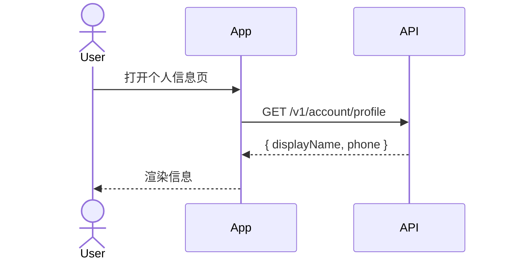

# Feature Specification: Account Profile Base

## User Journey Diagram

## Clarifications

### Session 2026-05-20

- Q: profile 返回是否包含完整手机号? → A: 否,中间 4 位掩码 (covers FR-002)

## User Scenarios & Testing

### User Story 1 — 查看个人信息 (Priority: P1)

**Why this priority**: 用户必须能查看自己的资料。

**Acceptance Scenarios**:
1. **Given** logged-in account, **When** open profile page, **Then** see displayName & masked phone

### Edge Cases

- 当 displayName 含 emoji 时如何展示? (covers FR-001)
- 用户 phone 被运营商回收后状态? (covers FR-002)

## Requirements

### Functional Requirements

- **FR-001**: System MUST return account profile
- **FR-002**: System MUST mask phone middle 4 digits

## Success Criteria

- **SC-001**: 95% of profile GET requests return in ≤ 200ms
- **SC-002**: 0 phone numbers exposed in plain text in API responses

## Assumptions

- 用户已通过登录流程
