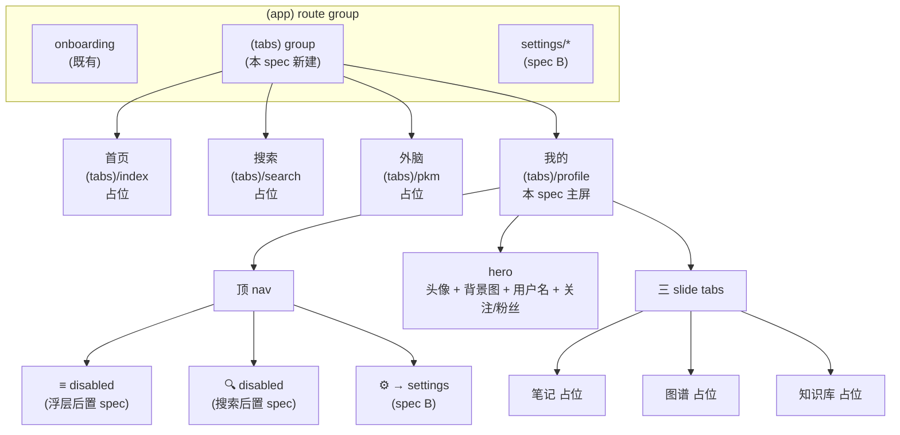
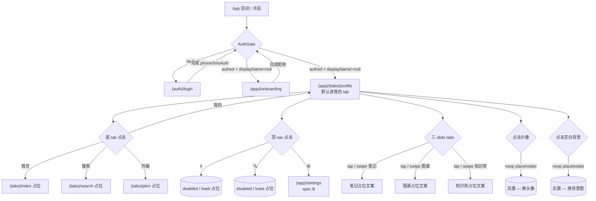

# Feature Specification: Account Profile（onboarding 信号 + displayName 维护 + 我的页骨架）

**Feature Branch**: `002-account-profile`
**Created**: 2026-05-04（server base） / 2026-05-07（client UI 段追加） / **mono migrated**: 2026-05-20
**Status**: Clarified（server 业务规则已 impl pending review；client UI 段已完成 /speckit.clarify）
**Module**: `account`（server `apps/server/src/modules/account` / mobile `apps/mobile/app/(app)/(tabs)/profile`）
**Input**:
- Server：phoneSmsAuth 不暴露 isNewAccount；客户端 auth 成功后查 `/me` 拿 displayName 决定是否进 onboarding 完善昵称；onboarding 强制不可跳。
- Client：建一个「我的」页，布局参考网易云音乐 — 顶 nav 三 entry / hero / 关注粉丝占位 / 三 slide tabs（笔记/图谱/知识库）/ 底 tab bar 4 项（首页/搜索/外脑/我的）。底 tab 是当前应用骨架的入口重构，本 spec 是 A → B → C 三步链（我的 → 设置 → 注销/解封 UI）的第一步。

> **2026-05-07 修订**：扩 `phone` 字段进 `/me` 响应（与前端账号与安全详情页联动 —— 详情页需 mask 显示 `+86 138****5678`）。原 FR-001 "deliberately narrow 4 fields" 立场被 supersede；**domain `Account.phone` 字段已存在**（注册即必填），本次仅扩 read shape，无 schema migration / domain 字段新增。
>
> **Context（server）**：ADR-0016 取消独立 register；新用户首登 auto-create 进 ACTIVE，**displayName 字段在 auto-create 时为 null**。客户端需独立信号决定路由 `(app)/onboarding` vs `(app)/`，本 spec 提供该信号 = `GET /api/v1/accounts/me`，并补 `PATCH /api/v1/accounts/me` 用于 onboarding 提交昵称。
>
> **反枚举不变性**：phoneSmsAuth 响应字节级不动（per ADR-0016 FR-006），displayName 仅在受 JWT 保护的 `/me` 流出。
>
> **决策约束（client）**：
>
> - **per ADR-0017 类 1 流程**：本 spec 阶段产出业务流 + 占位 UI；视觉决策（精确 px / hex / 阴影 / 自定义动画 / photo blur 沉浸式背景）**不进 spec / plan**，留 PHASE 2 mockup 落地后回填 plan.md UI 段
> - server 端 0 工作量：`/me` / `logout-all` / `delete-account` / `cancel-deletion` 全部已落地；本 spec 仅读 store 的 displayName（由 T031 packages/auth store 的 `loadProfile()` 写入；onboarding 流入口由后续 spec 引入）
> - 路由 `apps/mobile/app/(app)/(tabs)/profile.tsx` — 在 `(app)/(tabs)` 路由组内，受 AuthGate 第一层（`!authed → /(auth)/login`）保护；profile screen 自身无 auth 逻辑
> - **占位 UI 阶段不引入 packages/ui 新组件**（per FR-022）；现有共享组件（Button / Spinner 等）可复用，新组件等 PHASE 2 mockup 评估
> - 本 spec 是 SDD 拆分链 A → B → C 的 A；A → B 入口为「我的 → ⚙️ → 设置」，A → C 入口经 B 中转（账号与安全 → 注销账号）；本 spec 仅声明 `router.push('/(app)/settings')`，目标实现是 spec B 范围

## User Scenarios & Testing *(mandatory)*

### User Story 1 — [Server] 新用户首登：profile 缺失信号（Priority: P1）

<!-- us-meta: {"id": "US1", "priority": "P1", "independent_test": "Testcontainers PG + Redis；新用户经 phoneSmsAuth auto-create 后 GET /me 返 200 + phone=+8613900139000 + displayName=null", "trace_fr": ["FR-001", "FR-002", "FR-007"]} -->

新用户走 phoneSmsAuth auto-create 路径成功后，前端用 access token 调 `GET /api/v1/accounts/me`，server 返回 `displayName: null` —— 这是前端进 onboarding 的唯一触发条件。

**Why this priority**: 主路径，所有新用户首登必经；onboarding gate 决定路由的唯一信号源。

**Independent Test**: Testcontainers PG + Redis；POST `/api/v1/accounts/sms-codes` `{phone}` → POST `/api/v1/accounts/phone-sms-auth` `{phone, code}` 拿 access token → GET `/api/v1/accounts/me` with `Authorization: Bearer <access>` → 断言 200 + `phone: "+8613900139000"` + `displayName: null`。

**Acceptance Scenarios**:

1. **Given** 未注册号 `+8613900139000` 经 phoneSmsAuth auto-create 成功，**When** 持有 access token 调 GET `/api/v1/accounts/me`，**Then** 返回 200 + `{accountId, phone: "+8613900139000", displayName: null, status: "ACTIVE", createdAt}`；DB `account.display_name` 仍为 NULL（GET 不写库）
2. **Given** 同上账号，**When** 调 GET `/me` 多次，**Then** 每次响应字节级一致；幂等
3. **Given** access token 过期或缺失，**When** 调 GET `/me`，**Then** 返回 401 ProblemDetail（不区分"过期"vs"无效"，per FR-001 反枚举不暴露存在性）

---

### User Story 2 — [Server] Onboarding 提交：PATCH displayName（Priority: P1）

<!-- us-meta: {"id": "US2", "priority": "P1", "independent_test": "续 US1 流程 → PATCH /me {displayName: 小明} → 断言 200 + displayName=小明 + phone 透传不变；GET /me 返同值；DB account.display_name=小明", "trace_fr": ["FR-003", "FR-004", "FR-005", "FR-006"]} -->

新用户在 onboarding 页输入昵称后提交，前端调 `PATCH /api/v1/accounts/me` `{displayName}`，server 校验合法 → 写库 → 返回 200 + 最新 profile；前端再调 `/me` 确认（或直接信任 PATCH 响应）后路由跳 `/(app)/`。

**Why this priority**: 主路径；onboarding 完成的唯一写入入口。

**Independent Test**: 续 User Story 1 流程 → PATCH `/api/v1/accounts/me` `{displayName: "小明"}` → 断言 200 + `displayName: "小明"` + `phone` 透传不变；GET `/me` 返同值；DB `account.display_name = '小明'`。

**Acceptance Scenarios**:

1. **Given** 新用户 displayName=null，**When** PATCH `/me` `{displayName: "小明"}`，**Then** 返回 200 + 最新 profile（含原 `phone` + `displayName="小明"`）；DB 写入
2. **Given** 已有 displayName="小明"，**When** 再次 PATCH `/me` `{displayName: "小明"}`（同值），**Then** 返回 200 + 同 profile；幂等（更新 `updated_at` 但语义上无变化）
3. **Given** 已有 displayName="小明"，**When** PATCH `/me` `{displayName: "大明"}`，**Then** 返回 200 + `displayName: "大明"`；GET `/me` 同值
4. **Given** access token 过期或缺失，**When** PATCH `/me`，**Then** 返回 401（与 GET 一致路径）

---

### User Story 3 — [Server] 老用户回访：profile 已完整（Priority: P1）

<!-- us-meta: {"id": "US3", "priority": "P1", "independent_test": "预设 ACTIVE 账号 displayName=老张 → phoneSmsAuth 登录拿 access token → GET /me → 断言 200 + displayName=老张", "trace_fr": ["FR-001", "FR-002"]} -->

老用户（已完成 onboarding 历史落库 displayName）再次 phoneSmsAuth 登录，调 `GET /me` 返回 `displayName: "<已设值>"`，前端直跳 `/(app)/`，不进 onboarding。

**Why this priority**: 主路径；保证老用户每次登录不重复 onboarding。

**Independent Test**: 预设 ACTIVE 账号 displayName="老张" → phoneSmsAuth 登录拿 access token → GET `/me` → 断言 200 + `displayName: "老张"`。

**Acceptance Scenarios**:

1. **Given** ACTIVE 账号 `+8613800138000` 已有 displayName="老张"，**When** GET `/me`，**Then** 返回 200 + `displayName: "老张"`
2. **Given** 同账号 PATCH `/me` `{displayName: "老张"}`（同值再次提交），**Then** 200 + 不变；幂等

---

### User Story 4 — [Server] 异常账号：FROZEN / ANONYMIZED 鉴权（Priority: P2）

<!-- us-meta: {"id": "US4", "priority": "P2", "independent_test": "给 FROZEN / ANONYMIZED 账号签 token (手工调 JwtTokenService) → GET /me → 断言 401 (per FR-009 决策)", "trace_fr": ["FR-002", "FR-009"]} -->

冻结期 / 已匿名化账号即使持有未过期 access token，调 `/me` 也应被拒（status 检查兜底）。

**Why this priority**：合规边界；access token TTL 15min 可能跨越账号注销窗口。

**Independent Test**: 给 FROZEN / ANONYMIZED 账号签 token（手工调 `JwtTokenService`）→ GET `/me` → 断言 401 或 403（per FR-009 决策）。

**Acceptance Scenarios**:

1. **Given** access token sub=accountId（FROZEN 账号），**When** GET `/me`，**Then** 返回 401（与 token 过期 / 无效一致路径，反枚举吞）
2. **Given** access token sub=accountId（ANONYMIZED 账号），**When** GET `/me`，**Then** 同上 401

---

### User Story 5 — [Client] 已登录用户进入「我的」 tab（Priority: P1）

<!-- us-meta: {"id": "US5", "priority": "P1", "independent_test": "vitest + msw mock /me 返 {displayName: 小明} → 渲染 root layout → 断言 router decision 为 (app)/(tabs)/profile + profile screen 包含 小明 + 5 关注 / 12 粉丝 文案", "trace_fr": ["FR-013", "FR-014", "FR-016", "FR-018", "FR-019"]} -->

已 onboarded 用户（`displayName!=null`）冷启 / 登录完成 → AuthGate 第三态 → 默认 landing 在 `(app)/(tabs)/profile` → 渲染 hero（头像 / 用户名 / 假关注粉丝）+ 三 slide tabs（默认笔记）+ 顶 nav 三 entry。

**Why this priority**: 主路径，所有已 onboarded 用户冷启 / 登录后必经。

**Independent Test**: vitest + msw mock `/me` 返 `{displayName: "小明"}` → 渲染 root layout → 断言 router decision 为 `(app)/(tabs)/profile` + profile screen 渲染包含 "小明" + "5 关注" / "12 粉丝" 文案。

**Acceptance Scenarios**:

1. **Given** 用户 displayName="小明"，**When** AuthGate 评估，**Then** decision = `(app)/(tabs)/profile`
2. **Given** profile screen render 完成，**When** 检查 hero 区，**Then** 显示 "小明" + 关注/粉丝假数字 + 头像 placeholder + 背景图 placeholder
3. **Given** 三 slide tabs 渲染，**When** 检查 active tab，**Then** 默认为 "笔记"，underline 在第一个

---

### User Story 6 — [Client] 未登录用户点底 tab「我的」（Priority: P1）

<!-- us-meta: {"id": "US6", "priority": "P1", "independent_test": "vitest + auth store 设 accountId=null/accessToken=null → 模拟点击底 tab 我的 → 断言 router.replace 调用为 /(auth)/login + profile screen 未 render", "trace_fr": ["FR-027", "FR-028"]} -->

未登录用户（`!authed`）从其他 tab 点击底 tab「我的」 → AuthGate 第一层拦截 → `router.replace('/(auth)/login')`，profile screen **不渲染**。

**Why this priority**: 未登录态首要不变性 — 不能让未登录态读到任何用户数据（即使是假数字）。

**Independent Test**: vitest + auth store 设 `accountId=null / accessToken=null` → 模拟点击底 tab "我的" → 断言 router.replace 调用为 `/(auth)/login` + profile screen 未 render。

**Acceptance Scenarios**:

1. **Given** auth store 空，**When** 用户点底 tab「我的」，**Then** AuthGate 拦截 → router.replace `/(auth)/login`
2. **Given** 在 login 页完成 phoneSmsAuth，**When** AuthGate 重 evaluate（且 displayName!=null），**Then** router.replace 回 `(app)/(tabs)/profile`（不是 onboarding）

---

### User Story 7 — [Client] 三 slide tabs 切换 + sticky 滚动（Priority: P1）

<!-- us-meta: {"id": "US7", "priority": "P1", "independent_test": "vitest + RTL → 渲染 profile screen → fireEvent 点 图谱 tab → 断言 active tab state = 图谱 + 内容区切换；scroll 模拟测 sticky 行为 (scrollTo y > heroHeight → tabs sticky 状态触发)", "trace_fr": ["FR-020", "FR-021", "FR-030"]} -->

用户在 profile screen 点击三 slide tabs（"笔记" / "图谱" / "知识库"） → active tab 改变 + tab 内容区切换占位文案；underline 视觉跟随。**滚动到 tabs 触顶时，tabs 钉在顶 nav 下方，hero 区已滚出视口；内容区继续向上滚动**（sticky tabs paradigm，per CL-005 (b)）。Swipe 行为视 plan.md 评估（Open Question 1）。

**Why this priority**: 主交互 + 主 IA 验证 — slide tabs 是 PKM 视图未来落点；sticky 滚动是参考图核心视觉骨架。

**Independent Test**: vitest + RTL → 渲染 profile screen → fireEvent 点 "图谱" tab → 断言 active tab state = "图谱" + 内容区 textContent = "图谱占位文案"（具体文案 per FR-025）；scroll 模拟测 sticky 行为（scrollTo y > heroHeight → tabs 容器 sticky 状态触发，具体断言方式 plan.md 决，可能需 RTL fireEvent 'scroll' + style assertion）。

**Acceptance Scenarios**:

1. **Given** active tab = 笔记，**When** 用户点 "图谱"，**Then** active tab = 图谱 + 内容区切换 + underline 移到第二
2. **Given** active tab = 笔记，**When** swipe 启用且用户向左 swipe（plan.md 决是否启用），**Then** active tab = 图谱（下一 tab）
3. **Given** active tab = 知识库（最后一个），**When** 用户向左 swipe（若启用），**Then** **保持**（无下一 tab，不循环）
4. **Given** profile screen 内容区可滚动（超过屏高），**When** 用户向上滚 hero 已滚出视口，**Then** 三 slide tabs 钉在顶 nav 下方；**继续滚动**只滚内容区，sticky tabs 视觉位置不变

---

### User Story 8 — [Client] 点击 ⚙️ 跳设置（Priority: P1）

<!-- us-meta: {"id": "US8", "priority": "P1", "independent_test": "vitest + RTL → 渲染 profile screen → fireEvent 点 ⚙️ icon → 断言 router.push 调用为 /(app)/settings (目标实现在 spec B，本 spec 仅断言路径)", "trace_fr": ["FR-017"]} -->

用户在 profile screen 点击顶 nav 最右 ⚙️ → `router.push('/(app)/settings')`。

**Why this priority**: A → B 入口，链路验证。

**Independent Test**: vitest + RTL → 渲染 profile screen → fireEvent 点 ⚙️ icon → 断言 router.push 调用为 `/(app)/settings`（目标实现在 spec B，本 spec 仅断言路径）。

**Acceptance Scenarios**:

1. **Given** profile screen render 完成，**When** 用户点 ⚙️，**Then** router.push `/(app)/settings`
2. **Given** spec B 未实现（目标 route 缺失），**When** 用户点 ⚙️，**Then** Expo Router 行为容错（导航失败不 crash；此期间用户视觉上停留 profile；实际 spec B impl 会让 route 存在）

---

### User Story 9 — [Client] 顶 nav ≡ / 🔍 占位（Priority: P2）

<!-- us-meta: {"id": "US9", "priority": "P2", "independent_test": "vitest + RTL → fireEvent 点 ≡ → 断言无 router 调用 + 无 alert / no-op；同样测 🔍", "trace_fr": ["FR-017", "FR-022"]} -->

用户点击顶 nav 左 ≡ 或 🔍 → 占位反馈（无操作 / "暂未开放" toast，具体形式 PHASE 2 mockup 决定）；**不**触发任何 navigation。

**Why this priority**: 占位入口可见性，防误用；真功能后置 spec。

**Independent Test**: vitest + RTL → fireEvent 点 ≡ → 断言无 router 调用 + 无 alert / no-op；同样测 🔍。

**Acceptance Scenarios**:

1. **Given** profile screen，**When** 用户点 ≡ 或 🔍，**Then** 无 router 调用 + 视觉上有 disabled 状态指示（如 opacity 减 / pressed 反馈）
2. **Given** PHASE 1，**When** 同样点击，**Then** 可选弹 toast "敬请期待"（PHASE 2 mockup 定 toast 文案 / 形式）

---

### User Story 10 — [Client] 头像 / 背景图点击占位（Priority: P2）

<!-- us-meta: {"id": "US10", "priority": "P2", "independent_test": "vitest + RTL → fireEvent 点头像 / 背景空白 → 断言无 router 调用 + 无文件选择器调用", "trace_fr": ["FR-018"]} -->

用户点击头像 → noop（后置 — 换头像）；点击空白背景 → noop（后置 — 换背景图）。

**Why this priority**: hero 区 affordance 一致性 — 让占位有明确"未来可点击"信号但不实际操作。

**Independent Test**: vitest + RTL → fireEvent 点头像 / 背景空白 → 断言无 router 调用 + 无文件选择器调用。

**Acceptance Scenarios**:

1. **Given** profile screen，**When** 用户点头像，**Then** 触发 onPress 但 handler 是 noop（可加 console.debug 占位 log）
2. **Given** 同上，**When** 用户点空白背景，**Then** 同样 noop

---

### User Story 11 — [Client] 底 tab bar 4 项切换（Priority: P1）

<!-- us-meta: {"id": "US11", "priority": "P1", "independent_test": "vitest + RTL → 渲染 (tabs) layout → fireEvent 依次点 4 个 tab → 断言每次 active tab 切换 + 内容区切换 + URL 变化", "trace_fr": ["FR-013", "FR-015"]} -->

用户在 `(tabs)` 内点底 tab → 切换到对应 tab screen；非「我的」 tab 渲染占位文案 "功能即将推出"。

**Why this priority**: 应用骨架基础；tab 切换不抖、URL 正确变化是 navigation 健康度信号。

**Independent Test**: vitest + RTL → 渲染 `(tabs)` layout → fireEvent 依次点 4 个 tab → 断言每次 active tab 切换 + 内容区切换 + URL 变化。

**Acceptance Scenarios**:

1. **Given** active tab = 我的，**When** 用户点 "首页" tab，**Then** active tab = 首页 + 内容区 = 首页占位 + URL `/(tabs)/`（index）
2. **Given** active tab = 首页，**When** 用户点 "搜索" / "外脑" / "我的"，**Then** 各自切换正确
3. **Given** 任意 tab，**When** 用户重复点同一 tab，**Then** noop（不重新 mount）

---

### User Story 12 — [Client] Rehydrate 不抖（Priority: P1）

<!-- us-meta: {"id": "US12", "priority": "P1", "independent_test": "模拟 store rehydrate 完成 (含 displayName) → AuthGate 首次 render → 断言 router.replace 调用次数 = 0", "trace_fr": ["FR-014", "FR-028"]} -->

用户已在 `(app)/(tabs)/profile` 或其他 tab 内，刷新 / 冷启 app 后 AuthGate 应保持当前 tab；不闪 splash → login → onboarding → profile 多余跳转。

**Why this priority**: 体验细节 — 刷新闪烁是 RN Web 上肉眼可见的 D 类 bug。

**Independent Test**: 模拟 store rehydrate 完成（含 displayName） → AuthGate 首次 render → 断言 router.replace 调用次数 = 0。

**Acceptance Scenarios**:

1. **Given** rehydrate 完成 + displayName="小明" + URL=`(tabs)/profile`，**When** 首次 render，**Then** stay，无 router.replace
2. **Given** rehydrate in-flight，**When** 首次 render，**Then** 渲染 splash / loading 占位，不立即跳路由

---

### Edge Cases

#### Server Edge Cases

- **DisplayName 为空字符串 / 空白字符串**：trim 后长度 0 → 返回 `INVALID_DISPLAY_NAME` 400 (covers FR-005)
- **DisplayName 含控制字符**（含 `U+0000`-`U+001F` / `U+007F` / 零宽 `U+200B`-`U+200F` 等）：拒绝 `INVALID_DISPLAY_NAME` 400 (covers FR-005)
- **DisplayName 仅含 emoji**：允许（per CL-004），如 `"🎉🌸"` 长度 2 合法 (covers FR-005)
- **DisplayName 含 CJK 字符**：按 Unicode 码点计数（不按字节），如 `"小明"` 长度 2 (covers FR-005)
- **PATCH body 缺 displayName 字段**：返回 `VALIDATION_FAILED` 400（必填字段缺失校验拒绝）(covers FR-003, FR-005)
- **PATCH body 含未知字段**：忽略（未知字段策略 = 忽略而非拒绝，与既有约定一致）(covers FR-003)
- **同一 access token 高频调 PATCH**：复用既有 `@nestjs/throttler` 配置（throttler name `me-patch`，60s 10 次，tracker = `<accountId>` from JWT sub） (covers FR-008)

#### Client Edge Cases

- **加载 `/me` 失败**（既有 onboarding 流处理）：AuthGate 不死锁；fallback = stay 当前路由 + 静默重试 / retry 按钮 (covers FR-014)
- **profile screen render 时 displayName 仍为 null**（竞态）：罕见；直接渲染占位 "未命名" 而非闪 onboarding（因 AuthGate 应已分流） (covers FR-018)
- **三 slide tabs 横滑距离不足以切换**：沿用 `react-native-pager-view` 或自实现 threshold（plan.md 决定），太短手势 → 回弹原 tab (covers FR-020)
- **底 tab bar SafeArea 适配**（iOS home indicator）：用 `useSafeAreaInsets()` paddingBottom；`(tabs)/_layout.tsx` 内统一处理 (covers FR-026)
- **手势冲突**（三 slide tabs swipe vs 底 tab swipe）：底 tab bar 不响应 horizontal swipe（默认行为），仅 tap 切换；无冲突 (covers FR-020, FR-013)
- **小屏 / 长用户名**：用户名 > 屏宽时 `numberOfLines=1` + `ellipsizeMode='tail'` (covers FR-018)
- **横屏旋转**（M1 仅竖屏）：假设竖屏锁定（per existing app config）；本 spec 不处理横屏
- **Android hardware back 在 `(tabs)`**：用户在 `(tabs)/profile` 按 back → 沿用 Expo Router Tabs 默认行为（若 tab 内有 navigation history 先 pop；否则 exit app）；跨 tab 切换不计入 back history（默认 `backBehavior: 'firstRoute'` 等行为视 Expo Router 版本）；plan.md / T8 集成测验证默认行为符合预期，若不符再加 `Tabs.Screen` 的 `backBehavior` 配置 (covers FR-013)

## Requirements *(mandatory)*

### Server Functional Requirements

- **FR-001**: GET endpoint — 唯一 endpoint `GET /api/v1/accounts/me`；无入参；响应 `{accountId, phone: string, displayName: string | null, status, createdAt}` 或 RFC 9457 ProblemDetail 错误。`phone` 是 E.164 raw 字符串（如 `+8613800138000`），mask 由前端按需处理（per `apps/mobile/lib/format/phone.ts#maskPhone`）；ACTIVE 路径 `phone` 必非 null（ANONYMIZED 状态 phone 为 null 但被 FR-009 拦截，不可达此响应）
  <!-- fr-meta: {"id": "FR-001", "priority": "must", "needs_clarification": false, "questions": [], "trace_us": ["US1", "US3"], "trace_sc": ["SC-001", "SC-003"]} -->

- **FR-002**: GET 鉴权 — 必须 `Authorization: Bearer <access_token>` 头；缺失 / 无效 / 过期 / 账号 status != ACTIVE → **统一 401**（不区分原因，per User Story 4 反枚举）
  <!-- fr-meta: {"id": "FR-002", "priority": "must", "needs_clarification": false, "questions": [], "trace_us": ["US1", "US3", "US4"], "trace_sc": ["SC-005"]} -->

- **FR-003**: PATCH endpoint — `PATCH /api/v1/accounts/me`；入参 `{displayName: string}`；响应同 GET 200 形态
  <!-- fr-meta: {"id": "FR-003", "priority": "must", "needs_clarification": false, "questions": [], "trace_us": ["US2"], "trace_sc": ["SC-002"]} -->

- **FR-004**: PATCH 鉴权 — 同 FR-002；不通过 → 401
  <!-- fr-meta: {"id": "FR-004", "priority": "must", "needs_clarification": false, "questions": [], "trace_us": ["US2"], "trace_sc": ["SC-005"]} -->

- **FR-005**: DisplayName 校验规则（与前端镜像）— 长度 trim 后 Unicode 码点数 ∈ [1, 32]；字符集允 CJK / 拉丁 / 数字 / 常见标点 / emoji（Unicode 9.0+）；禁字符控制字符（`U+0000`-`U+001F` / `U+007F`）/ 零宽字符（`U+200B`-`U+200F` / `U+FEFF`）/ 行分隔符（`U+2028` / `U+2029`）；trim 行为前后空白 trim 后再校验长度，存储 trim 后的值；失败 → `INVALID_DISPLAY_NAME` 400 ProblemDetail
  <!-- fr-meta: {"id": "FR-005", "priority": "must", "needs_clarification": false, "questions": [], "trace_us": ["US2"], "trace_sc": ["SC-006"]} -->

- **FR-006**: 不要求全局唯一 — 多账号可同 displayName；DB 不加 unique 约束
  <!-- fr-meta: {"id": "FR-006", "priority": "must", "needs_clarification": false, "questions": [], "trace_us": ["US2"], "trace_sc": []} -->

- **FR-007**: auto-create 默认值 — phoneSmsAuth 自动注册路径 `account.display_name = NULL`；本 spec 不修改 phoneSmsAuth 行为，仅声明该不变性约束（实际由 V6 migration 默认 NULL + Account 聚合构造路径不写值保证）
  <!-- fr-meta: {"id": "FR-007", "priority": "must", "needs_clarification": false, "questions": [], "trace_us": ["US1"], "trace_sc": []} -->

- **FR-008**: 限流 — 复用既有 `@nestjs/throttler` 模块（001 `auth.module.ts` 已配 `ThrottlerModule.forRootAsync` + Redis storage）：新增 `me-get` (60s 60 次，防爆刷读) / `me-patch` (60s 10 次，防爆刷写) 两条 named throttler 配置，tracker = `<accountId>` (JWT sub claim)；超限 → 429 + `Retry-After`
  <!-- fr-meta: {"id": "FR-008", "priority": "must", "needs_clarification": false, "questions": [], "trace_us": ["US1", "US2"], "trace_sc": ["SC-004"]} -->

- **FR-009**: FROZEN / ANONYMIZED 拒接 token — JwtAuthFilter 验签后必须查 DB 验 `Account.status == ACTIVE`；非 ACTIVE → 401 ProblemDetail（与 token 过期一致路径）
  <!-- fr-meta: {"id": "FR-009", "priority": "must", "needs_clarification": false, "questions": [], "trace_us": ["US4"], "trace_sc": ["SC-005"]} -->

- **FR-010**: 错误响应格式 — 所有错误遵循 RFC 9457 ProblemDetail（`application/problem+json`）；由全局异常 filter 映射；与既有 use case 一致
  <!-- fr-meta: {"id": "FR-010", "priority": "must", "needs_clarification": false, "questions": [], "trace_us": ["GLOBAL"], "trace_sc": []} -->

- **FR-011**: 事件 — PATCH 成功路径**不发**事件（profile 字段更新非业务关键事件；M2+ 真有 cross-module 监听需求时再加 `AccountProfileUpdatedEvent`，per Out of Scope）
  <!-- fr-meta: {"id": "FR-011", "priority": "should", "needs_clarification": false, "questions": [], "trace_us": ["US2"], "trace_sc": []} -->

- **FR-012**: OpenAPI 暴露 — controller 装饰器自动派生 OpenAPI schema；本 spec 不预定义 OpenAPI 字节，仅约束行为（per Constitution § OpenAPI = data, spec.md = rules）
  <!-- fr-meta: {"id": "FR-012", "priority": "must", "needs_clarification": false, "questions": [], "trace_us": ["GLOBAL"], "trace_sc": []} -->

### Client Functional Requirements

- **FR-013**: 路由组 `(tabs)` — 新建 `(tabs)` 路由组：`apps/mobile/app/(app)/(tabs)/_layout.tsx` 含 Tabs.Screen × 4（`index` / `search` / `pkm` / `profile`）；label 中文（`首页 / 搜索 / 外脑 / 我的`），代码 path 用英文（`(tabs)/index` `(tabs)/search` `(tabs)/pkm` `(tabs)/profile`）
  <!-- fr-meta: {"id": "FR-013", "priority": "must", "needs_clarification": false, "questions": [], "trace_us": ["US5", "US11"], "trace_sc": ["SC-008", "SC-016"]} -->

- **FR-014**: AuthGate 第三态默认 tab — 目标从 `/(app)/` 改为 `/(app)/(tabs)/profile`（默认进我的 tab — 本批次唯一有内容的 tab）；决策函数 `auth-gate-decision.ts` 同步更新
  <!-- fr-meta: {"id": "FR-014", "priority": "must", "needs_clarification": false, "questions": [], "trace_us": ["US5", "US12"], "trace_sc": ["SC-009", "SC-014"]} -->

- **FR-015**: 其他 3 个 placeholder page — `(tabs)/index.tsx` / `(tabs)/search.tsx` / `(tabs)/pkm.tsx` 三个 placeholder page；每页含 `// PHASE 1 PLACEHOLDER` banner + 单一 `<Text>功能即将推出</Text>`；现有 `/(app)/index.tsx` 替换为 `(tabs)/index.tsx`（内容相同）
  <!-- fr-meta: {"id": "FR-015", "priority": "must", "needs_clarification": false, "questions": [], "trace_us": ["US11"], "trace_sc": ["SC-016"]} -->

- **FR-016**: profile screen 三大区域 — `(tabs)/profile.tsx`：顶 nav 区（三 entry） + hero 区（头像 / 背景 / 用户名 / 关注粉丝） + 三 slide tabs 区（笔记 / 图谱 / 知识库 + 内容占位）
  <!-- fr-meta: {"id": "FR-016", "priority": "must", "needs_clarification": false, "questions": [], "trace_us": ["US5"], "trace_sc": ["SC-008"]} -->

- **FR-017**: 顶 nav 三 entry — 左 `<Pressable>≡</Pressable>` (disabled handler) / 中右 `<Pressable>🔍</Pressable>` (disabled handler) / 最右 `<Pressable>⚙️</Pressable>` (`router.push('/(app)/settings')`)；settings stack **位于 `(app)/settings/*`**（即 `(tabs)/` **之外**，per CL-006），Expo Router 默认隐藏底 tab bar；具体图标资源 PHASE 2 决定，占位用 emoji 或 `<Text>` 字符
  <!-- fr-meta: {"id": "FR-017", "priority": "must", "needs_clarification": false, "questions": [], "trace_us": ["US8", "US9"], "trace_sc": ["SC-012"]} -->

- **FR-018**: hero 区 — 头像 placeholder 图（`packages/ui/src/assets/avatar-placeholder-default.png` 等系统默认资源，具体文件名 plan.md 定）；用户名读 `useAuthStore(s => s.displayName)`；头像 + 空白背景 `<Pressable>` onPress = noop placeholder（可加 `console.debug('[my-profile] avatar press — placeholder')`）
  <!-- fr-meta: {"id": "FR-018", "priority": "must", "needs_clarification": true, "questions": [{"q": "头像 / 背景 placeholder 资源选哪张 — 是否复用 packages/ui 现成资源还是 apps/mobile/assets/ 新增？", "options": ["复用 packages/ui", "apps/mobile/assets/ 新增", "plan.md 决"]}], "trace_us": ["US5", "US10"], "trace_sc": ["SC-008"]} -->

- **FR-019**: 关注 / 粉丝行 — 渲染 `<Text>5 关注</Text>` + `<Text>12 粉丝</Text>`（全局假数字，常量定义在 page top）；**非交互**（无 `<Pressable>` 包裹）
  <!-- fr-meta: {"id": "FR-019", "priority": "must", "needs_clarification": false, "questions": [], "trace_us": ["US5"], "trace_sc": ["SC-013"]} -->

- **FR-020**: 三 slide tabs 状态机 — `activeTab: 'notes' | 'graph' | 'kb'`，初始 `'notes'`（默认笔记）；切换由 **tap** 触发（必含）；horizontal **swipe** 触发（可选，plan.md 决定是否本批次实现 — 见 Open Question 1）；**不 persist**（冷启回 'notes'，跨底 tab 切走再回**保持** per CL-007）
  <!-- fr-meta: {"id": "FR-020", "priority": "must", "needs_clarification": true, "questions": [{"q": "三 slide tabs 是否本批次实现 swipe 切换？", "options": ["仅 tap（最简）", "tap + swipe（成熟 UX 但复杂度高）"]}], "trace_us": ["US7"], "trace_sc": ["SC-010"]} -->

- **FR-021**: 三 slide tabs 内容区 — 每 tab 渲染单 `<Text>` 占位文案（如 "笔记内容即将推出"）；无实际数据 fetch / 列表 / 卡片
  <!-- fr-meta: {"id": "FR-021", "priority": "must", "needs_clarification": false, "questions": [], "trace_us": ["US7"], "trace_sc": ["SC-010"]} -->

- **FR-022**: 占位 UI 4 边界（per ADR-0017 类 1 强制纪律）— 路由结构（FR-013） ✓ / 单层 form-equivalent 输入（本 spec 无 input — 替代为"状态切换"是 slide tabs activeTab） / 提交事件（替代为 tab 切换 + nav button press） / 状态机视觉指示（active tab underline / disabled 状态 opacity） / 错误展示位（本 spec 无网络请求 — 无错误展示）；**全裸 RN，禁引 packages/ui 新抽组件**；每 page 顶 `// PHASE 1 PLACEHOLDER — business flow validated; visuals pending mockup.` banner
  <!-- fr-meta: {"id": "FR-022", "priority": "must", "needs_clarification": false, "questions": [], "trace_us": ["US5", "US9"], "trace_sc": ["SC-011"]} -->

- **FR-023**: 不引入 packages/ui 新抽象组件（如 `<ProfileHero>` / `<SlideTabs>` / `<TopBar>`）— 现有共享组件（`Spinner` 等）按需复用；新组件 PHASE 2 mockup 落地后再评估
  <!-- fr-meta: {"id": "FR-023", "priority": "must", "needs_clarification": false, "questions": [], "trace_us": ["GLOBAL"], "trace_sc": ["SC-011"]} -->

- **FR-024**: 底 tab bar 占位视觉 — Expo Router `Tabs` 默认 options（label + title 中文）；**无图标**（`tabBarIcon: undefined`）；图标系统由 PHASE 2 mockup 决定；active 视觉用 Expo Router 默认行为
  <!-- fr-meta: {"id": "FR-024", "priority": "must", "needs_clarification": false, "questions": [], "trace_us": ["US11"], "trace_sc": ["SC-015"]} -->

- **FR-025**: i18n 不引入（per CLAUDE.md M1 现状）— 所有文案硬编中文，但**集中在 page top const**（如 `const COPY = { followers: '5 关注', ... }`）以方便后续抽离
  <!-- fr-meta: {"id": "FR-025", "priority": "should", "needs_clarification": false, "questions": [], "trace_us": ["GLOBAL"], "trace_sc": []} -->

- **FR-026**: a11y — 三 slide tabs 用 `accessibilityRole='tab'` + `accessibilityState.selected`；顶 nav 三 entry `accessibilityRole='button'` + `accessibilityLabel`；disabled entry `accessibilityState.disabled=true`；hero 头像 / 背景 `accessibilityHint='点击更换'`（尽管 noop）
  <!-- fr-meta: {"id": "FR-026", "priority": "must", "needs_clarification": false, "questions": [], "trace_us": ["US5", "US7", "US9"], "trace_sc": ["SC-012"]} -->

- **FR-027**: SafeArea 适配 — `(tabs)/_layout.tsx` 用 `useSafeAreaInsets()` 处理底 tab bar 高度 + iOS home indicator；profile screen 顶部用既有 `<SafeAreaView>` 模式（per onboarding）
  <!-- fr-meta: {"id": "FR-027", "priority": "must", "needs_clarification": false, "questions": [], "trace_us": ["US5"], "trace_sc": []} -->

- **FR-028**: 未登录态由 AuthGate 第一层处理（per onboarding spec FR-001）— profile screen 自身**不**做 auth 判断
  <!-- fr-meta: {"id": "FR-028", "priority": "must", "needs_clarification": false, "questions": [], "trace_us": ["US6", "US12"], "trace_sc": ["SC-014"]} -->

- **FR-029**: 头像 / 背景占位资源 — **不引图片资源**（per plan.md 决策 2）；头像用 `<View>` + `<Text>👤</Text>`（系统 emoji 字体），背景用裸 `<View>`（无图）；PHASE 2 mockup 落地时一并引入实际 PNG / SVG。理由：占位 UI 4 边界严禁视觉决策（per ADR-0017），图片资源涉及尺寸 / 风格 / 主题 — 本批次不锁
  <!-- fr-meta: {"id": "FR-029", "priority": "must", "needs_clarification": false, "questions": [], "trace_us": ["US5", "US10"], "trace_sc": ["SC-011"]} -->

- **FR-030**: 滚动行为（per CL-005 (b) sticky tabs）— 整页有单一垂直滚动容器；hero 区随滚动消失；三 slide tabs 区触顶后**钉在顶 nav 下方**（sticky）；内容区在 sticky tabs 下延续滚动。具体实现选型（单 `<ScrollView>` + `stickyHeaderIndices` / 第三方 collapsible-tab-view / pager-view 组合）由 plan.md 决，占位 UI 阶段倾向最简方案（单 ScrollView + stickyHeaderIndices）
  <!-- fr-meta: {"id": "FR-030", "priority": "must", "needs_clarification": true, "questions": [{"q": "sticky tabs 实现选哪种？", "options": ["单 ScrollView + stickyHeaderIndices（最简）", "react-native-collapsible-tab-view（成熟 + 第三方依赖）", "ScrollView + pager-view 组合（自组合）"]}], "trace_us": ["US7"], "trace_sc": ["SC-010"]} -->

## Key Entities

- **Account（聚合根）**：扩展既有 Account
  - **新增字段** `displayName: DisplayName | null`，nullable，无 unique 约束
  - 新增行为 `changeDisplayName(DisplayName, Instant updatedAt)`（package-private，经 `AccountStateMachine.changeDisplayName(Account, DisplayName, Instant)` 调用，与既有 `markLoggedIn` aggregate-method pattern 一致）
  - **2026-05-07 修订**：`phone: Phone`（既有字段，注册即必填；code-level class 名 `Phone` 见 `phone.vo.ts`）现 mirror 进 `/me` read 路径 — 不新增 domain 字段，仅 `AccountProfileResult` / `AccountProfileResponse` 两层 record 加 phone component；DB schema 零改动
- **新增**：`DisplayName` 值对象（domain 层）
  - record-style，mirror 既有 `Phone` VO (`phone.vo.ts`，private constructor + static factory)
  - 构造校验 FR-005 全部规则
  - 抛 `IllegalArgumentException("INVALID_DISPLAY_NAME: ...")`，由全局异常 filter 映射 400
- **删除**：无

```json entities
{
  "entities": [
    {
      "id": "E1",
      "name": "Account",
      "domain": "account",
      "aggregate_root": true,
      "attrs": [
        { "name": "accountId", "type": "string" },
        { "name": "phone", "type": "string", "format": "E.164" },
        { "name": "displayName", "type": "string | null", "max_len": 32 },
        { "name": "status", "type": "enum" },
        { "name": "createdAt", "type": "Instant" }
      ],
      "relations": []
    },
    {
      "id": "E2",
      "name": "DisplayName",
      "domain": "account",
      "aggregate_root": false,
      "attrs": [
        { "name": "value", "type": "string", "max_len": 32 }
      ],
      "relations": [
        { "to": "E1", "kind": "1:1" }
      ]
    }
  ]
}
```

## Success Criteria *(mandatory)*

### Server Measurable Outcomes

- **SC-001**: GET `/me` P95 ≤ 100ms（不含 token 验签 IO，从 controller 入到 200 响应）
- **SC-002**: PATCH `/me` P95 ≤ 150ms（含 DB write）
- **SC-003**: `/me` 与 `phoneSmsAuth` 字节级解耦 — phoneSmsAuth 响应 schema **零改动**；displayName 字段**仅**出现在 `/me` 响应中（grep `displayName` 不命中 `PhoneSmsAuthResponse` / `LoginResponse`）
- **SC-004**: 限流准确性 — FR-008 两条规则集成测试验证生效；429 + 正确 `Retry-After`
- **SC-005**: FROZEN / ANONYMIZED 账号持有未过期 access token 调 `/me` 必返 401（FR-009 集成测试覆盖）
- **SC-006**: DisplayName 校验规则集成测试覆盖：[空 / 仅空白 / 控制字符 / 零宽字符 / 33 码点超长 / CJK 32 字 / emoji-only / 混合合法] 8 个 case，全部按 FR-005 命中或放过
- **SC-007**: module 边界 CI 检查（per ADR-0020）仍 0 violation；DisplayName VO 在 domain 层 0 framework 依赖

### Client Measurable Outcomes

- **SC-008**: Client User Story (US5-US12) 全部 happy path 单测通过 — `pnpm --filter mobile test` + `pnpm --filter @nvy/auth test` 全绿
- **SC-009**: AuthGate 第三态目标更新为 `(tabs)/profile` 且不抖：9 子 case 单测断言（per onboarding SC-002 模式扩展）— vitest 表驱动
- **SC-010**: 三 slide tabs 状态机：`activeTab` 三态 × tap/swipe 触发 = 6 子 case 单测断言切换 + active 视觉指示 — vitest
- **SC-011**: 占位 UI 0 视觉决策：`(tabs)/profile.tsx` + `(tabs)/_layout.tsx` + 3 placeholder page **不含** hex / px / rgb 字面量 / 复杂样式属性（除 `flex` / `padding` 等基础布局）/ 新 packages/ui import — grep 静态分析 + manual review
- **SC-012**: 真后端冒烟：Playwright 跑（已 onboarded 用户） → 进 `(tabs)/profile` → 渲染 hero + 三 slide tabs → tap "图谱" tab 切换 → 点 ⚙️ 触发 router.push `/(app)/settings`（spec B 未实现时容错不 crash）→ 截图归档（手动跑 + `runtime-debug/2026-05-XX-my-profile-business-flow/`）
- **SC-013**: 反枚举不变性：profile screen / hero 区**不读 / 不渲染** `account.id` 数字；grep `accountId` 在本 spec 实现文件**仅**用于 store key 访问（不出现在 `<Text>{accountId}>` 等 render）— grep 静态分析
- **SC-014**: rehydrate 不抖：已 onboarded 用户冷启在 `(tabs)/profile` → AuthGate 首次 render → router.replace 调用次数 = 0 — vitest
- **SC-015**: 底 tab bar 视觉占位：渲染 4 个 label（首页 / 搜索 / 外脑 / 我的），无图标 / 自定义视觉决策 — manual review + grep `tabBarIcon` 应为 undefined
- **SC-016**: 现有 `/(app)/index.tsx` 已迁移为 `(tabs)/index.tsx`（首页 tab）：git diff 验证 file rename；原 home 占位文案保留或更新为 "首页内容即将推出" — git diff + manual
- **SC-017**: logout 路径不影响 tabs 结构：`logoutLocal` / `logoutAll`（既有）被调用后，`(tabs)` umount 干净 → 跳 `/(auth)/login` 无残留 view — vitest 集成测

## Clarifications

> server 端 4 点澄清（CL-001 ~ CL-004）于 2026-05-04 与 ADR-0016 / ADR-0017 决策同期完成；client 端 5 项 Cross-cutting Clarifications（CL-005 ~ CL-009）于 2026-05-07 完成。

### CL-001: onboarding 是否可跳过 [from server]

<!-- cl-meta: {"id": "CL-001", "resolved": true, "resolved_at": "2026-05-04", "trace_fr": ["FR-001"]} -->

**Q**：用户是否可以在 onboarding 页选"稍后再说"跳过 displayName 设置直接进 home？

**A**：**强制不可跳**。displayName=null 即视为 onboarding 未完成，前端 AuthGate 路由强制 `→ /onboarding`；用户唯一出口 = 提交合法昵称 / 登出。理由：(1) UX 一致性 — 所有用户进 home 即有昵称；(2) 减少前端"匿名状态"分支复杂度；(3) M2+ 想引入 avatar / bio 时不需重新规划 gate 逻辑。

**落点**：FR-001 GET 返 `null` → 前端 AuthGate 强制跳 onboarding；本 spec 不引入"skip" endpoint。

### CL-002: DisplayName 是否要求全局唯一 [from server]

<!-- cl-meta: {"id": "CL-002", "resolved": true, "resolved_at": "2026-05-04", "trace_fr": ["FR-006"]} -->

**Q**：两个用户能否同名（如都叫"小明"）？

**A**：**不要求 unique**。理由：(1) 大陆主流 app（微信 / 小红书 / 网易云）都允许同名；(2) 唯一性 = 抢注问题（恶意先到先得 + 用户体验差）；(3) 真要"唯一身份"应走 phone（已天然唯一）。

**落点**：FR-006 显式声明；DB schema 无 unique index。

### CL-003: avatar 是否本期范围 [from server]

<!-- cl-meta: {"id": "CL-003", "resolved": true, "resolved_at": "2026-05-04", "trace_fr": ["FR-001", "FR-003"]} -->

**Q**：onboarding 是否同期收集头像？

**A**：**不**。avatar 涉及对象存储（OSS bucket / 上传流 / 缩略图），本期范围聚焦 displayName 单字段闭环；avatar 推迟 M2+（与 PKM workspace 初始化等模块联动评估）。

**落点**：Out of Scope 显式列出；本 spec 不引入头像字段 / 上传 endpoint。

### CL-004: DisplayName 字符集 / 长度细则 [from server]

<!-- cl-meta: {"id": "CL-004", "resolved": true, "resolved_at": "2026-05-04", "trace_fr": ["FR-005"]} -->

**Q**：emoji / CJK / 零宽 / 控制字符各允禁如何取舍？

**A**：(1) 长度 [1,32] Unicode 码点（不按字节，避免 CJK 用户 16 字符即吃满 32 字节）；(2) 允 emoji（含 4 字节 surrogate pair，按码点 1 计）；(3) 允 CJK / 拉丁 / 数字 / 常见标点；(4) 禁 ASCII / Unicode 控制字符 + 零宽字符 + 行分隔符（防欺骗 / 注入）。

**落点**：FR-005 完整列出；DisplayName VO 构造时校验。

### CL-005: 滚动 paradigm（hero + slide tabs + 内容区）[from client]

<!-- cl-meta: {"id": "CL-005", "resolved": true, "resolved_at": "2026-05-07", "trace_fr": ["FR-030", "FR-020"]} -->

**决议**：**(b) sticky tabs** — hero 跟随整页滚动消失 → 三 slide tabs 触顶钉住（钉在顶 nav 下方）→ 内容区在 sticky tabs 下延续滚动（网易云风格）。具体技术实现（单 `<ScrollView>` + `stickyHeaderIndices` / `react-native-collapsible-tab-view` / `react-native-pager-view` 组合）**留 plan.md 决**；占位 UI 阶段如 swipe + sticky 组合复杂度过高，可先降级仅 tap 切换 + sticky 滚动（per Open Question 1）。

**落点**：FR-030 滚动行为 + FR-020 swipe 改可选。

### CL-006: 底 tab bar 在 settings / 注销等 stack push 后是否可见 [from client]

<!-- cl-meta: {"id": "CL-006", "resolved": true, "resolved_at": "2026-05-07", "trace_fr": ["FR-017"]} -->

**决议**：**(b) push 后隐藏** — settings / 账号与安全 / 注销 / 解封 等"专注操作"stack 路由放在 `apps/mobile/app/(app)/settings/*`（即 `(app)/(tabs)/` **之外**），Expo Router 默认在 `(tabs)` 之外的 stack 自动隐藏底 tab bar；返回 profile 后底 tab 恢复。

**落点**：FR-017 ⚙️ → `router.push('/(app)/settings')`；settings 路径声明 spec B。

### CL-007: 跨底 tab 切换后三 slide tabs activeTab 是否保持 [from client]

<!-- cl-meta: {"id": "CL-007", "resolved": true, "resolved_at": "2026-05-07", "trace_fr": ["FR-020"]} -->

**决议**：**(a) 保持** — Expo Router Tabs 默认 tab 不 unmount（`unmountOnBlur=false`），activeTab in-session 内保持；冷启 / app 重启回 'notes'（per FR-020 不 persist）；无额外实现成本。

**落点**：FR-020 切换语义补 "跨底 tab 切走再回保持"。

### CL-008: 未登录用户 deep link 直接访问 `/(tabs)/profile` [from client]

<!-- cl-meta: {"id": "CL-008", "resolved": true, "resolved_at": "2026-05-07", "trace_fr": ["FR-028"]} -->

**决议**：**(a) AuthGate 第一层拦截 → router.replace `/(auth)/login`** — 与点底 tab 同 UX（per User Story 6）；profile screen 自身仍**不**做 auth 判断，统一由 AuthGate 既有逻辑处理。

**落点**：FR-028；User Story 6 acceptance scenario 1 覆盖。

### CL-009: 冷启 landing tab（URL 记忆 vs 强制回我的）[from client]

<!-- cl-meta: {"id": "CL-009", "resolved": true, "resolved_at": "2026-05-07", "trace_fr": ["FR-014"]} -->

**决议**：**(b) 强制回我的 tab** — M1.X 简化：AuthGate 第三态固定 `(tabs)/profile`（per FR-014）；用户上次离开在 "首页" tab，冷启回 "我的" tab（其他 tab 占位无内容，回别的 tab 体验差）；PHASE 2+ 引入 URL state 记忆再评估。

**落点**：FR-014；User Story 12 rehydrate 不抖断言。

---

## Information Architecture（client）



## User Flow（client）



---

## Assumptions

### Server Assumptions

- **A-001**：复用既有 `@nestjs/throttler` `ThrottlerModule` 配置（per `auth.module.ts`，扩 throttler 不新建 service 类）/ `JwtTokenService` (`jwt-token.service.ts`，001 实装) / `AccountRepository` interface (`application/ports/account.repository.port.ts`)
- **A-002**：`access token` JWT 的 `sub` claim = `accountId`（既有 `JwtTokenService` 实现）；filter 验签后取 sub 即可定位 Account
- **A-003**：M1.X 阶段无真实用户，DB 加 nullable 列 + 默认 NULL 是 expand 步骤，可单 PR 落
- **A-004**：phoneSmsAuth use case 不感知 displayName；新建 Account 时 `display_name` 字段由 DB 默认 NULL 兜底，Account 聚合构造路径无需修改
- **A-005**：T012 引入 `AccountStateMachine` facade（**新建**，先前不存在）；新增 `changeDisplayName` 沿用既有 `markLoggedIn` aggregate-method 模式（时间戳更新 + 状态校验），保 status 验证一致

### Client Assumptions & Dependencies

- **AuthGate 既有**（per onboarding spec FR-001）：本 spec 仅扩展第三态目标（`(app)/` → `(tabs)/profile`），不改三态逻辑
- **`packages/auth` 既有 store**：`accountId / accessToken / refreshToken / displayName` 已 persist；本 spec 不增字段
- **`packages/api-client` 既有 `getAccountProfileApi().getMe()`**（per onboarding）：本 spec 不直接调，profile screen render 时 displayName 已 in store
- **Expo Router `(tabs)` group 能力**：Expo Router v6+ Tabs 文档 — 既有依赖
- **`react-native-safe-area-context`** 既有（per onboarding 用法）
- **swipe 实现选型**：候选 `react-native-pager-view`（成熟，需 prebuild） vs 自实现 PanResponder（无新依赖）；plan.md 决
- **mockup PHASE 2** 由 Claude Design 单独产出（按 `docs/experience/claude-design-handoff.md` § 2.1b 合一页 prompt 模板）；本 PR **不**等 mockup
- **server 端 0 工作量**：`/me` / `logout-all` / `delete-account` / `cancel-deletion` 全部已落地
- **spec B / spec C** 后续 PR 落地；本 spec 仅占位 `router.push('/(app)/settings')`，目标缺失时 Expo Router 容错（navigate to undefined route 行为按 framework 默认 — 不 crash）

---

## Out of Scope

### Server Out of Scope

- **avatar 上传 / 头像 URL 字段** — per CL-003 推迟 M2+
- **DisplayName 全局唯一 / 抢注规则** — per CL-002 拒绝
- **Onboarding skip / 临时昵称兜底** — per CL-001 拒绝
- **DisplayName 历史版本 / 修改次数限制** — M2+ 评估（恶意改名监测）
- **`AccountProfileUpdatedEvent` 跨模块事件** — 当前无消费方；per FR-011 不发事件，M2+ 真有需求再加
- **`PATCH /me` 改其他字段**（如 phone / status）— 本 spec 仅支持 displayName；其他字段需独立 use case（changePhone 等）
- **Avatar / displayName 内容审核**（涉黄涉政过滤） — M3 内测前评估接 SaaS 审核服务
- **Soft delete `displayName`**（清空到 null 的回退路径）— 当前 PATCH 必填，无清空入口；M2+ 真需要时再加 PATCH `{displayName: null}` 语义

### Client Out of Scope（M1.X 显式不做）

- **mockup / 视觉完成**（per ADR-0017 类 1 流程，PHASE 2 后置）— 占位 UI 阶段不做精确间距 / 颜色 / 字号 / 阴影 / photo blur 沉浸式背景 / 自定义动画 / 底 tab 图标系统
- **顶 nav 左 ≡ 浮层 list 内容**（扫码 / 消息 / 用户菜单 等）— 单起 spec
- **顶 nav 🔍 搜索功能**（全局搜 / 搜笔记）— 单起 spec
- **三 slide tabs 实际 PKM 内容**（笔记 list / 图谱可视化 / 知识库分类）— 独立模块，各起 spec
- **底 tab bar 其他 3 项**（首页 / 搜索 / 外脑）实际内容 — 各起 spec
- **互动模块**（关注 / 粉丝交互真功能）— M5+
- **多账号 / 切换账号能力** — M2+
- **换头像 / 换背景图** — M2+（需对象存储 + 上传 client）
- **本批次 `(tabs)` 之外的设置 / 账号与安全 / 注销 / 解封 UI** — spec B / spec C
- **`packages/ui` 新抽组件**（`<TopBar>` / `<ProfileHero>` / `<SlideTabs>` 等） — PHASE 2 mockup 后评估
- **国际化 i18n** — M3+
- **iOS / Android 真机渲染验证** — M2.1
- **横屏 / 大屏适配**（iPad / Foldable 等） — M2+

---

## Open Questions（client）

| # | 问 | 决议 |
| --- | --- | --- |
| 1 | swipe + sticky tabs 组合实现选型（per CL-005 (b)） | 🟡 plan.md 决，候选：(a) 单 `<ScrollView>` + `stickyHeaderIndices` + **仅 tap 切换**（最简，占位 UI 阶段倾向）；(b) `react-native-collapsible-tab-view`（成熟但第三方，需 prebuild + bundle 增量）；(c) `<ScrollView>` + 内嵌 `react-native-pager-view`（自组合，处理嵌套 scroll 复杂）；**占位 UI 阶段如复杂度 > 收益，先降级 swipe 为 PHASE 2 mockup 后置**，本批次仅 tap 切换 + sticky 滚动 |
| 2 | 关注 / 粉丝具体假数字 | ✅ **5 关注 / 12 粉丝** |
| 3 | 头像 / 背景 placeholder 资源选哪张 | 🟡 plan.md 决：中性视觉（灰色 / 中性蓝灰渐变），与未来 mockup 风格不冲突；如有 packages/ui 现成资源复用，否则 apps/mobile/assets/ 新增 |
| 4 | 顶 nav ≡ / 🔍 disabled 反馈形式 | 🟡 PHASE 1：无 toast / 仅视觉 disabled（opacity 0.5）；PHASE 2 mockup 决定是否加 toast / hover 提示 |
| 5 | 三 slide tabs 切换是否带过渡动画 | 🟡 PHASE 1：无动画 / 直接切；PHASE 2 mockup 决定 |
| 6 | 底 tab bar 切换是否带过渡动画 / lazy load 其他 tab | 🟡 PHASE 1：Expo Router 默认行为（lazy=true，不预 mount）；PHASE 2 mockup 决定 |
| 7 | 用户名长度溢出处理 | ✅ `numberOfLines=1` + `ellipsizeMode='tail'`（per Edge Cases） |
| 8 | profile screen 是否需 pull-to-refresh | 🟡 PHASE 1：**不**；本 spec 无网络数据展示（displayName 已 in store）；PHASE 2 决定是否加 |
| 9 | iOS 物理 back / Android hardware back 在 tab 切换时的行为 | 🟡 PHASE 1：沿用 Expo Router Tabs 默认（Android back 退回上一 tab，iOS 无 hardware back）；plan.md 验证默认行为符合预期 |

---

## References

- ADR-0016 — 上游 unified auth 决策
- ADR-0017 — SDD 业务流先行 + mockup 后置
- ADR-0020 — NestJS module + ESLint boundaries 规则
- 上游 use case：`specs/001-phone-sms-auth/`（auth 上游 use case）
- 后续 spec B：account-settings-shell（账号与安全详情页）
- 后续 spec C：delete-account-cancel-deletion-ui

---

## 变更记录

- **2026-05-04**：server spec 首次创建（base，业务规则 + endpoint 行为）。基于 ADR-0016 / ADR-0017 决策同期完成 4 点 server 端 Clarifications（CL-001 ~ CL-004）。
- **2026-05-07**：client spec 首次创建（M1.X — `(tabs)` 接入 + 我的页骨架）。基于 4 张参考截图 + 用户红框注释 + 21 项 Clarification Q&A 对齐。spec 阶段产出业务流 / 占位 UI 边界 / a11y / 路由结构；PHASE 2 mockup 由 Claude Design 单独产出后回填 plan.md UI 段。本 spec 是 SDD 拆分链 A → B → C 的 A，后续 PR 衔接 spec B（account-settings-shell） / spec C（delete-account-cancel-deletion-ui）。
- **2026-05-07 +1**（client）：`/speckit.clarify` round 1 — 追加 5 项 Cross-cutting Clarifications：滚动 paradigm 锁 sticky tabs / settings stack 在 `(tabs)` 之外底 tab 隐藏 / activeTab in-session 保持 / deep link 由 AuthGate 拦截 / 冷启强制回我的 tab。
- **2026-05-07 修订**（server）：扩 `phone` 字段进 `/me` 响应（与前端账号与安全详情页联动）。原 FR-001 "deliberately narrow 4 fields" 立场被 supersede；domain `Account.phone` 字段已存在，本次仅扩 read shape，无 schema migration / domain 字段新增。
- **2026-05-15**：合并两份子仓 spec.md 到 meta canonical（single source of truth）。
- **2026-05-20**：mono migrated — 全部 ID 重编号合并到统一命名空间（US1-US12 / FR-001-FR-030 / CL-001-CL-009 / SC-001-SC-017），适配 mono orchestrator schema；server / client 边界用 heading 子段保留语义；插入 AST marker（us-meta / fr-meta / cl-meta + json entities block）；未读取 design/ 视觉资料 / 未生成视觉规范。
